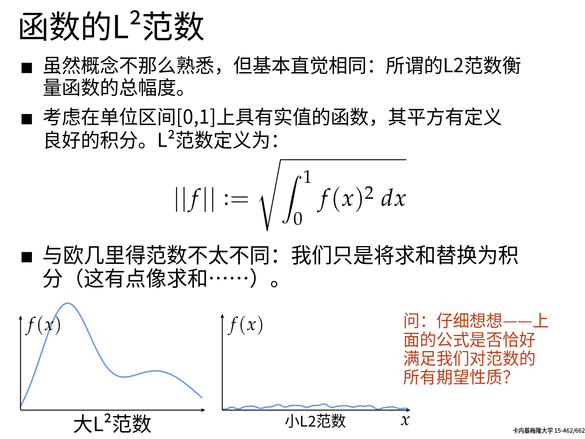
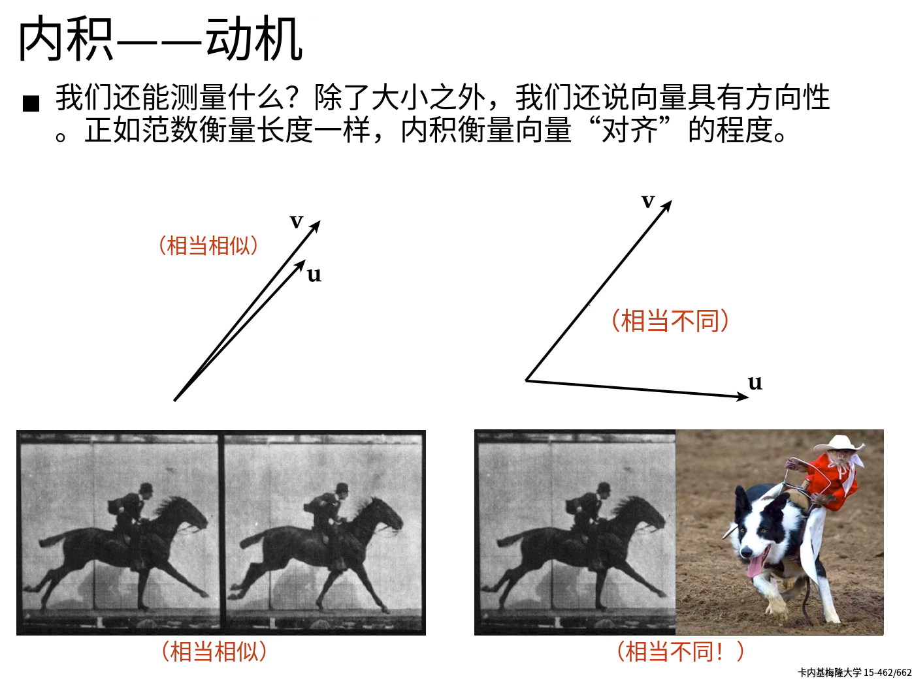
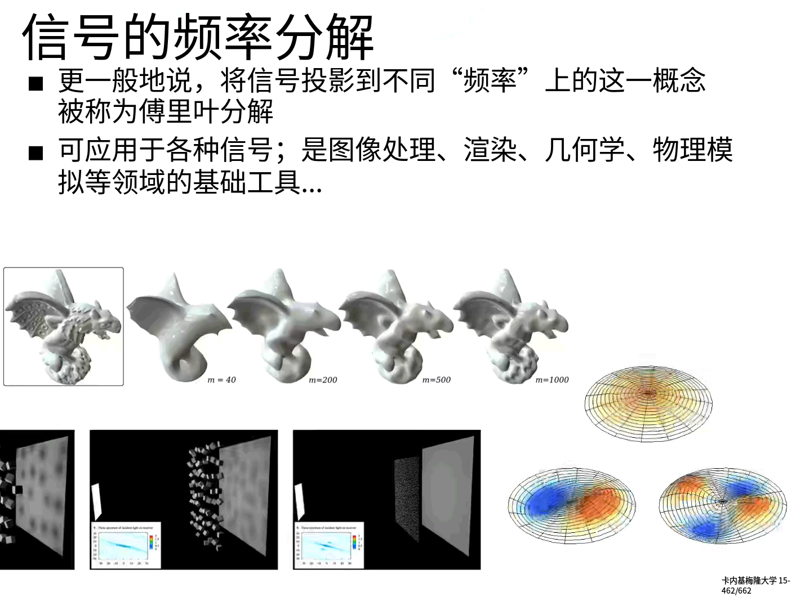

由于数学本身是一个极大的门类，而且我自己本身对数学也是知之甚少。所以会插入《线性代数的本质》的笔记来方便我复习和形成直觉。

## 01-向量究竟是什么？

### 1. **向量基本概念**

- **物理角度**：向量是**空间中的箭头**，由**长度**和**方向**确定。
- **计算机角度**：向量是**有序的数字列表**。
- **数学角度**：向量可以是任何东西，但要保证相加和数乘有意义。

### 2. **向量基本运算（加法与数乘）**

**向量加法**：对应项相加。
如上图所示，向量的加法可以从几何意义和代数意义上看。代数意义上，向量的加法便是对应分量相加。而几何意义上便是两个向量首尾相连，然后从第一个向量的起点到后一个向量的终点。

**向量数乘**：向量中的每一个分量与标量相乘（放缩）。

在代数意义上，缩放(Scaling)向量就是对应项✖一个数。而在几何意义上，便是对向量进行拉伸或者缩放，如上图所示。

## 02-线性组合、张成的空间和基

### 1. **基向量**
在二维空间中，所有的向量都可以看成 $\vec{i} = (1, 0)$ 和 $\vec{j} = (0, 1)$ 经过 **缩放/数乘(Scaling)** 和 **相加** 后的结果。而这两个向量通常是二维空间的**基向量**。

比如下面的向量 $\vec{v} = (-5, 2)$ 就可以看成：
$$
\begin{aligned}
\vec{v} &= -5 * \vec{i} + 2 * \vec{j} \\
&= -5\begin{pmatrix} 1 \\ 0 \end{pmatrix} + 2\begin{pmatrix} 0 \\ 1 \end{pmatrix} \\ &= \begin{pmatrix} -5 \\ 0 \end{pmatrix} + \begin{pmatrix} 0 \\ 2 \end{pmatrix} \\ &= \begin{pmatrix} -5 \\ 2 \end{pmatrix}
\end{aligned}
$$

值得注意的是，基向量还可以选择其他的向量，只要它们**线性无关**即可。关于线性无关，我们可以暂时理解成，两组向量不共线(平行/反向)即可。

所以我们需要有一个直觉，**每当我们使用数字描述向量的时候，它都依赖于我们正在使用的基向量**。

### 2. **线性组合**
而像这些通过对基向量缩放然后相加的动作本身，我们称其为**线性组合**。任何向量都可表示为基向量的**线性组合**。

至于为何称其为**线性组合**，我们可以先固定一个向量，然后任何缩放另一个向量，那么运动的轨迹就是一条直线。

两个数乘向量的和 $a\vec{v} + b\vec{w}$ 被称为这两个向量的线性组合。

有两种特殊情况，一种是两个向量都在同一条直线上，所产生的向量的终点被限制在一条过原点的直线。另一种是两个向量都是零向量，那么就只剩下一个原点。

### 3. **张成空间**

**一组向量的所有线性组合构成的向量集合**称为**张成空间**。

如两个不共线的二维向量可张成一个平面，三个不共面的三维向量可张成整个三维空间。

### 4. **线性相关与线性无关**
前面我们提到了线性无关，那么我们再看看**线性相关**和**线性无关**的定义和情况：

当你有多个向量，并且移除一个向量而不减少**张成空间**(共线或者有零向量)。这种情况发生时，我们便称这些向量为**线性相关**的。

另一方面，如果所有的向量都给**张成空间**添加了新的维度，那他们便是线性无关的。

基于这个以上的描述，我们给出基向量的严格定义：

还记得我们之前提到的，基向量可以任取，只要他们线性无关即可吗？现在看一下基向量的严格定义

## 03-矩阵与线性变换
### 1.**线性变换**

以上是数学上的严格定义，而在几何意义上，线性变换要满足以下两个条件：（1）**直线**依旧是直线（2）**原点**保持固定

线性变换看作是**保持网格线平行且等距分布**的变换。

### 2. **如何用数值描述一个线性变换**
如果我们想要给计算机进行编程，那么做什么才能让输入向量变为输出向量呢？

现在我们考虑一个情况，去基向量为$\vec{i} = (1, 0)$ 和 $\vec{j} = (0, 1)$。那么有向量$\vec{v} = -1\vec{i} + 2\vec{j}$。如下图所示：

然后我们运用一个线性变换，那么我们得到**变换后的基向量**。$$\begin{aligned}
Transformed (\vec{i}) = \begin{pmatrix} 1 \\ -2 \end{pmatrix} \\
Transformed (\vec{j}) = \begin{pmatrix} 3 \\ 0 \end{pmatrix}
\end{aligned}$$那么变换后的v向量便可以**直接使用变换前的系数乘以变换后的基向量相加**得到$Transformed (\vec{v})$ 。如下图所示。

### 3.**矩阵与线性变换的关系**
那么我们将这些变换后的基向量写在一个矩阵中，第一列为变换后的$\vec{i}$ 第二列为变换后的$\vec{j}$ 。那么我们就拿到了一个2×2的矩阵。

所以如果我们想要理解线性变换对一个向量的作用，**我们只需要取出向量的坐标，然后将它们分别与矩阵的特定列相乘再相加即可**。

所以我们以后**看到矩阵，我们都可以将其解释为一种对空间的特定变化。** 矩阵与向量的乘法，就是将这个矩阵的线性变换应用于这个向量。

## 04-矩阵乘法与线性变换复合

### 1.**矩阵相乘的几何意义**
前面我们经历了单个线性变换的过程，现在我们再来看看连续进行多次变换的过程。

如上图所示，我们对一个向量连续做两次变换，跟直接做复合变换的结果相同。所以我们自然得到了一下的结论：

我们先不管其代数上如何计算，至少在几何意义上，我们能够理解，**矩阵乘法就是多个线性变换的相继作用**。不过我们需要从右向左读。

那么我们如何推导出矩阵相乘的算法呢？现在我们先将$\vec{i}$的去向算出来。

那么，我们继续跟踪 $\vec{i}$ 在经过M2变换后的去向：

那么它便是复合变换的矩阵的第一列：

同样的，我们得到第二列：

### 2.矩阵乘法公式
由此我们便可以得到复合变换的矩阵，不过这样算是在太慢，这里，我贴一下计算公式：
**复合矩阵的维度，取决于第一个矩阵的行数和第二个矩阵的列数。**

例题为：

### 3. **矩阵相乘性质**
首先我们先直观理解一下交换两个矩阵相乘的顺序会发生什么事情。我们先水平剪切，然后逆时针90°旋转：

我们得到了如下的变换矩阵$$T = R \cdot S = \begin{pmatrix} 0 & -1 \\ 1 & 0 \end{pmatrix} \begin{pmatrix} 1 & 1 \\ 0 & 1 \end{pmatrix} = \begin{pmatrix} 0 & -1 \\ 1 & 1 \end{pmatrix}$$
然后我们调转顺序，先逆时针旋转90°，然后水平剪切：

$$ T' = S \cdot R = \begin{pmatrix} 1 & 1 \\ 0 & 1 \end{pmatrix} \begin{pmatrix} 0 & -1 \\ 1 & 0 \end{pmatrix} = \begin{pmatrix} 1 & -1 \\ 1 & 0 \end{pmatrix} $$
可以观察到，明显最终的变换不同。所以**矩阵的乘法不满足交换律**。然后我们看看矩阵相乘是否满足结合律？

如果我们从代数上证明，这分麻烦，但是如果在几何上，我们甚至不需要证明。因为列向量的矩阵乘法是从右向左看。

无论怎么看都是先应用C变换，再应用B变换最后运用A变换。这些在三维甚至是多维中都是一样的。

## 05-行列式

### 1. **什么是行列式**

首先我们先理解线性变换有的向外拉伸，有的向内挤压。想象一下，这个被拉伸后或被压缩后的面积。

行列式：**线性变换改变面积或体积的比例**被称为这个变换的行列式，二阶行列式可看做平行四边形的面积，三阶行列式可看做平行六面体的体积，正负号表示取向。

**行列式为零，矩阵必然线性相关，意味着变换减少了空间的维度（压缩空间）。**

那么问题来了，我们该如何理解行列式的负值呢？不管怎么拉伸压缩都不会变为一个负值的比例。（负值的绝对值仍然是被拉伸或者被压缩的面积的比例），

这一类变换改变了空间的**定向**。

空间的定向发生了改变后，行列式为负值。但是行列式的**绝对值**依然表示区域面积的缩放比例。拓展至三维空间的话，行列式负值就相当于**右手系变为左手系**。

### 2. **行列式的计算**
以下是二维行列式的计算：

关于如何推到，可以看这张图：

三维行列式的计算为：

以下是豆包给出的严格计算公式：

### 3. 思考题
思考一下，如果将两个矩阵相乘。它们乘积的行列式 == 他们行列式的乘积。这意味着什么。

因为行列式就是用来描述线性变换对空间的影响程度。如果看陈这样，那么上面的等式的左边就可以用自然语言描述为$$先进行M_2线性变换，再进行M_1线性变换后。两种线性变换叠加后对空间的影响程度$$
而等式的右边则为：$$M_1线性变换对空间的影响成都 * M_2线性变换对空间的影响程度$$
既然都是测量影响程度，而且空间无论从左边看还是从右边看，空间都经历了 $M_1$ 和 $M_2$ 的线性变换，那么空间收到的影响程度应该是一样的。 **行列式的乘法，就是线性变换缩放比例的乘法**，不管是分开看还是复合看，最终对空间的缩放效果都是一样的。

## 06-逆矩阵、列空间与零空间 线性方程组

### 1.线性方程组
线性代数除了在机器人、计算机图形学、机器学习里面有重要应用之外，几乎在所有工程领域里面都有一席之地，除了它能够描述空间的变换，还可以求解特定的方程组。

假设有这样的方程：

- 在每一个方程中，所有的未知量只有常系数
- 这些未知量之间只进行加和
- 未知量没有幂次，没有奇怪的函数，没有未知量之间的乘积等
他们可以写成如下形式：

将系数矩阵看为$A$ 。 未知量向量看为 $\vec{x}$  。常数系数向量看为 $\vec{v}$ 。那么线性方程组的形式就出来了：
$$A\vec{x} = \vec{v}$$
这样，我们就可以只考虑对空间变形，以及变换后的重叠，就将多个未知数的复杂方程引入脑海之中。

现在我们想要求得未知量向量 $\vec{x}$ 。那么这个解的情况完全依赖于变换矩阵 $A$ 所代表的变换。

### 2.线性方程组解存在的情况与行列式的关系
$A$ 是将空间挤压到一条线或者一个点等低维空间，还是保留像初始状态一样完整的二维/三维空间。那么这种情况就适用于上一节提到的**行列式**。**压缩到低维空间就意味着行列式 $det(A) = 0$ 。保留完整空间即为行列式 $det(A) \ne 0$ 。**

绝大部分时候 $det(A) \ne 0$  ，那么有且仅有一个向量与 $\vec{v}$ 重合。如下图所示：

我们如何求到 $\vec{x}$ 呢？根据上图和公式所示，$\vec{x}$ 经过 $A$ 的变换才变换为 $\vec{v}$ 。那么我们将 $\vec{v}$ 还原，就能得到原来的 $\vec{x}$ 。即 $A$ 的逆变换。

重要的是，如果我们对一个向量先做了 $A$ 变换，然后再做了逆变换 $A^{-1}$  。那么，$\vec{i}$ 和 $\vec{j}$ 应该保持原样，如下图所示：

一旦我们找到 $A^{-1}$ 。我们就可以在两边同时✖$A^{-1}$ 。来求解向量方程。

同样的，在三维空间，**只要 $det(A) \ne 0$ 。那么 $A^{-1}$ 便存在，我们求解方程就可以通过在方程两边同时乘以$A^{-1}$ 来完成求解。**

但是，当行列式 $det(A) = 0$ 的时候， $A^{-1}$ 便不复存在。因为行列式为0意味着空间被压缩为一个平面一条线甚至是一个点。**没有线性变换可以升维**。所以自然不存在 $A^{-1}$ 。至少这不是函数能够做到的。比如只有一条线的情况下，我们无法将一个向量通过函数变为多个平面上的多个向量。函数不能1输出多。

但是即便不存在 $A^{-1}$ 。解仍然可能存在。假设变换将空间压缩成了一条直线，但是足够幸运，未知量向量 $\vec{v}$ 刚好落在这条直线上。

三维中也是一样，只是难度更高，将整个三维空间压缩为一条直线后，解存在的概率更低。

### 3. **秩**
当我们的变换将空间压缩为一条直线的时候，我们称这个变换(矩阵)的秩为1。如果变换后的向量落在某个二维平面上，我们称这个变换(矩阵)的秩为2。

我们知道，可以用**矩阵的列来代表变换后的基向量**，那么顾名思义，列空间，就是**矩阵的列**所张成的空间。**秩等于列空间的维数**。

- 满秩：秩达到最大值，秩与列数相等。
- 零向量：如果矩阵并非**满秩**，那么**变换后落在原点的向量的集合**称为**零空间**。零向量一定在列空间中。因为线性变换一定保持原点位置不变。
- 解的集合：对于线性方程组而言，零空间给出的就是这个向量方程所有可能的解。

零空间与解的集合

### 4. 非方阵
如下图所示，

2×3的矩阵是将二维空间升维为三维空间。

类似的，当我们看到一个2×3的矩阵的时候，我们就应该反应过来，它时将三维空间压缩为二维：

还可以从二维压缩到一维：

## 07-点积与对偶性

### 1. **点积**

首先先复习一下点积的标准运算，点积的结果是一个标量或者一维向量。

再来看看点积的几何意义，向量 $\vec{w}$ 向过原点的向量 $\vec{v}$ 上投影，然后将投影的长度 × $\vec{v}$ 的程度。就是点积。

所以，当**两个向量的指向大致相同**的时候，它们的点积为正。当**它们相互垂直的时候**，它们的点积为0.
当**它们的指向基本相反**的时候，它们的点积为负数。

为什么点积和顺序无关呢？明明从几何上，看起来就完全不一样。这个可以从对偶性来解释。

### 2. **对偶性**
几何上，两个向量互相在对方身上投影，然后以投影长度乘以对方的长度。互为镜像：

如果我们随意缩放其中一个，让其为原来的两倍，对偶性(Symmetry)就被破坏了：

通过对偶性，可以将上述两种关于点积的观点联系起来。

首先点积可以看作是高维到一维的线性变换。用几何来展示为什么点积相当于矩阵乘法（虽然在数值计算上是显而易见的）。

运用这个线性变换相当于和对偶向量点积。

## 08-叉积的标准介绍

叉积是**平行四边形的面积**（二维）（数值上相等）。

叉积与向量先后顺序有关，在于正负符号不同，其绝对值是一样的。

看到这里有没有发现叉积的计算和行列式的计算是一样的（所求面积是一样的）。

严格意义上的叉积是使用2个三维向量生成1个新的三维向量，且该向量与输入的两个向量垂直，**长度数值上等于输入向量张成的平行四边形的面积**。其中叉积的方向用右手定则判断。

## 09-基变换

### 1. **基向量**

回想向量那节课，我们知道每当我们在使用数字描述向量时，它都依赖于我们正在使用的**基**。

矩阵乘法可以看作是一次线性变换。那么基向量的不同，所构成的矩阵也不同。假如有另一个人詹妮弗。它眼中的基向量(1, 0)和(0, 1)。在我们的坐标系中为(2, 1) 和 (-1, 1)。

它看上图的感觉是：

所以，因为我们没有达成一致，没有使用一个坐标系。导致同一个向量我们会有完全不同的看法。

毕竟空间本身并没有网格对吧，都是我们自己人为绘制的。但是只要我们的原点重合就行。那么如何转化坐标系呢？

### 2. **不同坐标系的转化**
如果詹妮弗用(-1, 2)描述一个向量，那么在我们的坐标系中，该如何描述？
那么在詹妮弗看来它的向量的基于基向量的线性组合为：$$\vec{v} = -1\vec{b_1} + 2\vec{b_2}$$

在我们看来，詹妮弗的基向量为$$
\begin{aligned}
\vec{b_1} &= \begin{pmatrix} 2 \\ 1 \end{pmatrix} \\
\vec{b_2} &= \begin{pmatrix} -1 \\ 1 \end{pmatrix}
\end{aligned}$$

**线性变换前的向量是基向量的特定线性组合**，变换后的向量**仍是相同的线性组合**，但使用的是新的基向量。所以我们完全可以把詹妮弗认为的基向量看成一种线性变换

这样，我们就可以在我们的坐标系中表达詹妮弗描述的$\begin{pmatrix} -1 \\ 2 \end{pmatrix}$了。即$\begin{pmatrix} -4 \\ 1 \end{pmatrix}$ 。

那么，假设我们使用自己的坐标系描述一个向量$\begin{pmatrix} 3 \\ 2 \end{pmatrix}$。如何转化为詹妮弗理解的向量呢？
之前，从詹妮弗 → 我们的语言。**我们使用詹妮弗的基向量作为变换的矩阵**。从而求得了詹妮弗的$\begin{pmatrix} -1 \\ 2 \end{pmatrix}$。那么我们的语言→詹妮弗的语言，则需要反过来，将我们的$\begin{pmatrix} 3 \\ 2 \end{pmatrix}$ 去乘以 矩阵的逆。

### 3. 最终结论
如何转为我们的语言？
首先，我们不用她的语言来描述，而是使用**基变换矩阵转为我们的语言**。即将詹妮弗描述的向量乘以**基变换矩阵(我们的语言描述环境下，用我们的语言描述詹妮弗的基向量)**。

首先应用基变换，然后进行线性变换，最后应用基变换的逆，这三种矩阵的复合就得出了詹妮弗语言描述的线性变换矩阵。

上图的形式往往表述为一种转移，$A$ 和 $A^{-1}$ 表示基变换和其逆。$M$ 表示线性变换。

## 10-特征向量与特征值

### 1.概念
如下图所示，绝大部分向量在经过线性变换后，都离开了自己原来所张成的空间。比如二维平面中向量 $\vec{v}$ 离开了自己原来所在的直线。

但是，有一些特殊的向量在变换后仍然留在自己变换前所张成的空间中。

这意味着矩阵的变换对它来讲仅仅只是缩放的所用(Scaling)。如同数乘一个标量。这些特殊的向量就被称为一个**变换(矩阵)的特征向量**。每一特征向量都有一个所属的值，即为**特征值**，即衡量特征向量在变换中**缩放比例的因子**。

你可以有一个属于特征值-1/2的特征向量：

意味着这个向量被反向，并压缩为了原来的1/2。

### 2.为什么值得研究？

如果我们在三维空间中能够找到一次旋转变换的特征向量，那么这个**特征向量就是旋转轴**。

理解线性变换的关键往往较少依赖于特定的坐标系，我们用了太多特定的只是为了讲解。就像旋转一样，**最好的是找到其特征向量和特征值**。

### 3.计算方法

其实就是说v向量的矩阵乘法与另一个数乘相等。

将右侧变为常数乘以单位矩阵：

然后移动到左侧，合并同类项：

如果向量 $\vec{v}$ 本身就是 $\vec{0}$ ，那等式恒成立，但没什么意义，我们想要的是非零的特征向量。看上面的等式，我们知道，**当且仅当矩阵代表的变换把空间压缩到更低的维度时，才会存在一个非零向量，使得矩阵和它的乘积为零向量。**

对应的就是行列式 = 0的情况。

总结如下：

### 4.特殊的情况，对角矩阵

一个简单的例子是将所有向量变为2倍的矩阵。

唯一的特征值为2.但是平面内所有的向量都是属于这个特征值的特征向量。

## 11-抽象向量空间

### 1.函数即向量
回到最开始，什么是向量呢？虽然我们的所有笔记都是以二三维的向量为准来描述，但还有很多东西也是向量。比如，从某种意义上来说。函数是另一种向量。

比如向量加法：

两个函数之间，我们可以直接相加，然后得到一个新的函数$(f + g)$ 。

类似的，函数与一个数字数乘也有合理的解释，只是把输出的值与那个数相乘

因为对向量的操作也只有相加和数乘的两个操作，所以，我们在之前的推论应该可以原封不动的拿到函数中。

### 2.函数的线性变换
如下图所示，该函数接收一个函数，并输出另一个函数。如下图所示，导数便是一个函数的线性变换：

关于函数的线性变换，我们时常听到的叫法为“线性算子”而非线性变换。不过意思一样。那如果一个函数变换是线性的，那代表什么呢？

那就跟线性的严格定义有关系了，那非常抽象，但是却带来了普世性的好处。

### 3.线性的定义
满足以下两个性质的变换为线性变换：

一个是**可加性**，一个是**成比例**。
- 可加性是说明，**对两个向量的线性变换相加 == 对两个向量的和做线性变换。**
- 成比例是说明，**对缩放后的向量做线性变换 == 对向量做线性变换后再缩放。**

那么，如果满足这两个性质，我们就可以把线性的概念延展到其他地方，比如**函数求导**。

即**求导具有可加性和成比例性**。

如果我们把$$两个函数相加，然后求导 ==  先求两个函数的导数，然后相加$$
这是可加性。
类似的，如果我们将$$函数先求导，再与数相乘 == 先对函数求导，然后把结果与数相乘$$

### 4.矩阵求导
为了真正的用线性的方式来描述，我们来看看如何用矩阵求导。没错，矩阵可以求导。

我们先看看关于$x$的多项式：

首先，为这个无穷多多项式组成的向量空间，寻找它的**基向量**。因为多项式已经是线性组合的形式，唯一不同的就是$x$的次幂，所以基向量便是$x$的不同次幂。

因为$x$的次幂可以无限大，所以**所有基向量组成的基函数集合也是无穷大**。

比如，我们描述$$1x^2 + 3x + 5\cdot 1$$就可以描述为下图的向量。

然后我们求导：

做以上的矩阵乘法，便能求出函数$1x^3 + 5x^2 + 4x + 5$的导数为$3x^2 + 10x + 4$。
实际上，大部分的线性代数的概念在函数中都有其别名。

实际上，只要满足这八条公里的都可以被称为向量。而它们张成的空间就是向量空间：

## 12-CMU 15-462/662 的线性代数复习
在完成了之前的直觉建立之后，教授也否定了从头就使用抽象概念的想法：

教授强调，要去思考为什么有这些定义，为什么它们是对的？当然，我也是因为基础不够才去补充的线性代数的本质系列视频。

### 1.向量vector究竟编码了什么信息

那么向量还能编码什么信息呢？这个问题我们后面慢慢探索。

常见的，我们在欧几里得空间中编码向量：

但是，在计算机图形学中，我们比欧几里得向量空间往往走得更远。在真实的空间中，**向量空间是函数的张成空间**。而不是一些箭头。这些函数可以描述很多事情。比如图像的亮度，描述几何物体的形状或者发出声音的振幅等。

这些都是向量，我们可以对它们做向量的基本运算：**数乘**和**相加**。

就如同之前复习的抽象向量空间一样，函数也可以做向量操作：

然后，教授举例了一些在几何上的操作是如何在代数上计算的：

**⚠️ 教授特别警告**：不能直接比较不同坐标系中的坐标，也不能混用极坐标和直角坐标进行比较。这是图形学代码中极常见的 bug 来源。

> 老师提问：零向量对应哪个函数？ → 处处为零的函数。

### 2.范数（Norm）如何测量向量
**动机**：怎么度量向量的"大小"？

一般的箭头很容易看出来，但函数呢？图像呢？

那么描述向量大小的范数有什么基础性质呢？我们从实际触发，比如两个点的距离：

由此，教授得出了一些基本性质。
**三条基本性质（从几何直觉导出）**：

1. 非负性：$∣u∣≥0，且 ∣u∣=0⇔u=0$
2. 齐次性：$∣cu∣=∣c∣∣u∣$（为什么是绝对值？因为长度不能为负）
3. 三角不等式：$∣u∣+∣v∣≥∣u+v∣$（两点间直线最短）

> **老师的"小彩蛋"**：他故意把三角不等式说成"pentagon inequality"（五边形不等式），因为图里那个三角形加了一个圈之后很像五边形。他说这明显是错的，希望同学们积极提问，不要盲目接受权威。

上面我们知道，Norm就是一个赋予数字的函数，并且要满足非负性、齐次性和三角不等式。那么我们在常用的欧几里得空间中，可以验证一下：

这个留为作业。

**欧几里得范数**：$∣u∣= \sqrt{\sum_{i=1}^{n} u_i^2}$​​，即各分量平方和的开方。

**函数的 L2L^2 L2 范数** ：$∥f∥ = \sqrt{\int_0^1 [f(x)]^2\, dx}​$，与欧几里得范数高度类比（积分≈求和）。

> **老师的计算示例**：对 $f(x) = x\sqrt{3}$​，算出 $∥f∥ = 1$，这是一个"单位范数"函数，可能出乎意料。

> **老师的留题**：$L^2$ 范数是否严格满足所有范数公理？他暗示有一个微妙之处（几乎处处为零的函数）。

### 3.内积（Inner Product）—— 向量点积

**动机**：度量两个向量方向的"对齐程度"。

**几何解释**：对单位向量 $\mathbf{u}$、$\mathbf{v}$，内积 $\langle\mathbf{u}, \mathbf{v}\rangle$ 就是 $\mathbf{v}$  在 $\mathbf{u}$  方向上投影的长度。

就像我们可以对函数进行求norm范数一样，我们也可以对函数求点积累，即内积：

再比如图像。

**四条性质（从几何推出）**：

### 4.线性映射(变换)

以下是线性变换的举例：

一个几乎完美的直觉是，线性变换将线映射为线(即不会弯折)。还有一个点，必须保持原点！我们在之前也提到过。

以下是claude的总结：

### 5.基和张成空间
由于在之前有过详细讨论，直接看claud的总结即可

### 6.傅里叶变换

### 7.线性方程组和矩阵

