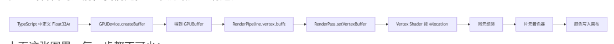
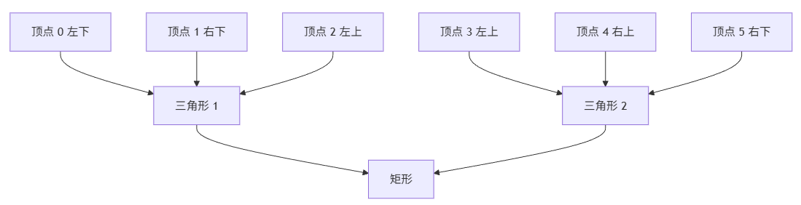
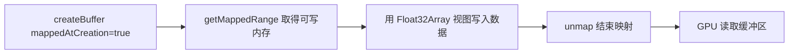
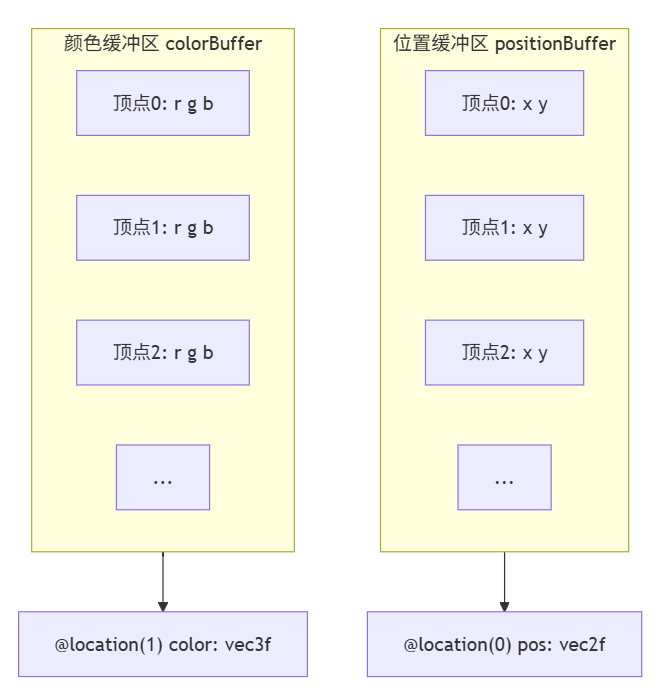
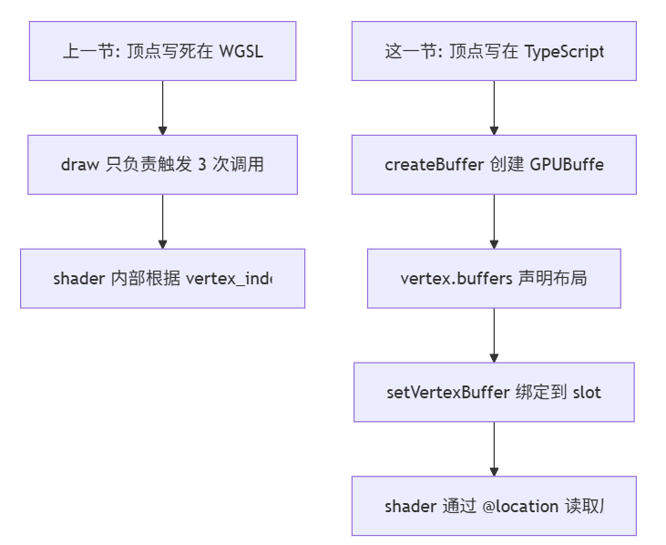

## 1. 这一节我们要做什么？

上一节，我们已经成功在画布上绘制出了第一个红色三角形。但如果你还记得上一节的 `shader.wgsl`，就会发现一个非常重要的问题：

- 三角形的顶点坐标，是直接写死在 WGSL 里的；
- 三角形的颜色，也是直接写死在 WGSL 里的；
- TypeScript 端虽然创建了渲染管线，但**没有真正把“模型数据”传给 GPU**。

这意味着，上一节更像是在证明：

> “WebGPU 的渲染管线能跑起来，shader 能执行，draw 调用也确实能触发 GPU 工作。”

而这一节，我们终于要迈入真正的图形渲染开发了。

这一节的目标非常明确：

1. 把顶点数据从 WGSL 中拿出来，改为在 TypeScript 里定义；
2. 把这些数据写入 GPUBuffer；
3. 告诉 WebGPU：这些缓冲区里的字节，应该如何解释为“位置”和“颜色”；
4. 在 `RenderPass` 中绑定缓冲区；
5. 通过 `draw(6)` 画出一个由两个三角形组成的矩形。

如果说上一节解决的是：

- GPU 是否能执行渲染命令？

那么这一节解决的就是：

- **GPU 到底从哪里拿顶点数据？**
- **GPU 怎么知道哪些浮点数是位置，哪些浮点数是颜色？**
- **TypeScript 里的数组，究竟是如何一步步变成屏幕图像的？**

这就是本节最核心的主题：**创建 GPU 缓冲区（GPU Buffer）并建立 CPU 数据与 shader 输入之间的映射关系。**

---

## 2. 先复盘上一节：为什么“把顶点写死在 shader 里”不是长久之计？

上一节的顶点着色器，大致是这样的：

```wgsl
@vertex
fn vertexMain(
    @builtin(vertex_index) vertexIndex: u32
) -> VertexOut {
    let pos = array(
        vec2f( 0.0,  0.5),
        vec2f(-0.5, -0.5),
        vec2f( 0.5, -0.5)
    );

    var output: VertexOut;
    output.position = vec4f(pos[vertexIndex].x, pos[vertexIndex].y, 0.0, 1.0);
    output.color = vec4f(1.0, 0.0, 0.0, 1.0);
    return output;
}
```

这种写法当然没错，而且它是 Hello Triangle 阶段最容易理解的最小方案。但它有几个明显的问题：

### 2.1 顶点数据被写死在 GPU 程序里

只要你想换一个形状，比如正方形、五边形、立方体，就必须改 shader 源码。这显然不合理，因为：

- shader 的职责应该是“定义计算规则”；
- 而顶点数据属于“运行时输入数据”。

也就是说，**数据和逻辑应该分离**。

### 2.2 CPU 无法动态更新模型数据

现实中的图形应用程序，顶点数据通常都来自：

- 模型文件；
- 数学生成；
- 动画系统；
- 物理系统；
- 用户输入；
- 网络同步。

如果数据只能写死在 WGSL 里，那就根本谈不上“动态场景”。

### 2.3 无法建立通用渲染流程

真正的图形渲染流程应该是：

- CPU 侧准备顶点数据；
- 数据上传到 GPU；
- 渲染管线描述“这块数据怎么解释”；
- shader 按约定读取输入。

这才是现代图形 API 的正常工作方式。

所以，本节的意义并不只是“换一种写法画矩形”，而是要完成一个非常关键的转折：

> 从“shader 自己硬编码顶点”，过渡到“CPU 提供数据，GPU 按布局读取数据”。

---

## 3. 先建立整体图景：这一节的数据流到底是什么？

在正式看代码之前，我们先把整条链路建立清楚。



上面这张图里，每一步都不可少：

1. **CPU 先有数据**  
   也就是 `Float32Array`。

2. **把数据装进 GPUBuffer**  
   GPU 并不会直接读取 JS 数组；它只能读取 GPU 资源。

3. **声明内存布局**  
   GPU 不会猜你这堆 float 的意义，必须明确告诉它步长、偏移、格式。

4. **在 draw 前绑定到 RenderPass**  
   只有绑定之后，当前这次 draw 才知道去哪个缓冲区里取数据。

5. **shader 按 location 接收输入**  
   TypeScript 端的 `shaderLocation`，必须和 WGSL 端的 `@location(...)` 一一对应。

这几步合在一起，才叫真正意义上的“把模型数据送进 GPU”。

---

## 4. 本节完整代码

### 4.1 `src/main.ts`

```typescript
// 从shader源代码引入
import shaderSource from "./shaders/shader.wgsl?raw";

class Renderer {
  private context!: GPUCanvasContext;
  private device!: GPUDevice;
  private pipeline!: GPURenderPipeline;
  // 新增 顶点位置缓冲区
  private positionBuffer!: GPUBuffer;
  // 新增 顶点颜色缓冲区
  private colorBuffer!: GPUBuffer;

  constructor() {}
  
  public async initialize(): Promise<void> {
    if (!navigator.gpu) {
      alert("WebGPU不受支持!");
      return;
    }

    const canvas = document.getElementById('canvas') as HTMLCanvasElement;
    this.context = canvas.getContext('webgpu')!;
    
    if(!this.context) {
      alert("当前画布不支持WebGPU上下文!");
      return;
    }

    const adapter = await navigator.gpu.requestAdapter()!;

    if (!adapter) {
      alert("无法找到合适的适配器(显卡)")
    }

    const info = adapter?.info;
    console.log("显卡的厂商:", info?.vendor);
    console.log("显卡的架构:", info?.architecture);

    this.device = await adapter?.requestDevice()!;
    
    this.context.configure({
      device: this.device,
      format: navigator.gpu.getPreferredCanvasFormat(),
    });

    // 新增 在CPU侧定义好顶点的相关数据 位置 颜色
    // 使用新的 私有方法 this.createBuffer()
    this.positionBuffer = this.createBuffer(new Float32Array([
      -0.5, -0.5, // x, y 共六个顶点位置
      0.5, -0.5,
      -0.5, 0.5,
      -0.5, 0.5,
      0.5, 0.5,
      0.5, -0.5
    ]))

    this.colorBuffer = this.createBuffer(new Float32Array([
      1.0, 0.0, 1.0,  // r g b 第一个顶点的颜色
      0.0, 1.0, 1.0,
      0.0, 1.0, 1.0,
      1.0, 0.0, 0.0,  // r g b 第四个顶点的颜色
      0.0, 1.0, 0.0,
      0.0, 0.0, 1.0,
    ]))

    // 新增，准备shader module 着色器模块
    this.prepareModel();
  }

  // 新增 私有方法 createBuffer() 用于创建各种缓冲区
  // 传入参数是一个 f32 数组
  private createBuffer(data: Float32Array): GPUBuffer {
    const buffer = this.device.createBuffer({
      size: data.byteLength,  // 为啥是byteLength而不是length
      usage: GPUBufferUsage.VERTEX | GPUBufferUsage.COPY_DST,
      mappedAtCreation: true
    });

    new Float32Array(buffer.getMappedRange()).set(data);
    buffer.unmap();

    return buffer;
  }

  private prepareModel(): void {
    const shaderModule = this.device.createShaderModule({
      code: shaderSource
    });

    // 虽然我们创建了顶点缓冲区，但是还需要创建布局才能应用
    // 之前的数据我们人脑自己划分了数据的界限，比如一行算一个顶点位置，两个f32数据
    // 但是没有手动设置到渲染管线中
    const positionBufferLayout: GPUVertexBufferLayout = {
      arrayStride: 2 * Float32Array.BYTES_PER_ELEMENT, // 2 个浮点数 × 每个浮点数 4 字节
      attributes: [
        {
          shaderLocation: 0,  // 这个与vertex shader代码里的 @location(0)对应
          offset: 0,
          format: "float32x2" // 为什么arrayStride定义了这里还要定义
        }
      ],
      stepMode: "vertex"
    };

    const colorBufferLayout: GPUVertexBufferLayout = {
      arrayStride: 3 * Float32Array.BYTES_PER_ELEMENT,
      attributes: [
        {
          shaderLocation: 1,  // 对应vertex shader的@location(1)
          offset: 0,
          format: "float32x3"
        }
      ],
      stepMode: "vertex"
    };

    const vertexState: GPUVertexState = {
      module: shaderModule,
      entryPoint: "vertexMain",
      buffers: [
        // 新增 将缓冲区布局插入
        positionBufferLayout,
        colorBufferLayout
      ]
    };

    const fragmentState: GPUFragmentState = {
      module: shaderModule,
      entryPoint: "fragmentMain",
      targets: [
        {
          format: navigator.gpu.getPreferredCanvasFormat()
        }
      ]
    };

    // 注意：WebGPU中不需要自己创建RenderPipeline的Layout, 因为可以auto
    // Render Pipeline Layout里保存了 bind_group相关的信息
    this.pipeline = this.device.createRenderPipeline({
      layout: "auto",
      vertex: vertexState,
      fragment: fragmentState,
      primitive: {
        topology: "triangle-list"
      }
    });
  }

  public draw() {
    const commandEncoder = this.device.createCommandEncoder();
    const rendePassDescriptor: GPURenderPassDescriptor = {
      colorAttachments: [
        {
          clearValue: { r: 0.8, g: 0.8, b: 0.8, a: 1.0 },
          loadOp: "clear",
          storeOp: "store",
          view: this.context.getCurrentTexture().createView()
        }
      ]
    };

    const passEncoder = commandEncoder.beginRenderPass(rendePassDescriptor);
    // DRAW HERE
    passEncoder.setPipeline(this.pipeline);
    // 新增 在renderpass解码器中设置GPU缓冲区
    // 因为之前都是创建CPU端的数据，和描述缓冲区的具体布局
    // 这里才是在GPU端设置内存(缓冲区)
    passEncoder.setVertexBuffer(0, this.positionBuffer);
    passEncoder.setVertexBuffer(1, this.colorBuffer);
    passEncoder.draw(6);

    passEncoder.end();

    const commandBuffer = commandEncoder.finish();
    this.device.queue.submit([commandBuffer]);
  }
}

const renderer = new Renderer();
renderer.initialize().then(() => renderer.draw());
```

### 4.2 `src/shaders/shader.wgsl`

```wgsl
struct VertexOut {
    @builtin(position) position: vec4f, // 顶点在裁剪空间中的位置
    @location(0) color: vec4f
}

@vertex
fn vertexMain(
    @location(0) pos: vec2f,    // 顶点的xy坐标
    @location(1) color: vec3f,  // rgb颜色值
) -> VertexOut {
    var output: VertexOut;
    output.position = vec4f(pos, 0.0, 1.0);
    output.color = vec4f(color, 1.0);

    return output;
}

// 片段着色器会针对三角形中的每个像素进行调用。
@fragment
fn fragmentMain(fragData: VertexOut) -> @location(0) vec4f {
    return fragData.color; // 像素的最终颜色
}
```

---

## 5. 新增代码总览：这一节到底新增了什么？

和上一节相比，本节其实只新增了四类能力：

1. **新增两个 GPUBuffer**
   - 一个存顶点位置；
   - 一个存顶点颜色。

2. **新增一个通用的 `createBuffer()` 方法**
   - 负责把 `Float32Array` 变成 `GPUBuffer`。

3. **在渲染管线中新增顶点缓冲区布局**
   - 告诉 GPU：slot 0 是 `vec2f` 位置；
   - slot 1 是 `vec3f` 颜色。

4. **在 draw 阶段绑定顶点缓冲区**
   - `setVertexBuffer(0, ...)`
   - `setVertexBuffer(1, ...)`

如果只看一句话总结，那就是：

> 上一节是“GPU 自己在 shader 里生成顶点”；这一节是“CPU 先准备顶点，再送给 GPU”。

---

## 6. 为什么 WebGPU 一定要用缓冲区？

这是本节最根本的问题。

在 JavaScript 里，我们当然可以直接写：

```typescript
const vertexData = new Float32Array([...]);
```

但这个数组只存在于 **CPU 可见的 JavaScript 内存** 中。GPU 并不会自动访问 JS 变量，也不会直接去读 V8 的堆内存。GPU 能访问的，是它自己的资源对象，例如：

- `GPUBuffer`
- `GPUTexture`

在图形渲染里，最常见的两类资源就是：

- **缓冲区（Buffer）**：存放通用的原始数据；
- **纹理（Texture）**：存放按像素组织的图像数据。

补充阅读材料里也提到过这一点：

- `GPUBuffer` 更像是一块原始线性内存；
- `GPUTexture` 更像是按二维/三维像素组织的专用图像内存。

而我们这一节要传的是：

- 顶点位置；
- 顶点颜色。

这些都是普通数值数据，所以最适合放进 `GPUBuffer`。

### 6.1 你可以把 `GPUBuffer` 理解成什么？

你可以先把它粗略理解为：

> GPU 上的一段连续字节内存。

它本身不知道里面的数据是：

- 坐标；
- 颜色；
- 法线；
- 矩阵；
- 索引；
- 还是别的什么。

这些语义，都需要你通过“用途标志”和“布局描述”告诉它。

也就是说，**GPUBuffer 只管存字节，至于这些字节代表什么，要靠你自己声明。**

---

## 7. 本节要画的图形是什么？为什么是 `draw(6)`？

上一节是一个三角形，所以 `draw(3)`。

这一节你会发现，代码里变成了：

```typescript
passEncoder.draw(6);
```

为什么是 6？

因为这次我们要画的不再是单个三角形，而是一个矩形。而在 WebGPU 的基础图元里，并没有“矩形”这种 primitive，只有：

- 点；
- 线；
- 三角形。

所以矩形要拆成两个三角形。

### 7.1 当前顶点位置数据

```typescript
new Float32Array([
  -0.5, -0.5,
   0.5, -0.5,
  -0.5,  0.5,
  -0.5,  0.5,
   0.5,  0.5,
   0.5, -0.5
])
```

把它按每两个值一组拆开，就是 6 个顶点：

1. `(-0.5, -0.5)`
2. `( 0.5, -0.5)`
3. `(-0.5,  0.5)`
4. `(-0.5,  0.5)`
5. `( 0.5,  0.5)`
6. `( 0.5, -0.5)`

在 `triangle-list` 模式下，每连续 3 个顶点组成一个三角形，因此：

- 第 1、2、3 个顶点组成第一个三角形；
- 第 4、5、6 个顶点组成第二个三角形。

这样刚好拼成一个矩形。



这其实也正好呼应了补充材料里关于图元组装的内容：**GPU 只认识图元，不认识“高级几何图形”**。矩形、圆、多边形，最后都得还原成点、线、三角形。

---

## 8. 位置与颜色：为什么这里用了两个缓冲区？

这一节的代码没有把位置和颜色塞进同一个缓冲区，而是分成了：

- `positionBuffer`
- `colorBuffer`

这是一个很好的教学写法，因为它把“位置数据”和“颜色数据”的职责分得非常清楚。

### 8.1 位置缓冲区

```typescript
this.positionBuffer = this.createBuffer(new Float32Array([
  -0.5, -0.5,
   0.5, -0.5,
  -0.5,  0.5,
  -0.5,  0.5,
   0.5,  0.5,
   0.5, -0.5
]))
```

每个顶点只有两个分量：

- `x`
- `y`

所以它在 shader 里会对应成：

```wgsl
@location(0) pos: vec2f
```

### 8.2 颜色缓冲区

```typescript
this.colorBuffer = this.createBuffer(new Float32Array([
  1.0, 0.0, 1.0,
  0.0, 1.0, 1.0,
  0.0, 1.0, 1.0,
  1.0, 0.0, 0.0,
  0.0, 1.0, 0.0,
  0.0, 0.0, 1.0,
]))
```

每个顶点有三个颜色分量：

- `r`
- `g`
- `b`

所以它在 shader 里会对应成：

```wgsl
@location(1) color: vec3f
```

### 8.3 这种写法的好处是什么？

优点是非常直观：

- 一个缓冲区只负责一种属性；
- 每个缓冲区的布局都非常简单；
- 更容易看懂 `arrayStride`、`format`、`shaderLocation` 到底在描述什么。

### 8.4 但这是不是最常见的工程写法？

不一定。

补充阅读材料里举的典型例子，其实是**交错存储（interleaved layout）**，也就是一个顶点的数据长这样：

```typescript
[pos.x, pos.y, color.r, color.g, color.b]
```

然后三个顶点连在一起，放进同一个 `Float32Array`。

这样做的优点通常是：

- 内存访问更集中；
- 一个顶点的所有属性放在一起；
- 工程实践中更常见。

但这一节的目标是教学清晰度，所以采用了**分离存储（separate buffers）**的方式。这样更有助于你理解：

- “一个缓冲区槽位对应一类属性”
- “一个 `shaderLocation` 对应 shader 的一个输入”

等你把这一节完全吃透了，再去看交错存储，就会非常轻松。

---

## 9. `createBuffer()`：TypeScript 数组是怎么变成 GPUBuffer 的？

这是本节最关键的新函数：

```typescript
private createBuffer(data: Float32Array): GPUBuffer {
  const buffer = this.device.createBuffer({
    size: data.byteLength,
    usage: GPUBufferUsage.VERTEX | GPUBufferUsage.COPY_DST,
    mappedAtCreation: true
  });

  new Float32Array(buffer.getMappedRange()).set(data);
  buffer.unmap();

  return buffer;
}
```

虽然函数不长，但每一行都很重要。

---

## 10. `device.createBuffer(...)`：先创建一块 GPU 内存

### 10.1 `createBuffer` 是谁的方法？

它来自 `GPUDevice`：

```typescript
const buffer = this.device.createBuffer(...)
```

这和前面几节的思路完全一致：

- `GPUAdapter` 对应物理适配器；
- `GPUDevice` 对应逻辑设备；
- 凡是要真正创建 GPU 资源，通常都得从 `device` 出发。

### 10.2 `createBuffer` 的核心属性有哪些？

补充材料中提到，`GPUDevice.createBuffer()` 最常见的属性有四个：

|属性|是否必需|作用|
|---|---|---|
|`label`|否|调试名称|
|`size`|是|缓冲区字节大小|
|`usage`|是|缓冲区用途标志|
|`mappedAtCreation`|否|是否在创建时立刻映射到 CPU 可写内存|

本节代码实际用了其中三个：

- `size`
- `usage`
- `mappedAtCreation`

---

## 11. 为什么是 `data.byteLength`，而不是 `data.length`？

这个问题非常关键。

```typescript
size: data.byteLength
```

这里必须传的是**字节数**，而不是元素个数。

假设你有：

```typescript
const data = new Float32Array([1, 2, 3, 4]);
```

那么：

- `data.length === 4`
- `data.byteLength === 16`

因为：

- `Float32Array` 的每个元素是 32 位浮点数；
- 32 位 = 4 字节；
- 4 个元素一共占 16 字节。

而 `GPUBuffer` 的 `size` 字段要求的是：

> 这块 GPU 缓冲区总共要分配多少字节。

所以这里必须是 `byteLength`，不能是 `length`。

### 11.1 为什么 GPU API 总是强调“字节”？

因为 GPU 并不认识 “JS 数组第几个元素” 这种高级概念，它操作的是底层内存。

在 GPU 看来，所有资源最终都是按字节排布的。无论你存的是：

- `float32`
- `uint32`
- `vec2f`
- `mat4x4<f32>`

最终都要还原成“占多少字节，从哪一个字节开始读”。

这也是为什么后面你会经常看到：

- `arrayStride`
- `offset`
- `size`

这些字段，单位几乎全部都是字节。

---

## 12. `usage`：为什么要写 `GPUBufferUsage.VERTEX | GPUBufferUsage.COPY_DST`？

这一句也非常重要：

```typescript
usage: GPUBufferUsage.VERTEX | GPUBufferUsage.COPY_DST
```

`usage` 的意思是：

> 提前告诉 WebGPU，这个缓冲区将来会拿来做什么。

这不是“可有可无的注释”，而是底层资源分配和安全校验的一部分。浏览器和驱动会根据它决定：

- 如何分配这块内存；
- 允许哪些 API 访问它；
- 哪些操作应该被判定为非法。

### 12.1 `GPUBufferUsage.VERTEX`

表示：

> 这个缓冲区会作为顶点缓冲区，被 `setVertexBuffer()` 绑定后供顶点阶段读取。

如果你不给这个标志，却拿它去做顶点缓冲区，WebGPU 会直接报错。

### 12.2 `GPUBufferUsage.COPY_DST`

表示：

> 这个缓冲区可以作为复制操作的目标。

从语义上说，它通常意味着“允许 CPU / Queue 把数据写进去”。

即使当前这份代码使用的是 `mappedAtCreation` 这种写入方式，保留 `COPY_DST` 也是一种很常见的写法，因为后面如果改成：

```typescript
device.queue.writeBuffer(...)
```

就需要这个用途标记。

### 12.3 常见 `GPUBufferUsage` 标志

补充阅读材料里列出了一批常见用途，这里一起整理一下：

|标志|作用|
|---|---|
|`GPUBufferUsage.VERTEX`|作为顶点缓冲区|
|`GPUBufferUsage.INDEX`|作为索引缓冲区|
|`GPUBufferUsage.INDIRECT`|作为间接绘制参数缓冲区|
|`GPUBufferUsage.UNIFORM`|作为 uniform 缓冲区|
|`GPUBufferUsage.STORAGE`|作为 storage 缓冲区|
|`GPUBufferUsage.COPY_SRC`|作为拷贝源|
|`GPUBufferUsage.COPY_DST`|作为拷贝目标|
|`GPUBufferUsage.MAP_READ`|允许映射读取|
|`GPUBufferUsage.MAP_WRITE`|允许映射写入|

这张表你不需要现在全部背下来，但至少要建立一个意识：

> **同样是 GPUBuffer，不同用途决定了它在管线中的身份。**

---

## 13. `mappedAtCreation: true` 到底是什么意思？

这一句是本节最容易让人迷糊的地方之一：

```typescript
mappedAtCreation: true
```

它的意思不是“马上上传到 GPU 并立即渲染”，而是：

> 创建缓冲区时，同时把这块缓冲区先映射到一段 CPU 可访问的内存区域，让我们可以先往里面写数据。

你可以把它理解成一种“创建后立刻拿到可写窗口”的机制。

### 13.1 为什么要映射？

因为直接创建出来的 `GPUBuffer`，默认不是你想写就写的。你要么：

- 通过映射，拿到一段可访问的内存视图；
- 要么通过 `queue.writeBuffer()`，把数据从 CPU 拷过去。

这两条路线都能完成“把数据写入 GPUBuffer”这件事。

### 13.2 本节代码选的是哪条路线？

本节代码选的是：

- `mappedAtCreation: true`
- `getMappedRange()`
- `unmap()`

也就是“创建即映射”的路线。

这个方案的优点是：

- 写法紧凑；
- 非常适合初始化阶段一次性填充静态顶点数据；
- 能帮助你更直观地理解“缓冲区映射”这件事。

---

## 14. `getMappedRange()` 和 `unmap()`：这两步到底在干嘛？

代码如下：

```typescript
new Float32Array(buffer.getMappedRange()).set(data);
buffer.unmap();
```

我们拆开看。

### 14.1 `buffer.getMappedRange()`

这个方法返回的是：

> 当前映射区域对应的一段 `ArrayBuffer`。

注意，它不是 `Float32Array`，而是更底层的裸内存缓冲。

所以代码里才会再包一层：

```typescript
new Float32Array(buffer.getMappedRange())
```

这样做的意义是：

- 把那段原始字节内存按 `Float32Array` 的视角重新解释；
- 然后就可以用 `.set(data)` 一次性把原数组拷进去。

### 14.2 `.set(data)`

这一句是标准 TypedArray API，它的意思是：

> 把 `data` 里的所有元素复制到目标 `Float32Array` 中。

本质上，就是把 CPU 侧的浮点数组内容，写进映射内存。

### 14.3 `buffer.unmap()`

这一步非常重要。

它的作用是：

> 结束 CPU 侧的映射访问，把这块内存“交还”给 GPU 使用。

在调用 `unmap()` 之前，这块缓冲区还处于“CPU 正在写”的阶段；调用之后，它才真正回到可供 GPU 正常读取的状态。

所以这一整段流程可以理解成：




也就是说：

- `getMappedRange()` 是拿到写入口；
- `.set(data)` 是写入；
- `unmap()` 是提交这份写入结果，让 GPU 可以正式使用。

---

## 15. 为什么补充材料里更多提到的是 `queue.writeBuffer()`？

你在补充阅读材料 `渲染.md` 里会看到，书里的示例更常见的是：

```typescript
device.queue.writeBuffer(vertexBuffer, 0, vertexData);
```

这和当前代码的 `mappedAtCreation` 路线不一样。

### 15.1 两种写法的关系

它们的共同目标都是：

> 把 CPU 数据写入 GPUBuffer。

只是路径不同。

### 15.2 `mappedAtCreation` 路线

适合：

- 创建后立刻填充一次；
- 初始化静态数据；
- 教学演示“映射内存”的概念。

### 15.3 `queue.writeBuffer()` 路线

适合：

- 使用队列把数据拷进去；
- 后续频繁更新；
- 不想自己显式处理映射。

### 15.4 为什么这里仍然要补充 `writeBuffer` 的知识？

因为它是 WebGPU 中非常重要的 API，而且补充材料明确把它列为了常用方法之一。你现在至少应该知道：

- `createBuffer()` 负责“创建资源”；
- `writeBuffer()` 负责“往已存在的缓冲区里写内容”；
- `setVertexBuffer()` 负责“在当前渲染通道里绑定它用于绘制”。

这三者不是一回事，千万不要混淆。

---

## 16. 顶点缓冲区创建好了，为什么还需要“布局对象”？

这是本节最核心的理论点。

很多初学者会觉得：

> “我不是已经把坐标和颜色放进 GPUBuffer 了吗？GPU 自己读不就行了？”

答案是不行。

原因非常简单：

**GPU 只看到一串字节，它不知道这串字节应该按什么结构去解释。**

比如位置缓冲区里这一段数据：

```typescript
[-0.5, -0.5, 0.5, -0.5, -0.5, 0.5, ...]
```

在“人脑视角”里，我们很容易知道：

- 每两个 float 是一个顶点；
- 第一个是 x；
- 第二个是 y。

但 GPU 并不会自动知道这层语义。

所以，应用程序必须通过 `GPUVertexBufferLayout` 告诉渲染管线：

- 一个“顶点记录”跨多少字节；
- 每个属性从记录的第几个字节开始；
- 属性是几个分量；
- 每个分量是什么类型；
- 这个属性应该送进 shader 的哪个 `@location`。

这就是“布局对象”的职责。

---

## 17. `positionBufferLayout`：位置缓冲区布局逐项拆解

代码如下：

```typescript
const positionBufferLayout: GPUVertexBufferLayout = {
  arrayStride: 2 * Float32Array.BYTES_PER_ELEMENT,
  attributes: [
    {
      shaderLocation: 0,
      offset: 0,
      format: "float32x2"
    }
  ],
  stepMode: "vertex"
};
```

我们逐项看。

### 17.1 `arrayStride`

```typescript
arrayStride: 2 * Float32Array.BYTES_PER_ELEMENT
```

`Float32Array.BYTES_PER_ELEMENT` 等于 `4`，所以这里实际上就是：

```typescript
arrayStride: 8
```

意思是：

> GPU 每读取完一个顶点位置后，要跳过 8 个字节，再去读下一个顶点位置。

因为每个顶点位置由两个 `float32` 组成：

- x：4 字节
- y：4 字节

总共 8 字节。

### 17.2 `attributes`

这里的 `attributes` 是一个数组，表示：

> 在单个顶点记录内部，包含哪些属性。

当前位置缓冲区只有一种属性，所以数组里只有一个元素。

### 17.3 `shaderLocation: 0`

表示：

> 这个属性会被送到 shader 的 `@location(0)` 输入参数。

这就是为什么 WGSL 要写：

```wgsl
@location(0) pos: vec2f
```

### 17.4 `offset: 0`

表示：

> 这个属性从每个顶点记录的第 0 个字节开始读取。

因为在这个缓冲区里，每条记录一上来就是位置数据，没有别的字段，所以偏移自然是 0。

### 17.5 `format: "float32x2"`

这一项的意思是：

> 该属性由 2 个 `float32` 分量组成。

也就是：

- `x`
- `y`

这个字段非常重要。很多人会问：

> “明明 `arrayStride` 已经说了每个顶点跨 8 个字节，为什么还要再写 `format`？”

因为这两个字段根本不是一回事。

- `arrayStride` 说的是：**一整个顶点记录有多宽**
- `format` 说的是：**当前这个属性本身是什么类型**

如果将来一个顶点里有多个属性，那么“整条记录的跨度”和“某个属性的类型”几乎一定不是一回事。

### 17.6 `stepMode: "vertex"`

表示：

> 每处理一个顶点，就前进到下一条记录。

这也是最普通的顶点输入模式。

如果以后进入实例化渲染，你会看到另一个值：

- `instance`

那时就表示“每个实例前进一步，而不是每个顶点前进一步”。

---

## 18. `colorBufferLayout`：颜色缓冲区布局逐项拆解

代码如下：

```typescript
const colorBufferLayout: GPUVertexBufferLayout = {
  arrayStride: 3 * Float32Array.BYTES_PER_ELEMENT,
  attributes: [
    {
      shaderLocation: 1,
      offset: 0,
      format: "float32x3"
    }
  ],
  stepMode: "vertex"
};
```

理解方式和位置布局完全一样，只不过这里每个顶点的颜色由三个浮点数组成：

- r
- g
- b

所以：

- `arrayStride = 12`
- `format = "float32x3"`
- `shaderLocation = 1`

这就对应到了 shader 里的：

```wgsl
@location(1) color: vec3f
```

---

## 19. 用一张图彻底看懂 `arrayStride`、`offset`、`format`

补充阅读材料里专门强调了这几个概念，因为它们确实很容易混。

这里我们用当前代码的“分离缓冲区”方案画一个更直观的示意图：



如果再从“单条记录”的角度去理解：

- 在 `positionBuffer` 中：
  - 一条记录宽 8 字节；
  - 从偏移 0 开始读；
  - 按 `float32x2` 解释。

- 在 `colorBuffer` 中：
  - 一条记录宽 12 字节；
  - 从偏移 0 开始读；
  - 按 `float32x3` 解释。

这就是布局对象的全部本质。

---

## 20. `vertex.buffers`：为什么要把布局塞进渲染管线？

看这段代码：

```typescript
const vertexState: GPUVertexState = {
  module: shaderModule,
  entryPoint: "vertexMain",
  buffers: [
    positionBufferLayout,
    colorBufferLayout
  ]
};
```

这里的 `buffers` 不是“顶点数据本身”，而是：

> 顶点阶段输入的**布局描述列表**。

它和后面 `setVertexBuffer()` 的关系非常紧密：

- `buffers[0]` 描述第 0 号顶点缓冲槽位；
- `buffers[1]` 描述第 1 号顶点缓冲槽位。

而在真正绘制时，你会写：

```typescript
passEncoder.setVertexBuffer(0, this.positionBuffer);
passEncoder.setVertexBuffer(1, this.colorBuffer);
```

也就是说：

- slot 0 绑定 `positionBuffer`
- slot 1 绑定 `colorBuffer`

然后渲染管线会用：

- `buffers[0]` 去解释 `positionBuffer`
- `buffers[1]` 去解释 `colorBuffer`

这两个数组位置必须严格对应。

如果你把它们顺序写反了，那么 shader 就会出现灾难性的误读：

- 本来该读位置的地方读成了颜色；
- 本来该读颜色的地方读成了位置。

结果自然就是画面错误甚至管线校验失败。

---

## 21. WGSL 这一节到底改了什么？

上一节的 shader 输入是：

- 用 `@builtin(vertex_index)` 读取顶点编号；
- 再从 shader 内部数组里取位置。

而这一节改成了：

```wgsl
@vertex
fn vertexMain(
    @location(0) pos: vec2f,
    @location(1) color: vec3f,
) -> VertexOut
```

这是一种本质性的变化。

### 21.1 `@location(0) pos: vec2f`

表示：

> 顶点着色器希望从顶点输入槽位中读取一个二维浮点向量，作为位置。

而这个输入，正是由 TypeScript 端的这段布局提供的：

```typescript
{
  shaderLocation: 0,
  offset: 0,
  format: "float32x2"
}
```

### 21.2 `@location(1) color: vec3f`

表示：

> 顶点着色器希望再读取一个三维浮点向量，作为颜色。

而它对应的是：

```typescript
{
  shaderLocation: 1,
  offset: 0,
  format: "float32x3"
}
```

所以你会发现，WGSL 和 TypeScript 并不是各写各的，而是在做非常严格的一一配对。

---

## 22. TypeScript 布局和 WGSL 输入是如何一一映射的？

这是本节最重要的总表之一。

|TypeScript 布局|WGSL 输入|含义|
|---|---|---|
|`buffers[0]`|第 0 个顶点缓冲槽位|用于绑定位置缓冲区|
|`shaderLocation: 0`|`@location(0)`|位置属性入口|
|`format: "float32x2"`|`vec2f`|两个 32 位浮点数组成位置|
|`buffers[1]`|第 1 个顶点缓冲槽位|用于绑定颜色缓冲区|
|`shaderLocation: 1`|`@location(1)`|颜色属性入口|
|`format: "float32x3"`|`vec3f`|三个 32 位浮点数组成颜色|

只要你真正理解了这张表，你就算真正理解了：

> **“顶点输入布局”到底是在干嘛。**

它的本质，就是在 TypeScript 端给 WGSL 端“布线”。

---

## 23. `output.position = vec4f(pos, 0.0, 1.0)` 为什么这样写？

shader 中还有这一句：

```wgsl
output.position = vec4f(pos, 0.0, 1.0);
```

这里的 `pos` 是 `vec2f`，只有：

- x
- y

但 `@builtin(position)` 必须输出四维向量，所以需要补上：

- z = `0.0`
- w = `1.0`

于是变成：

```wgsl
vec4f(x, y, z, w)
```

这里：

- `z = 0.0` 表示深度暂时固定在同一平面；
- `w = 1.0` 是标准齐次坐标写法。

这一部分和上一节的原理完全一样，只不过上一节的坐标来自 shader 内部数组，这一节的坐标来自顶点缓冲区。

---

## 24. `output.color = vec4f(color, 1.0)`：为什么颜色输入是 `vec3f`，输出却是 `vec4f`？

这是另一个很值得注意的细节。

输入颜色来自：

```wgsl
@location(1) color: vec3f
```

也就是只有：

- r
- g
- b

但片元阶段最终返回给颜色附件的值，通常要写成四维颜色：

- r
- g
- b
- a

所以这里补了一个透明度：

```wgsl
output.color = vec4f(color, 1.0);
```

意思就是：

- RGB 使用顶点输入的颜色；
- Alpha 固定为 1.0，也就是完全不透明。

---

## 25. `setVertexBuffer()`：创建了缓冲区，为什么还要“绑定”一次？

这一点非常容易被忽略。

很多人会以为：

- 我已经 `createBuffer()` 了；
- 我也已经把布局写进 `createRenderPipeline()` 了；
- 那 draw 的时候 GPU 应该自动知道用哪个缓冲区才对。

其实不行。

因为：

- 渲染管线只知道“顶点输入长什么样”；
- 但当前这一次 draw 要用哪一个具体缓冲区，还得在 `RenderPass` 中显式绑定。

所以才有：

```typescript
passEncoder.setVertexBuffer(0, this.positionBuffer);
passEncoder.setVertexBuffer(1, this.colorBuffer);
```

它的语义是：

- 在当前渲染通道里，把 `positionBuffer` 绑定到顶点槽位 0；
- 把 `colorBuffer` 绑定到顶点槽位 1。

只有这样，后面的 `draw(6)` 才知道：

- 去哪个缓冲区读位置；
- 去哪个缓冲区读颜色。

### 25.1 `setVertexBuffer()` 的常见参数

补充材料中提到，这个方法常见参数有：

|参数|作用|
|---|---|
|`slot`|顶点槽位索引|
|`buffer`|要绑定的 GPUBuffer|
|`offset`|从缓冲区哪个字节开始读|
|`size`|本次可读取的字节范围|

当前代码只用了最基本的两个参数：

```typescript
setVertexBuffer(slot, buffer)
```

这意味着：

- 从缓冲区开头开始读；
- 使用缓冲区的默认有效范围。

---

## 26. 为什么 `draw(6)` 就能让 shader 自动读取 6 组数据？

这是 draw 调用和缓冲区布局配合工作的关键。

```typescript
passEncoder.draw(6);
```

它的意思是：

> 发起一次非索引绘制，顶点数量是 6。

在 `primitive.topology = "triangle-list"` 的前提下，GPU 会：

1. 对顶点 0 调用一次顶点着色器；
2. 对顶点 1 调用一次顶点着色器；
3. 对顶点 2 调用一次顶点着色器；
4. ...
5. 一共调用 6 次。

每调用一次，GPU 都会根据当前绑定的顶点缓冲区布局，自动去：

- `positionBuffer` 中取当前顶点的 `vec2f`；
- `colorBuffer` 中取当前顶点的 `vec3f`。

也就是说，**这一次你没有再显式使用 `vertex_index`，因为“按顶点顺序读取缓冲区”这件事，已经由管线和 `draw()` 帮你做掉了。**

---

## 27. 本节代码中的 `draw`、`createBuffer`、`setVertexBuffer` 三者分工

为了防止概念混乱，这里单独把三者职责对比一下：

|API|职责|
|---|---|
|`createBuffer()`|在 GPU 上创建一块缓冲区资源|
|`setVertexBuffer()`|把某个具体缓冲区绑定到当前 RenderPass 的顶点槽位|
|`draw(6)`|发起一次绘制，让 GPU 真的开始按顶点顺序读取并渲染|

请注意，这三者缺一不可：

- 只有 `createBuffer`，没有 `setVertexBuffer`，draw 不知道读哪块缓冲区；
- 只有 `setVertexBuffer`，没有正确布局，shader 不知道怎么解释字节；
- 只有布局，没有 `draw`，GPU 根本不会开始绘制。

---

## 28. 补充阅读：分离缓冲区 vs 交错缓冲区

前面说过，当前示例使用的是“分离缓冲区”。但补充材料 `渲染.md` 重点展示的是“交错缓冲区”。这里一定要讲清楚。

### 28.1 分离缓冲区（当前代码）

位置一个缓冲区，颜色一个缓冲区：

```typescript
positionBuffer: [x, y][x, y][x, y]...
colorBuffer:    [r, g, b][r, g, b][r, g, b]...
```

优点：

- 概念清晰；
- 属性分离；
- 教学友好。

缺点：

- 需要绑定多个缓冲区；
- 顶点的完整信息分散在多处；
- 工程里不一定是最紧凑的组织方式。

### 28.2 交错缓冲区（补充材料中的典型方案）

把同一个顶点的所有属性放在一起：

```typescript
const vertexData = new Float32Array([
  0.0,  0.5, 0.0, 1.0, 0.0,
 -0.5, -0.5, 1.0, 0.0, 0.0,
  0.5, -0.5, 0.0, 0.0, 1.0,
]);
```

每个顶点记录是：

```typescript
[pos.x, pos.y, color.r, color.g, color.b]
```

这样布局对象通常会写成：

```typescript
const bufferLayout: GPUVertexBufferLayout = {
  arrayStride: 20,
  attributes: [
    { shaderLocation: 0, offset: 0, format: "float32x2" },
    { shaderLocation: 1, offset: 8, format: "float32x3" },
  ],
};
```

这里：

- `arrayStride = 20`，因为每个顶点 5 个 float，共 20 字节；
- 位置从偏移 0 开始；
- 颜色从偏移 8 开始。

### 28.3 为什么补充材料更推荐交错存储？

因为在许多真实工程里，交错存储更常见，也往往有更好的缓存局部性。

但请注意，这不是说当前代码“不对”，而是它更适合教学。当前这节先把概念拆开讲，等后面你看交错布局时，脑子会特别清楚：

- `arrayStride` 在描述什么；
- `offset` 为什么会存在；
- `shaderLocation` 为什么必须和 WGSL 对上。

所以你可以这样理解：

> 当前代码用“分离缓冲区”帮你搞懂概念；补充材料用“交错缓冲区”帮你认识工程常态。

---

## 29. 本节与上一节的本质差异，用一张图总结



所以，上一节和这一节的差异不是“画三角形”还是“画矩形”这么简单，而是：

- 上一节是**程序内嵌顶点数据**；
- 这一节是**真正建立了数据驱动渲染**。

这是 WebGPU 入门过程中非常关键的一步。

---

## 30. 容易踩坑的几个点

### 30.1 `size` 写成了 `length`

这是最典型的错误之一。

如果你写成：

```typescript
size: data.length
```

那么 GPUBuffer 会分配出错误的大小，后续轻则数据不完整，重则直接报错。

### 30.2 `shaderLocation` 和 `@location` 对不上

比如 TS 写的是：

```typescript
shaderLocation: 1
```

但 WGSL 却写成：

```wgsl
@location(0) color: vec3f
```

那就会造成输入错位。

### 30.3 `format` 和 shader 类型对不上

例如 TS 写：

```typescript
format: "float32x3"
```

WGSL 却写：

```wgsl
@location(1) color: vec2f
```

这种类型不匹配，通常会导致管线创建失败或校验报错。

### 30.4 忘了 `unmap()`

如果缓冲区还处于映射状态，GPU 就不能正常把它当作顶点缓冲区使用。

### 30.5 创建了布局，但没有 `setVertexBuffer()`

布局只是“解释规则”，不是“绑定动作”。真正让当前 draw 用上这块缓冲区的，是 `setVertexBuffer()`。

### 30.6 `draw()` 的顶点数和缓冲区数据量不一致

当前代码里是 6 组位置、6 组颜色，所以 `draw(6)` 正好匹配。

如果你：

- 位置只有 6 个顶点；
- 颜色却只准备了 5 个顶点；

那么最后读取第 6 个颜色时就会出问题。

---

## 31. 从 API 角度回看：这一节我们到底真正掌握了哪些 WebGPU 能力？

到这里，其实你已经掌握了 WebGPU 图形渲染里一整条非常重要的基础路径：

### 31.1 资源创建

- `GPUDevice.createBuffer()`

用于创建 GPU 缓冲区资源。

### 31.2 缓冲区写入

- `mappedAtCreation`
- `getMappedRange()`
- `unmap()`

用于初始化缓冲区内容。

### 31.3 顶点输入布局

- `GPUVertexBufferLayout`
- `arrayStride`
- `attributes`
- `shaderLocation`
- `offset`
- `format`
- `stepMode`

用于定义缓冲区字节如何映射到 shader 输入。

### 31.4 绘制期绑定

- `GPURenderPassEncoder.setVertexBuffer()`

用于把具体缓冲区接入当前渲染通道。

### 31.5 发起绘制

- `draw(vertexCount)`

用于真正触发顶点着色器调用和后续渲染流程。

这条链路会在未来反复出现。无论你以后渲染的是：

- 一个彩色三角形；
- 一个 3D 模型；
- 一整张地形；
- 成千上万个实例；

最底层都离不开这条路径。

---

## 32. 总结

这一节看起来只是“把三角形升级成了矩形”，但从图形编程的角度看，它是一个里程碑式的变化。

因为从这一节开始，我们终于不再依赖 shader 内联顶点，而是真正建立了：

- CPU 侧准备数据；
- GPUBuffer 存储数据；
- 顶点布局描述数据；
- shader 输入读取数据；
- RenderPass 绑定并绘制数据。

如果你读完这一节，应该至少真正吃透下面这些结论：

1. `GPUBuffer` 本质上是一块 GPU 可访问的原始字节内存；
2. `createBuffer()` 只是创建资源，不代表 GPU 已经知道这些字节的语义；
3. `size` 使用字节数，所以必须是 `byteLength`；
4. `usage` 决定缓冲区可以扮演什么角色；
5. `mappedAtCreation + getMappedRange + unmap` 是初始化缓冲区的一条常见路径；
6. `GPUVertexBufferLayout` 的职责，是告诉 GPU 如何把字节解释为顶点属性；
7. `shaderLocation` 和 WGSL 的 `@location` 必须严格一一对应；
8. `setVertexBuffer()` 负责在当前 draw 之前把具体缓冲区绑定到槽位；
9. `draw(6)` 之所以画出矩形，是因为 `triangle-list` 会把 6 个顶点解释成两个三角形；
10. 当前示例采用的是“分离缓冲区”，而补充材料中的典型工程方案更常见的是“交错缓冲区”。

到了这里，你的 WebGPU 代码终于开始有“真正渲染器”的样子了。

下一步，通常会继续往两个方向深入：

- 引入 **索引缓冲区（Index Buffer）**，避免重复顶点；
- 引入 **Uniform Buffer**，让矩阵、时间、颜色等参数可以动态更新。

当你学到那里时，就会发现，今天这一节讲透的“缓冲区 + 布局 + location 映射”，几乎会成为后续所有内容的地基。
