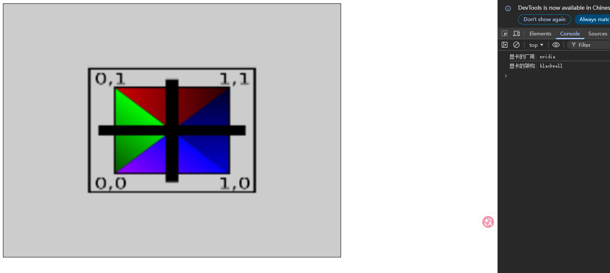
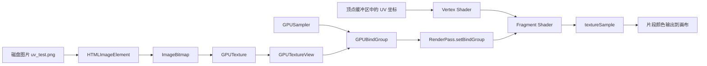
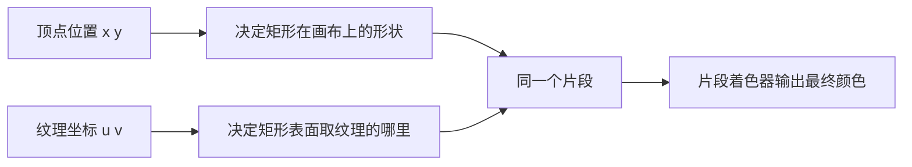
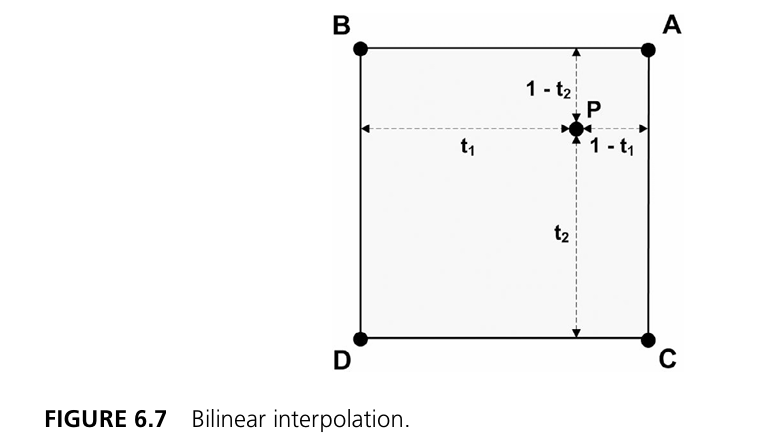
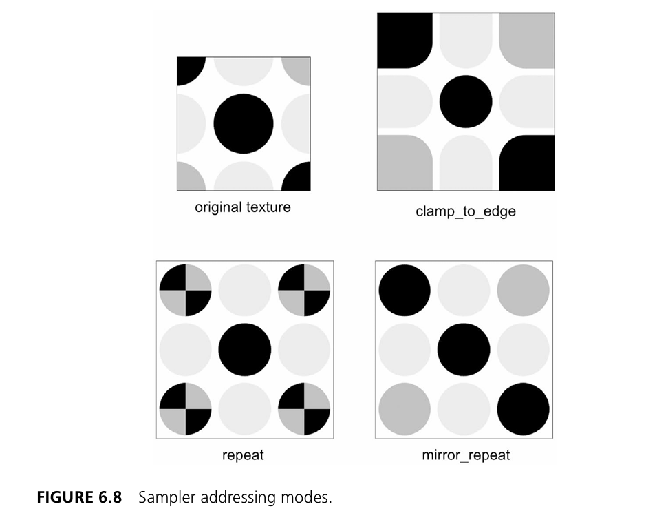
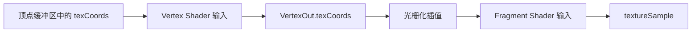
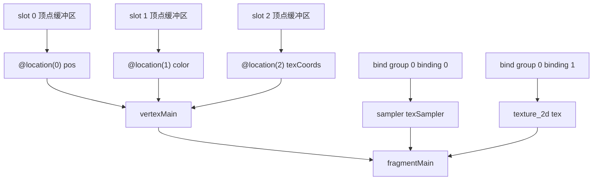

## 1. 这一节我们要做什么？

在前四篇里，我们已经一步一步把 WebGPU 渲染的骨架搭起来了：

- 第 1 篇，我们搭好了开发环境，确认浏览器能跑 WebGPU；
- 第 2 篇，我们拿到了 `GPUCanvasContext`、`GPUAdapter`、`GPUDevice`、`GPUCommandEncoder` 这些基础对象；
- 第 3 篇，我们写出了第一个真正可见的三角形，理解了 `RenderPipeline`、`RenderPass` 与 WGSL 的关系；
- 第 4 篇，我们把顶点数据从 shader 中拿回了 CPU 侧，学会了 `GPUBuffer`、顶点布局和 `setVertexBuffer()`。

到这里，我们已经能画“有几何形状、有顶点颜色”的图元了。对于入门来说，这已经很不错了，因为我们终于不是只在控制台里打印对象，而是真的开始往画布上渲染东西。

但问题也很明显：如果一个矩形只能靠四个顶点颜色去表达画面，那能表现出来的信息其实非常有限。真实项目里，无论是地面、角色、UI 面板，还是按钮图标、字体贴图，几乎都离不开纹理。

换句话说，前面几篇解决的是“把图形画出来”，而这一篇开始解决“把图形画得像点样子”。

所谓纹理（Texture），你可以先把它理解成：

> 一张被上传到 GPU 的图片，片段着色器会在渲染过程中按照 UV 坐标去读取它的颜色。

这一节，我们就正式把“图片”接入渲染流程里。

所以这一节，我们就正式把“图片”接入渲染流程里。本节会完成这些事情：

1. 从本地图片加载纹理；
2. 在 GPU 上创建 `GPUTexture`；
3. 把图片像素复制进纹理资源；
4. 创建 `GPUSampler`，决定纹理如何被采样；
5. 创建 `BindGroupLayout`、`PipelineLayout` 和 `BindGroup`，把采样器与纹理绑到 shader 能访问的位置；
6. 在 WGSL 片段着色器里调用 `textureSample(...)`；
7. 用纹理颜色乘以顶点颜色，渲染出一个贴图矩形。

所以，如果说第 4 篇解决的是：

- **GPU 如何读取顶点数据？**

那么这一篇要解决的就是：

- **GPU 如何读取图片数据？**
- **片段着色器怎样拿到纹理和采样器？**
- **为什么采样器、纹理、绑定组、UV 坐标必须一起出现？**

也就是说，这一篇的重点已经不再只是顶点缓冲区，而是资源系统开始真正扩展开了。本节最核心的主题就是：

> **把一张图片变成 GPU 可采样的纹理资源，并通过绑定组把它送进片段着色器。**

---

## 2. 先看最终效果：这一次我们不再只是画颜色，而是在“贴图”

本节运行结果如下：



如果你和前一篇的结果对比，会立刻发现几个明显差别：

- 几何形状还是那个由两个三角形组成的矩形；
- 但矩形表面不再只是纯顶点色，而是覆盖了一张图片；
- 图片上的黑色十字、四角的颜色块和边缘文字，都被成功绘制到了矩形表面；
- 背景仍然是灰色，说明 `RenderPass` 的清屏逻辑没有变；
- 控制台中依然打印了显卡信息，说明初始化流程沿用了前面的渲染器骨架。

这张图很适合作为本节的“导航图”，因为它一下子把我们想做的事情都暴露出来了。背后实际上同时发生了三件事：

1. 顶点阶段继续负责把矩形顶点送进流水线；
2. 顶点除了位置和颜色之外，又多传了一份 UV 坐标；
3. 片段阶段不再直接返回插值颜色，而是用 UV 去纹理里采样，再和顶点颜色相乘。

所以这一节并不是把上一节推翻重来，而是在上一节“位置 + 颜色”那套链路上，继续补进了“纹理坐标 + 纹理资源 + 采样器”。

---

## 3. 先建立整体图景：纹理是如何进入渲染流程的？

在正式拆代码前，我们先把这条链路看清楚。



这条链路里有几个关键角色：

- **图片文件**：纹理最初的数据来源；
- **`GPUTexture`**：GPU 里真正保存像素数据的资源；
- **`GPUSampler`**：告诉 GPU 该如何“读取纹理”；
- **`GPUBindGroup`**：把纹理和采样器打包后绑定给 shader；
- **UV 坐标**：告诉 shader“去图片的哪个位置采样”。

这里一定要先建立一个正确印象：纹理采样绝不是“有一张图就够了”，而是至少需要这三样东西一起配合：

1. 纹理资源；
2. 采样器；
3. 坐标。

少任何一个，片段着色器都没法完成采样。

---

## 4. 这一节与第 4 篇相比，到底新增了什么？

如果只看 `src/main.ts`，这一节相较于第 4 篇，新增内容主要有六类：

1. 引入了两个新模块：
   - `QuadGeometry`
   - `Texture`

2. 新增了一个顶点缓冲区：
   - `textureBuffer`

3. 新增了两个 GPU 资源概念：
   - `GPUTexture`
   - `GPUSampler`

4. 新增了一整条绑定系统：
   - `BindGroupLayout`
   - `PipelineLayout`
   - `BindGroup`

5. WGSL 顶点输出里新增了一份插值数据：
   - `@location(1) texCoords`

6. 片段着色器开始真正调用：
   - `textureSample(tex, texSampler, fragData.texCoords)`

可以用一句话概括：

> 第 4 篇解决“顶点属性如何进入 shader”，这一篇解决“纹理资源如何进入 shader”。

---

## 5. 本节完整代码

### 5.1 `src/main.ts`

```typescript
// 从shader源代码引入
import shaderSource from "./shaders/shader.wgsl?raw";
import { QuadGeometry } from "./geometry";
import { Texture } from "./texture";

class Renderer {
  private context!: GPUCanvasContext;
  private device!: GPUDevice;
  private pipeline!: GPURenderPipeline;
  private positionBuffer!: GPUBuffer;
  private colorBuffer!: GPUBuffer;
  // 新增 纹理缓冲区
  private textureBuffer!: GPUBuffer;
  // 新增 纹理绑定组
  private textureBindGroup!: GPUBindGroup;
  // 新增 测试用的图像纹理
  private testTexture!: Texture;

  constructor() {}
  
  public async initialize(): Promise<void> {
    if (!navigator.gpu) {
      alert("WebGPU不受支持!");
      return;
    }

    const canvas = document.getElementById('canvas') as HTMLCanvasElement;
    this.context = canvas.getContext('webgpu')!;
    
    if(!this.context) {
      alert("当前画布不支持WebGPU上下文!");
      return;
    }

    const adapter = await navigator.gpu.requestAdapter()!;

    if (!adapter) {
      alert("无法找到合适的适配器(显卡)")
    }

    const info = adapter?.info;
    console.log("显卡的厂商:", info?.vendor);
    console.log("显卡的架构:", info?.architecture);

    this.device = await adapter?.requestDevice()!;
    
    this.context.configure({
      device: this.device,
      format: navigator.gpu.getPreferredCanvasFormat(),
    });

    // 新增 创建纹理
    this.testTexture = await Texture.createTextureFromURL(this.device, "src/assets/uv_test.png");

    // 新增 在CPU侧定义好顶点的相关数据 位置 颜色 与 纹理坐标
    // 使用新封装的  QuadGeometry 类
    const geometry = new QuadGeometry();
    // 直接使用 geometry 对象创建 GPUBuffer
    this.positionBuffer = this.createBuffer(new Float32Array(geometry.positions));
    this.colorBuffer = this.createBuffer(new Float32Array(geometry.colors));
    this.textureBuffer = this.createBuffer(new Float32Array(geometry.texCoords));

    // 新增，准备shader module 着色器模块
    this.prepareModel();
  }

  private createBuffer(data: Float32Array): GPUBuffer {
    const buffer = this.device.createBuffer({
      size: data.byteLength, 
      usage: GPUBufferUsage.VERTEX | GPUBufferUsage.COPY_DST,
      mappedAtCreation: true
    });

    new Float32Array(buffer.getMappedRange()).set(data);
    buffer.unmap();

    return buffer;
  }

  private prepareModel(): void {
    const shaderModule = this.device.createShaderModule({
      code: shaderSource
    });

    const positionBufferLayout: GPUVertexBufferLayout = {
      arrayStride: 2 * Float32Array.BYTES_PER_ELEMENT, // 2 个浮点数 × 每个浮点数 4 字节
      attributes: [
        {
          shaderLocation: 0,  // 这个与vertex shader代码里的 @location(0)对应
          offset: 0,
          format: "float32x2" // 为什么arrayStride定义了这里还要定义
        }
      ],
      stepMode: "vertex"
    };

    const colorBufferLayout: GPUVertexBufferLayout = {
      arrayStride: 3 * Float32Array.BYTES_PER_ELEMENT,
      attributes: [
        {
          shaderLocation: 1,  // 对应vertex shader的@location(1)
          offset: 0,
          format: "float32x3"
        }
      ],
      stepMode: "vertex"
    };

    // 新增 创建纹理坐标布局 也是顶点缓冲
    const textureCoordsLayout: GPUVertexBufferLayout = {
      arrayStride: 2 * Float32Array.BYTES_PER_ELEMENT,
      attributes: [
        {
          shaderLocation: 2,
          offset: 0,
          format: "float32x2"
        }
      ],
      stepMode: "vertex"
    };

    const vertexState: GPUVertexState = {
      module: shaderModule,
      entryPoint: "vertexMain",
      buffers: [
        positionBufferLayout,
        colorBufferLayout,
        textureCoordsLayout
      ]
    };

    const fragmentState: GPUFragmentState = {
      module: shaderModule,
      entryPoint: "fragmentMain",
      targets: [
        {
          format: navigator.gpu.getPreferredCanvasFormat(),
          // 新增 添加混合字段的属性 也就是 fragShader 的 @location(1) 了
          blend: {
            color: {
              srcFactor: "one",
              dstFactor: "one-minus-src-alpha",
              operation: "add"
            },
            alpha: {
              srcFactor: "one",
              dstFactor: "one-minus-src-alpha",
              operation: "add"
            }
          }
        }
      ]
    };

    // 由于纹理使用了binding group 所以需要手动定义布局
    const textureBindGroupLayout = this.device.createBindGroupLayout({
      entries: [
        // 第一个entries的数组元素，对应@binding(0)
        {
          binding: 0,
          visibility: GPUShaderStage.FRAGMENT,
          sampler: {}
        },
        // 第二个entries的数组元素，对应@binding(1)
        {
          binding: 1,
          visibility: GPUShaderStage.FRAGMENT,
          texture: {}
        }
      ]
    }); 
    
    // 新增 对应的管线布局也要手动创建
    const pipelineLayout = this.device.createPipelineLayout({
      bindGroupLayouts: [
        textureBindGroupLayout
      ]
    });

    // 有了管线布局和绑定组布局后才可以创建绑定组
    this.textureBindGroup = this.device.createBindGroup({
      layout: textureBindGroupLayout,
      entries: [
        {
          binding: 0,
          resource: this.testTexture.sampler
        },
        {
          binding: 1,
          resource: this.testTexture.texture.createView()
        }
      ]
    });

    this.pipeline = this.device.createRenderPipeline({
      layout: pipelineLayout,
      vertex: vertexState,
      fragment: fragmentState,
      primitive: {
        topology: "triangle-list"
      }
    });
  }

  public draw() {
    const commandEncoder = this.device.createCommandEncoder();
    const rendePassDescriptor: GPURenderPassDescriptor = {
      colorAttachments: [
        {
          clearValue: { r: 0.8, g: 0.8, b: 0.8, a: 1.0 },
          loadOp: "clear",
          storeOp: "store",
          view: this.context.getCurrentTexture().createView()
        }
      ]
    };

    const passEncoder = commandEncoder.beginRenderPass(rendePassDescriptor);
    // DRAW HERE
    passEncoder.setPipeline(this.pipeline);
    passEncoder.setVertexBuffer(0, this.positionBuffer);
    passEncoder.setVertexBuffer(1, this.colorBuffer);
    passEncoder.setVertexBuffer(2, this.textureBuffer);
    passEncoder.setBindGroup(0, this.textureBindGroup);
    passEncoder.draw(6);

    passEncoder.end();

    const commandBuffer = commandEncoder.finish();
    this.device.queue.submit([commandBuffer]);
  }
}

const renderer = new Renderer();
renderer.initialize().then(() => renderer.draw());
```

### 5.2 `src/geometry.ts`

```typescript
// 新模块 —— geometry模块 封装 图形的 顶点数据：位置、颜色和纹理坐标
export class QuadGeometry {
    public positions: number[];
    public colors: number[];
    public texCoords: number[];

    constructor() {
        this.positions = [
            -0.5, -0.5, // x, y
            0.5, -0.5,
            -0.5, 0.5,
            -0.5, 0.5,
            0.5, 0.5,
            0.5, -0.5
        ];

        this.colors = [
            1.0, 0.0, 1.0,  // r g b 
            0.0, 1.0, 1.0,  // r g b 
            0.0, 1.0, 1.0,  // r g b 
            1.0, 0.0, 0.0,  // r g b 
            0.0, 1.0, 0.0,  // r g b 
            0.0, 0.0, 1.0,  // r g b 
        ];

        this.texCoords = [
            0.0, 1.0, // u, v
            1.0, 1.0,
            0.0, 0.0,
            0.0, 0.0,
            1.0, 0.0,
            1.0, 1.0
        ]
    }
}
```

### 5.3 `src/texture.ts`

```typescript
export class Texture {
    constructor(public texture: GPUTexture, public sampler: GPUSampler) {}

    /**
     * 为 WebGPU 纹理和采样器创建占位纹理
     * @param device 
     * @param image 
     * @returns 
     */
    public static async createTexture(device: GPUDevice, image: HTMLImageElement): Promise<Texture> {
        const texture = device.createTexture({
            size: { width: image.width, height: image.height },
            format: "rgba8unorm",
            usage: GPUTextureUsage.COPY_DST | GPUTextureUsage.TEXTURE_BINDING | GPUTextureUsage.RENDER_ATTACHMENT
        });

        const data = await createImageBitmap(image);

        device.queue.copyExternalImageToTexture(
            { source: data },
            { texture: texture },
            { width: image.width, height: image.height }
        );

        const sampler = device.createSampler({
            magFilter: "linear",
            minFilter: "linear"
        });

        return  new Texture(texture, sampler); 
    }

    /**
     * 从 URL 加载纹理
     * @param device 
     * @param url 
     * @returns 
     */
    public static async createTextureFromURL(device: GPUDevice, url: string) : Promise<Texture>
    {
        const promise = new Promise<HTMLImageElement>((resolve, reject) => {
            const image = new Image();
            image.src = url;
            image.onload = () => resolve(image);
            image.onerror = () => 
            {
                console.error(`Failed to load image ${url}`);
                reject();
            }
        });

        const image = await promise;
        return Texture.createTexture(device, image);
    }
}
```

### 5.4 `src/shaders/shader.wgsl`

```wgsl
struct VertexOut {
    @builtin(position) position: vec4f, // 顶点在裁剪空间中的位置
    @location(0) color: vec4f,
    // 新增 在 fragment shader 的 slot 1 中插入纹理坐标数据
    @location(1) texCoords: vec2f,
}

@vertex
fn vertexMain(
    @location(0) pos: vec2f,    // 顶点的xy坐标
    @location(1) color: vec3f,  // rgb颜色值
    // 新增 在vertex shader 的 slot 2 中插入uv坐标数据，从GPUVertexBufferLayout.attributes.[shaderlocation]里拿到
    @location(2) texCoords: vec2f, // uv坐标数据
) -> VertexOut {
    var output: VertexOut;
    output.position = vec4f(pos, 0.0, 1.0);
    output.color = vec4f(color, 1.0);
    output.texCoords = texCoords;

    return output;
}

// 新增 创建纹理采样器 采样器可以指定 采样的方式，比如 linear 或者 nearest
@group(0) @binding(0)
var texSampler: sampler;
// 新增 创建texture 2d 对象，表示我们自己的纹理对象
@group(0) @binding(1)
var tex: texture_2d<f32>;

// 片段着色器会针对三角形中的每个像素进行调用。
@fragment
fn fragmentMain(fragData: VertexOut) -> @location(0) vec4f {
    // 新增 通过 纹理对象 纹理采样器 以及 坐标 得到每一个纹理像素的颜色
    var textureColor = textureSample(tex, texSampler, fragData.texCoords);
    return fragData.color * textureColor; // 像素的最终颜色
}
```

---

## 6. 这一篇为什么必须单独讲“纹理”和“绑定组”？

很多人第一次学纹理时，会把这件事想得特别简单：

- 有一张 PNG；
- 有一个矩形；
- 把图贴上去；
- 结束。

但真正的 WebGPU 渲染过程比这要细得多。

至少要回答下面几个问题：

1. 这张图片在 CPU 里是以什么形式存在的？
2. 这张图片如何变成 GPU 可访问的资源？
3. GPU 读取图片时，是按最近邻采样，还是线性采样？
4. shader 通过什么机制拿到“纹理 + 采样器”？
5. 一个片段到底采样图片的哪个位置？

你会发现，纹理系统不是单一 API，而是一整套协作机制：

- `GPUTexture` 负责“存图片”；
- `GPUSampler` 负责“定义怎么读图片”；
- `GPUBindGroup` 负责“把这些资源送进 shader”；
- UV 坐标负责“指定采样位置”；
- `textureSample()` 负责“在 shader 里真正取样”。

也正因如此，这一篇虽然表面上是在“加纹理”，实际上是在第一次正式接触：

> **WebGPU 的资源绑定系统。**

---

## 7. 从几何数据说起：为什么这一节先多了一个 `QuadGeometry`？

这一节首先做了一个小但非常重要的结构调整：

```typescript
import { QuadGeometry } from "./geometry";
```

然后在 `initialize()` 里：

```typescript
const geometry = new QuadGeometry();
this.positionBuffer = this.createBuffer(new Float32Array(geometry.positions));
this.colorBuffer = this.createBuffer(new Float32Array(geometry.colors));
this.textureBuffer = this.createBuffer(new Float32Array(geometry.texCoords));
```

和第 4 篇相比，这里最大的变化是：

- 顶点数据不再直接内嵌在 `main.ts` 里；
- 而是被封装成了一个独立的几何模块。

这一步非常合理，因为从这一节开始，顶点属性已经从前一节的两种，变成了三种：

1. 位置；
2. 颜色；
3. 纹理坐标。

如果还把这些数组全部堆在 `main.ts` 里，代码会越来越难读。把它们拆到 `geometry.ts` 中，相当于把“几何描述”和“渲染器逻辑”分层了。

这也是渲染代码逐渐工程化的一个信号。

---

## 8. `QuadGeometry` 到底描述了什么？

我们先看它的数据：

```typescript
this.positions = [
  -0.5, -0.5,
   0.5, -0.5,
  -0.5,  0.5,
  -0.5,  0.5,
   0.5,  0.5,
   0.5, -0.5
];
```

这和上一节一样，仍然是 6 个顶点，组成两个三角形，拼成一个矩形。

颜色数据：

```typescript
this.colors = [
  1.0, 0.0, 1.0,
  0.0, 1.0, 1.0,
  0.0, 1.0, 1.0,
  1.0, 0.0, 0.0,
  0.0, 1.0, 0.0,
  0.0, 0.0, 1.0,
];
```

这说明每个顶点仍然带有一个 RGB 颜色值，所以最终画面并不是“纯纹理颜色”，而是：

- 顶点颜色插值结果；
- 再乘上纹理采样结果。

最后是最关键的新数据：

```typescript
this.texCoords = [
  0.0, 1.0,
  1.0, 1.0,
  0.0, 0.0,
  0.0, 0.0,
  1.0, 0.0,
  1.0, 1.0
];
```

这组数据就是 UV 坐标。

---

## 9. UV 坐标到底是什么？为什么它和顶点位置不是一回事？

这是学纹理时最重要的概念之一。

### 9.1 顶点位置 `(x, y)` 是“这个点画在屏幕哪里”

例如：

```typescript
(-0.5, -0.5)
```

这是裁剪空间中的几何位置，决定的是：

- 这个顶点在画布上的形状位置。

### 9.2 UV 坐标 `(u, v)` 是“这个点对应图片的哪里”

例如：

```typescript
(0.0, 1.0)
```

它决定的不是顶点在屏幕上的位置，而是：

- 这个顶点要取纹理的哪一个位置作为采样参考。

也就是说：

- `x/y` 负责“几何”；
- `u/v` 负责“贴图”。

这两套坐标系统完全不是一回事。

### 9.3 为什么 UV 范围通常在 `0 ~ 1`？

在最常见的二维纹理采样里，WebGPU 采样函数通常使用归一化纹理坐标：

- `u = 0` 表示纹理最左侧；
- `u = 1` 表示纹理最右侧；
- `v = 0` 表示纹理一侧边界；
- `v = 1` 表示纹理另一侧边界。

你的这组数据恰好是把整张图片完整地映射到整个矩形上。

结合本节运行结果图，你会看到：

- 左下顶点对应纹理的一角；
- 右上顶点对应纹理的另一角；
- 中间区域由光栅化和插值自动算出中间的 UV；
- 片段着色器再根据插值得到的 UV 去采样。

---

## 10. 用一张图看懂“几何位置”和“纹理坐标”的分工



这张图其实是在说一件很本质的事：

> 一个片段最终显示成什么颜色，往往是“几何阶段 + 资源阶段”共同决定的。

在本节里：

- 几何阶段让你得到一个矩形；
- 资源阶段让矩形表面出现纹理图案。

---

## 11. 为什么 `initialize()` 一上来就先创建纹理？

在 `initialize()` 里，这句是本节最关键的新增代码之一：

```typescript
this.testTexture = await Texture.createTextureFromURL(this.device, "src/assets/uv_test.png");
```

它的意义可以拆成三层：

1. **说明纹理资源本质上是初始化阶段准备的重对象**  
   和管线、缓冲区一样，纹理不是每帧临时 new 的东西。

2. **说明纹理创建本身是异步的**  
   因为它依赖图片加载。

3. **说明纹理系统被封装到了 `Texture` 类中**  
   `main.ts` 不再直接处理图片加载、位图创建、纹理拷贝、采样器创建等细节。

这和 `QuadGeometry` 一样，也是在做结构分层：

- `geometry.ts` 负责几何数据；
- `texture.ts` 负责纹理资源；
- `main.ts` 负责组装整个渲染流程。

---

## 12. 先补理论：什么是 `GPUTexture`？

在第 4 篇里我们已经讲过，`GPUBuffer` 可以理解为 GPU 上的一段原始线性内存。

而纹理不是普通缓冲区。

补充阅读材料里说得很清楚：

> 纹理资源本质上类似于缓冲区，但由于它们包含图像数据，GPU 会将它们存储在专用的纹理内存中。

也就是说，`GPUTexture` 的本质是：

> GPU 上一块以图像方式组织的资源。

和 `GPUBuffer` 相比，它有几个明显特点：

- 通常按二维或三维维度组织；
- 有明确的像素格式；
- 更适合被 shader 用坐标方式访问；
- 能通过纹理采样硬件做过滤、插值、寻址等操作。

简单说：

- `GPUBuffer` 擅长存“原始数值数据”；
- `GPUTexture` 擅长存“图像/像素数据”。

---

## 13. 纹理从文件进入 GPU，一般要经过哪些步骤？

补充阅读材料把这件事总结得非常好：

1. 从图像文件内容创建 `ImageBitmap`；
2. 调用 `device.createTexture` 创建纹理；
3. 把 `ImageBitmap` 写入纹理；
4. 调用 `device.createSampler` 创建采样器；
5. 把纹理和采样器放进绑定组；
6. 在片段着色器中访问它们。

你的代码正是沿着这条主线写的，只不过在“加载图片”这一步，采用的是：

- `HTMLImageElement`
- 再 `createImageBitmap(image)`

而不是补充材料里举例的：

- `fetch()`
- `response.blob()`
- `createImageBitmap(blob)`

两条路径的本质是一样的：

> 都是在想办法把一张外部图片，转成可被 WebGPU 高效复制到纹理中的位图数据。

---

## 14. `Texture` 类：为什么要专门封装一个纹理工具类？

先看它的构造函数：

```typescript
constructor(public texture: GPUTexture, public sampler: GPUSampler) {}
```

这个设计非常有意思。

它没有只返回纹理，也没有只返回采样器，而是把两者打包在一个对象里。

原因很简单：

- 在 shader 里采样时，纹理和采样器总是成对出现；
- 在绑定组里，它们也总是成对配置；
- 在业务层面，这两者一起才构成“可采样纹理资源”。

所以封装成：

- `texture`
- `sampler`

这两个字段，是非常自然的设计。

---

## 15. `createTextureFromURL()`：先把图片异步加载进来

我们先看这个方法：

```typescript
public static async createTextureFromURL(device: GPUDevice, url: string) : Promise<Texture>
{
    const promise = new Promise<HTMLImageElement>((resolve, reject) => {
        const image = new Image();
        image.src = url;
        image.onload = () => resolve(image);
        image.onerror = () => 
        {
            console.error(`Failed to load image ${url}`);
            reject();
        }
    });

    const image = await promise;
    return Texture.createTexture(device, image);
}
```

这个方法做的事情很朴素：

1. 创建一个 `Image` 对象；
2. 设置 `src` 为目标图片路径；
3. 等待 `onload`；
4. 加载成功后，把 `HTMLImageElement` 交给 `createTexture(...)`；
5. 最终返回封装好的 `Texture` 对象。

### 15.1 为什么它返回的是 `Promise<Texture>`？

因为图片加载本身就是异步的。

只有当浏览器真正把图片资源读进来之后，我们才能知道：

- 图片有没有成功加载；
- 它的 `width` 和 `height`；
- 是否可以继续创建 `ImageBitmap` 和 `GPUTexture`。

所以这里必须是异步。

### 15.2 为什么不直接在 `main.ts` 里写这些逻辑？

当然可以写，但会让 `main.ts` 变得越来越臃肿。

把图片加载封装到 `Texture` 类里以后，`main.ts` 就只需要关心一件事：

```typescript
this.testTexture = await Texture.createTextureFromURL(...)
```

这大大提升了阅读性。

---

## 16. `createTexture()`：真正创建 GPU 纹理资源的地方

现在进入最核心的方法：

```typescript
public static async createTexture(device: GPUDevice, image: HTMLImageElement): Promise<Texture> {
    const texture = device.createTexture({
        size: { width: image.width, height: image.height },
        format: "rgba8unorm",
        usage: GPUTextureUsage.COPY_DST | GPUTextureUsage.TEXTURE_BINDING | GPUTextureUsage.RENDER_ATTACHMENT
    });

    const data = await createImageBitmap(image);

    device.queue.copyExternalImageToTexture(
        { source: data },
        { texture: texture },
        { width: image.width, height: image.height }
    );

    const sampler = device.createSampler({
        magFilter: "linear",
        minFilter: "linear"
    });

    return  new Texture(texture, sampler); 
}
```

虽然方法不长，但它几乎浓缩了“纹理创建”的核心全部流程。

---

## 17. `device.createTexture(...)`：这一步到底创建了什么？

### 17.1 和 `createBuffer(...)` 的关系

如果你已经熟悉第 4 篇，那么这里可以类比理解：

- `createBuffer(...)` 创建的是一块 GPU 缓冲区；
- `createTexture(...)` 创建的是一块 GPU 纹理资源。

二者都是“先创建一个空壳资源”，然后再往里面填数据。

### 17.2 `size`

```typescript
size: { width: image.width, height: image.height }
```

这表示纹理尺寸和图片尺寸一致。

补充材料里提到，`size` 可以写成数组，也可以写成对象。当前代码采用的是对象形式：

- `width`
- `height`

在二维纹理场景下，这是最直观的写法。

### 17.3 `format: "rgba8unorm"`

这是当前纹理像素的格式。

这个字段非常关键，因为它定义了：

- 每个像素有几个通道；
- 每个通道占多少位；
- 数值应该如何解释。

`rgba8unorm` 可以拆成三部分理解：

- `rgba`：有红、绿、蓝、透明度四个分量；
- `8`：每个分量 8 位；
- `unorm`：无符号归一化值，shader 读取时会映射到 `0.0 ~ 1.0`。

这也是最常见、最好理解的一种普通彩色纹理格式。

补充材料里也特别提到，在很多简单应用中，`rgba8unorm` 是最常见的选择。

### 17.4 `usage`

```typescript
usage: GPUTextureUsage.COPY_DST | GPUTextureUsage.TEXTURE_BINDING | GPUTextureUsage.RENDER_ATTACHMENT
```

这和缓冲区的 `usage` 一样，不是在写注释，而是在声明用途。

这三个标志分别表示：

- `COPY_DST`
  - 允许这张纹理作为复制写入目标；
  - 因为后面要用 `copyExternalImageToTexture(...)` 把图片数据写进去。

- `TEXTURE_BINDING`
  - 允许这张纹理被绑定给 shader 作为可采样纹理使用；
  - 没有这个标志，片段着色器就不能把它当纹理读。

- `RENDER_ATTACHMENT`
  - 允许这张纹理作为渲染附件使用；
  - 虽然当前示例没有把它拿来做离屏渲染目标，但这是一种常见且兼容的配置。

补充材料里同样给出了这个组合，并解释了为何常见示例中会同时设置这几个标志。

---

## 18. 为什么在创建纹理后，还要 `createImageBitmap(image)`？

当前代码写的是：

```typescript
const data = await createImageBitmap(image);
```

这一步的作用是：

> 把浏览器图片对象转换成更适合图形管线复制的 `ImageBitmap`。

补充材料里也明确指出，WebGPU 从 `ImageBitmap` 创建纹理是最顺手的路径之一。

### 18.1 为什么不用 `HTMLImageElement` 直接喂给 GPU？

因为真正的 GPU 拷贝 API，例如：

- `copyExternalImageToTexture`

更适合处理的是“外部图像源”的标准化表示，而 `ImageBitmap` 正是这种非常适合图形处理的中间格式。

简单理解：

- `Image` 更偏网页资源加载对象；
- `ImageBitmap` 更偏图形处理对象。

所以当前代码是：

1. 先用 `Image` 负责加载；
2. 再用 `ImageBitmap` 负责进入 GPU 复制流程。

---

## 19. `copyExternalImageToTexture(...)`：真正把像素拷进 GPUTexture

这是整个纹理上传过程的关键一步：

```typescript
device.queue.copyExternalImageToTexture(
    { source: data },
    { texture: texture },
    { width: image.width, height: image.height }
);
```

补充阅读材料里把这个 API 讲得很细。它的核心思想是：

> 从一个“外部图像源”复制像素，到一张 GPU 纹理里。

它有三个参数对象：

1. `source`
2. `destination`
3. `copySize`

在当前代码里，它们分别是：

- `source: data`
  - 即前面创建好的 `ImageBitmap`

- `texture: texture`
  - 即我们刚刚创建的 `GPUTexture`

- `width/height`
  - 即本次拷贝的区域尺寸

### 19.1 为什么不用 `queue.writeTexture(...)`？

补充材料也提到了，纹理写入常见有两种方式：

- `writeTexture`
- `copyExternalImageToTexture`

区别在于数据来源：

- 如果你手里是 `TypedArray`、`ArrayBuffer`，更像是 `writeTexture` 的场景；
- 如果你手里是 `ImageBitmap`、Canvas、VideoFrame 这类“外部图像源”，更适合 `copyExternalImageToTexture`。

当前代码显然属于后者。

---

## 20. 采样器 `GPUSampler`：为什么有纹理了，还不够？

这是很多人第一次接触贴图时最困惑的点。

直觉上，你可能会觉得：

- 纹理里已经有像素了；
- shader 直接读不就行了？

但图形 API 里通常会把“纹理数据”和“采样规则”拆开。

原因是：

> 同一张纹理，可以用不同的方式被读取。

例如：

- 放大时是像素风的最近邻；
- 还是柔和的线性插值；
- 越界时是重复平铺；
- 还是夹紧到边缘；
- 使用哪一级 mipmap；
- 是否做比较采样；
- 是否启用各向异性过滤。

这些规则都不属于“纹理像素本身”，所以它们被独立封装成了采样器 `GPUSampler`。

---

## 21. `device.createSampler(...)`：当前代码选择了什么采样策略？

```typescript
const sampler = device.createSampler({
    magFilter: "linear",
    minFilter: "linear"
});
```

当前代码只设置了两个字段：

- `magFilter`
- `minFilter`

但这两个字段已经足够重要。

### 21.1 `minFilter`

补充材料中的定义是：

> 当采样器访问的区域小于一个纹理单元时，如何获取纹理单元数据。

简单理解，就是纹理被缩小时怎么采样。

### 21.2 `magFilter`

补充材料中的定义是：

> 当采样器访问的区域大于一个纹理单元时，如何获取纹理单元数据。

简单理解，就是纹理被放大时怎么采样。

### 21.3 为什么这里都设成了 `linear`？

因为 `linear` 会让采样结果更加平滑。

和它对应的另一个常见值是：

- `nearest`

两者区别可以这么理解：

- `nearest`
  - 取最近的那个 texel；
  - 结果更硬、更像像素风。

- `linear`
  - 结合周围 texel 做加权平均；
  - 结果更平滑。

这也正好对应补充材料里的过滤理论。

---

## 22. 双线性插值到底是什么意思？

补充阅读材料专门给了一张图来解释：



当采样点不恰好落在单个 texel 的中心，而是落在四个 texel 中间时，就有两种选择：

1. 直接取最近的一个 texel；
2. 结合四个相邻 texel 计算一个混合值。

当选择 `linear` 时，GPU 做的其实就是后一种事。

在二维纹理中，这种基于四邻域的插值就叫：

> **双线性插值（Bilinear Interpolation）**

这张图中的 A、B、C、D 可以理解成四个相邻 texel 的颜色，P 是采样点。  
GPU 会根据 P 在四个 texel 之间的位置比例，求一个加权平均，最终得到比最近邻更平滑的颜色。

所以，当前代码中：

```typescript
magFilter: "linear",
minFilter: "linear"
```

本质上是在告诉 GPU：

> 无论纹理放大还是缩小，都优先采用平滑的插值采样。

---

## 23. 纹理越界时怎么办？补充理解 `addressMode`

虽然当前代码没有显式设置：

- `addressModeU`
- `addressModeV`

但补充材料里专门讲了这一点，所以这一篇一定要补上。

当 shader 访问的 UV 超出了 `0 ~ 1` 范围时，GPU 必须决定“取什么值”。

常见有三种模式：

- `clamp-to-edge`
  - 超出后夹紧到边缘；

- `repeat`
  - 把纹理重复平铺；

- `mirror-repeat`
  - 以镜像方式重复。

补充材料中的示意图如下：



这张图非常值得理解，因为它解释了“纹理寻址模式”的本质：

- 纹理坐标不一定永远只在 `0 ~ 1` 内；
- 一旦超出，采样器就必须根据寻址模式决定如何解释；
- 因此，“采样器”不仅决定过滤方式，还决定越界行为。

当前示例没有主动超出 UV 范围，所以默认行为已经足够。但等后面做纹理平铺、地面材质、滚动 UV 动画时，这些寻址模式就会非常重要。

---

## 24. 为什么这一节还新增了一个 `textureBuffer`？

你在 `Renderer` 里会看到新增字段：

```typescript
private textureBuffer!: GPUBuffer;
```

然后在初始化中：

```typescript
this.textureBuffer = this.createBuffer(new Float32Array(geometry.texCoords));
```

这意味着：

> UV 坐标和位置、颜色一样，也必须先经过顶点缓冲区，才能进入 shader。

这和第 4 篇的思路是一致的：

- 第 4 篇有位置缓冲区和颜色缓冲区；
- 这一篇在此基础上，再新增了纹理坐标缓冲区。

也就是说，顶点现在携带的是三类属性：

1. 位置；
2. 颜色；
3. UV。

---

## 25. `textureCoordsLayout`：为什么纹理坐标也需要顶点布局？

代码如下：

```typescript
const textureCoordsLayout: GPUVertexBufferLayout = {
  arrayStride: 2 * Float32Array.BYTES_PER_ELEMENT,
  attributes: [
    {
      shaderLocation: 2,
      offset: 0,
      format: "float32x2"
    }
  ],
  stepMode: "vertex"
};
```

这和第 4 篇讲过的位置布局，本质完全一样。

原因也一样：

> GPU 只看到字节，不知道这两个 float 是“UV 坐标”。

所以我们必须明确告诉它：

- 每个顶点的 UV 由两个 `float32` 组成；
- 每个顶点记录跨度是 8 字节；
- 从偏移 0 开始读；
- 读出来后要送到 `shaderLocation: 2`。

这就和 WGSL 中的输入：

```wgsl
@location(2) texCoords: vec2f
```

成功接上了。

---

## 26. 为什么顶点着色器输入是 `@location(2)`，输出却变成了 `@location(1)`？

这是本节一个很容易忽略，但必须讲清楚的细节。

在顶点输入里，我们有：

```wgsl
@location(0) pos: vec2f
@location(1) color: vec3f
@location(2) texCoords: vec2f
```

而在 `VertexOut` 里：

```wgsl
@location(0) color: vec4f
@location(1) texCoords: vec2f
```

为什么输入和输出的 location 编号不一样？

因为这两套 `@location` 分别属于两个不同阶段之间的接口：

1. **顶点输入 location**
   - 对应 TypeScript 中 `GPUVertexBufferLayout.attributes.shaderLocation`
   - 表示“从顶点缓冲区读进顶点着色器”

2. **顶点输出 / 片段输入 location**
   - 表示“从顶点着色器传给片段着色器”

这两者虽然都叫 `@location`，但作用域不同。

所以：

- 顶点输入 `@location(2)` 并不要求顶点输出也必须是 `2`；
- 顶点着色器完全可以把输入重新组织后，以新的 location 编号传给片段阶段。

当前代码就是这么做的：

- 顶点输入：
  - `pos` 是 0
  - `color` 是 1
  - `texCoords` 是 2

- 顶点输出：
  - `color` 改为输出到 0
  - `texCoords` 输出到 1

这没有任何问题，只要片段输入和顶点输出匹配即可。

---

## 27. `shader.wgsl`：这一节的 WGSL 到底新增了什么？

这一节的 shader 改动其实可以分成三块：

1. 顶点输入多了 `texCoords`
2. 顶点输出多了 `texCoords`
3. 片段阶段多了 `sampler`、`texture` 和 `textureSample(...)`

下面我们按顺序拆。

---

## 28. `VertexOut`：为什么顶点输出里要多带一份纹理坐标？

```wgsl
struct VertexOut {
    @builtin(position) position: vec4f,
    @location(0) color: vec4f,
    @location(1) texCoords: vec2f,
}
```

这一步的本质是：

> 顶点着色器必须把 UV 坐标从顶点阶段带到片段阶段。

因为真正的纹理采样发生在片段着色器中，而 UV 数据最初来自顶点缓冲区。所以我们必须经过这条链路：



这张图说明了一件非常核心的事：

> 片段着色器并不是直接从顶点缓冲区读取 UV，而是从“光栅化后插值出来的 UV”中读取。

这也是为什么三角形内部每个片段都能拿到自己的采样坐标。

---

## 29. `vertexMain(...)`：这一节顶点着色器做了哪些事？

```wgsl
@vertex
fn vertexMain(
    @location(0) pos: vec2f,
    @location(1) color: vec3f,
    @location(2) texCoords: vec2f,
) -> VertexOut {
    var output: VertexOut;
    output.position = vec4f(pos, 0.0, 1.0);
    output.color = vec4f(color, 1.0);
    output.texCoords = texCoords;

    return output;
}
```

这段逻辑其实非常直白：

- `pos`
  - 转成 `vec4f`，作为裁剪空间位置；

- `color`
  - 补上 alpha 值 `1.0`，变成 `vec4f`；

- `texCoords`
  - 原样透传给片段阶段。

也就是说，顶点着色器在这一节没有做任何复杂变换，它的核心任务是：

> **把顶点属性整理成流水线后续阶段所需的输出格式。**

---

## 30. `@group(0) @binding(0)` 和 `@group(0) @binding(1)`：为什么纹理要靠绑定组进 shader？

片段着色器中新增了两段声明：

```wgsl
@group(0) @binding(0)
var texSampler: sampler;

@group(0) @binding(1)
var tex: texture_2d<f32>;
```

这就是 WebGPU 资源绑定系统第一次真正登场的地方。

### 30.1 什么是 `@group` 和 `@binding`？

你可以这样理解：

- `@group(n)`
  - 指的是第几个绑定组；

- `@binding(m)`
  - 指的是该组中的第几个资源槽位。

也就是说：

- `@group(0) @binding(0)` 表示：
  - 从第 0 号绑定组中，取第 0 号资源。

- `@group(0) @binding(1)` 表示：
  - 从第 0 号绑定组中，取第 1 号资源。

当前代码里，这两个槽位分别对应：

- `binding 0` -> `sampler`
- `binding 1` -> `texture view`

这和后面 TypeScript 里的 `createBindGroup(...)` 是一一对齐的。

---

## 31. 为什么纹理进入 shader 不能靠 `setVertexBuffer()`？

这是理解绑定组的最佳切入点。

`setVertexBuffer()` 适合绑定的是：

- 按顶点逐条读取的数据。

例如：

- 位置；
- 法线；
- 颜色；
- UV。

这些数据的特点是：

- 每个顶点都有一份；
- 在 draw 时按顶点索引逐个推进。

而纹理和采样器不是这种“每个顶点一份”的数据。

它们更像是：

- 当前 draw 调用共享的一份资源；
- 所有片段都可能访问它；
- 访问位置由 UV 决定，而不是由顶点槽位顺序决定。

因此，WebGPU 把这类资源放在另一条通道里管理：

- **绑定组（Bind Group）**

所以一定要建立一个意识：

- 顶点属性走 `setVertexBuffer()`；
- 纹理、采样器、uniform、storage buffer 等共享资源走 `BindGroup`。

---

## 32. `createBindGroupLayout(...)`：先声明“这一组资源长什么样”

代码如下：

```typescript
const textureBindGroupLayout = this.device.createBindGroupLayout({
  entries: [
    {
      binding: 0,
      visibility: GPUShaderStage.FRAGMENT,
      sampler: {}
    },
    {
      binding: 1,
      visibility: GPUShaderStage.FRAGMENT,
      texture: {}
    }
  ]
});
```

这段代码在做的事情，不是“创建资源本身”，而是：

> 先描述一份资源布局合同。

你可以把它理解成：

- 这个绑定组会有几个槽位；
- 每个槽位装的是什么类型；
- 哪个 shader 阶段可以访问它。

### 32.1 第一个 entry

```typescript
{
  binding: 0,
  visibility: GPUShaderStage.FRAGMENT,
  sampler: {}
}
```

表示：

- 槽位编号是 0；
- 这是一个采样器资源；
- 片段阶段可见。

它对应 WGSL：

```wgsl
@group(0) @binding(0)
var texSampler: sampler;
```

### 32.2 第二个 entry

```typescript
{
  binding: 1,
  visibility: GPUShaderStage.FRAGMENT,
  texture: {}
}
```

表示：

- 槽位编号是 1；
- 这是一个纹理资源；
- 片段阶段可见。

它对应 WGSL：

```wgsl
@group(0) @binding(1)
var tex: texture_2d<f32>;
```

---

## 33. `visibility: GPUShaderStage.FRAGMENT` 为什么是片段阶段？

因为当前纹理和采样器只在片段着色器中使用：

```wgsl
var textureColor = textureSample(tex, texSampler, fragData.texCoords);
```

顶点着色器根本没有访问它们。

所以把可见性限制在 `FRAGMENT` 是完全合理的，这既符合资源语义，也让布局更明确。

如果你以后在顶点着色器中采样纹理，或者在多个阶段都要访问，就可以把可见阶段配得更广。

---

## 34. 为什么当前代码手动创建了 `PipelineLayout`，而不是继续用 `layout: "auto"`？

这是这一节非常值得讲清楚的点。

代码写的是：

```typescript
const pipelineLayout = this.device.createPipelineLayout({
  bindGroupLayouts: [
    textureBindGroupLayout
  ]
});
```

然后：

```typescript
this.pipeline = this.device.createRenderPipeline({
  layout: pipelineLayout,
  ...
});
```

### 34.1 这一步的本质是什么？

它是在告诉渲染管线：

> 这条管线会使用哪些绑定组布局。

换句话说，`PipelineLayout` 是更高层级的资源布局描述：

- `BindGroupLayout` 描述“一个组内部的资源结构”；
- `PipelineLayout` 描述“整条管线会用到哪些组”。

### 34.2 这里为什么不继续用 `auto`？

理论上，在一些简单场景下，`layout: "auto"` 也能根据 WGSL 中的 `@group/@binding` 自动推导布局。

但当前代码显式手动创建布局，有两个好处：

1. **教学上更清楚**  
   你能明确看见：
   - shader 里声明了哪些绑定；
   - TypeScript 里如何一一把它们配置出来。

2. **工程上更可控**  
   当多个管线、多个绑定组需要共享布局时，显式创建会更清晰。

所以这里手动写 `BindGroupLayout + PipelineLayout`，非常适合用来理解 WebGPU 绑定系统的基本工作方式。

---

## 35. `createBindGroup(...)`：真正把纹理和采样器装进一个资源组

布局声明好后，接下来才是真正放资源进去：

```typescript
this.textureBindGroup = this.device.createBindGroup({
  layout: textureBindGroupLayout,
  entries: [
    {
      binding: 0,
      resource: this.testTexture.sampler
    },
    {
      binding: 1,
      resource: this.testTexture.texture.createView()
    }
  ]
});
```

这段代码非常关键，因为它终于把：

- JavaScript 里的真实采样器对象；
- JavaScript 里的真实纹理对象；

绑定到了前面那份布局合同上。

### 35.1 为什么 `binding: 0` 放的是 sampler？

因为前面的 `BindGroupLayout` 约定了：

```typescript
binding: 0 -> sampler
```

所以这里必须塞一个 `GPUSampler`。

### 35.2 为什么 `binding: 1` 不是直接放 `texture`，而是 `texture.createView()`？

这个点非常重要。

WebGPU 里 shader 访问的通常不是纹理对象本体，而是：

> **纹理视图（Texture View）**

视图的意义可以理解为：

- 从这张纹理中，以某种特定方式看待它；
- 指定访问哪个 mip 级别、哪个数组层、哪种维度解释方式等。

当前代码直接使用默认：

```typescript
this.testTexture.texture.createView()
```

因为：

- 它就是一张普通二维纹理；
- 不需要特殊的 mip、layer、cube 等配置；
- 默认视图已经够用。

补充阅读材料里也强调了这一点：绑定组通常不是直接持有 `GPUTexture`，而是持有 `texture.createView(...)` 的结果。

---

## 36. `setBindGroup(0, ...)`：为什么在 draw 之前还要再绑定一次？

和顶点缓冲区一样：

- 创建 `BindGroup` 并不代表它已经参与当前 draw；
- 它只是准备好了一组可供绑定的资源。

真正让当前 `RenderPass` 使用这组资源的，是：

```typescript
passEncoder.setBindGroup(0, this.textureBindGroup);
```

这里的 `0` 表示：

- 绑定到第 0 号组位；
- 对应 shader 里的 `@group(0)`。

所以这又形成了一个非常严格的映射：

|TypeScript|WGSL|含义|
|---|---|---|
|`setBindGroup(0, ...)`|`@group(0)`|当前绑定组编号|
|`entries.binding = 0`|`@binding(0)`|采样器槽位|
|`entries.binding = 1`|`@binding(1)`|纹理槽位|

只要这几处编号对应不上，shader 就拿不到正确资源。

---

## 37. 片段着色器里的 `texture_2d<f32>` 是什么意思？

```wgsl
@group(0) @binding(1)
var tex: texture_2d<f32>;
```

它可以拆开理解：

- `texture_2d`
  - 这是二维纹理；

- `<f32>`
  - 表示采样得到的数据按浮点向量来解释。

补充材料里列出了很多纹理类型，例如：

- `texture_1d<T>`
- `texture_2d<T>`
- `texture_3d<T>`
- `texture_cube<T>`

当前示例使用的是最常见的二维颜色纹理，所以 `texture_2d<f32>` 是最合适的类型。

---

## 38. `textureSample(...)`：纹理采样真正发生的地方

片段着色器核心代码只有两行：

```wgsl
var textureColor = textureSample(tex, texSampler, fragData.texCoords);
return fragData.color * textureColor;
```

第一行的意思是：

> 用 `fragData.texCoords` 作为 UV，利用 `texSampler` 去 `tex` 中采样，得到当前位置的纹理颜色。

这里三个参数缺一不可：

1. `tex`
   - 纹理资源；
2. `texSampler`
   - 采样规则；
3. `fragData.texCoords`
   - 采样坐标。

补充阅读材料也明确指出，`textureSample` 是最常用的纹理函数。  
对于普通颜色纹理，它返回的就是 `vec4f`。

---

## 39. 为什么最终返回的是 `fragData.color * textureColor`？

这一句非常值得单独讲：

```wgsl
return fragData.color * textureColor;
```

它说明当前示例不是“只显示纹理”，而是做了一个颜色调制（modulate）：

- 顶点颜色来自几何数据；
- 纹理颜色来自采样；
- 最终颜色是二者逐分量相乘。

这会带来一个效果：

> 顶点颜色会像一层染色滤镜一样影响纹理结果。

也正因如此，最终运行图中，你不仅能看到原图图案，还能看到明显的颜色倾向。

如果这里直接写成：

```wgsl
return textureColor;
```

那么结果就更接近原始纹理本身。

如果写成：

```wgsl
return fragData.color;
```

那就又退回到了上一节的纯顶点色渲染。

所以这行代码刚好很好地展示了：

- 顶点属性；
- 纹理资源；
- 片段着色逻辑；

三者如何共同作用。

---

## 40. 为什么当前 `fragment.targets[0]` 还加了 `blend`？

代码中有这样一段：

```typescript
blend: {
  color: {
    srcFactor: "one",
    dstFactor: "one-minus-src-alpha",
    operation: "add"
  },
  alpha: {
    srcFactor: "one",
    dstFactor: "one-minus-src-alpha",
    operation: "add"
  }
}
```

这一步意味着：

> 当前颜色输出启用了混合（Blending）。

混合的本质是：

> 当前片段颜色，不一定直接覆盖目标颜色，而是按某种规则和已有颜色进行组合。

### 40.1 为什么纹理示例里要提混合？

因为纹理常常带有透明度信息。  
只要你的纹理存在 alpha，或者未来你想让贴图有镂空、半透明、边缘过渡效果，就离不开混合。

虽然当前这段配置写法更像是一个“提前埋好的通路”，但它至少向你说明了一件重要的事：

> 当资源系统开始丰富起来时，片段输出阶段也不再只是“返回一个颜色”那么简单了，它还会和附件中的旧颜色发生混合关系。

这一块后续如果你继续写透明纹理、UI、粒子系统，会频繁遇到。

---

## 41. `draw()` 阶段：这一节真正多了哪两步？

到了 `draw()` 函数，和上一节相比，真正多出来的关键动作只有两类：

```typescript
passEncoder.setVertexBuffer(2, this.textureBuffer);
passEncoder.setBindGroup(0, this.textureBindGroup);
```

这两句分别负责两种不同类型的数据：

### 41.1 `setVertexBuffer(2, this.textureBuffer)`

负责绑定：

- 每顶点一份的 UV 数据。

### 41.2 `setBindGroup(0, this.textureBindGroup)`

负责绑定：

- 当前 draw 共享的一组资源：
  - sampler
  - texture view

这两步放在一起看，就很能体现这一节的本质：一边是按顶点推进的属性输入，一边是整次 draw 共享的资源输入，两条通路现在都被接通了。

---

## 42. 用一张图彻底看懂这一节的资源绑定关系



这张图其实就是本节最关键的总结构：

- 顶点属性走左边三条线；
- 共享资源走右边两条线；
- 最终在 shader 中汇合。

如果你能把这张图在脑子里建立起来，那这一篇最核心的知识就已经真正吃透了。

---

## 43. 这一节和补充阅读材料的对应关系

这次代码和补充材料的对应关系其实很清晰：

### 43.1 创建纹理对象

代码：

```typescript
device.createTexture(...)
```

对应补充材料中的：

- 纹理格式 `format`
- 纹理尺寸 `size`
- 纹理用途 `usage`

### 43.2 将图像写入纹理

代码：

```typescript
device.queue.copyExternalImageToTexture(...)
```

对应补充材料中的：

- `source`
- `destination`
- `copySize`

### 43.3 创建采样器

代码：

```typescript
device.createSampler({
  magFilter: "linear",
  minFilter: "linear"
})
```

对应补充材料中的：

- `magFilter`
- `minFilter`
- 过滤方式与双线性插值

### 43.4 更新绑定组

代码：

```typescript
createBindGroupLayout(...)
createPipelineLayout(...)
createBindGroup(...)
setBindGroup(...)
```

对应补充材料中的：

- `@group`
- `@binding`
- `createView()`
- 绑定组资源访问

### 43.5 片段着色器采样

代码：

```wgsl
textureSample(tex, texSampler, fragData.texCoords)
```

对应补充材料中的：

- `sampler`
- `texture_2d<f32>`
- `textureSample(...)`

所以你可以把这一篇理解成：

> **补充材料“纹理章节”的第一份落地代码实践。**

---

## 44. 容易踩坑的地方

### 44.1 纹理坐标和顶点位置混淆

最常见的误区就是把：

- `(x, y)`
- `(u, v)`

当成同一回事。

一定要记住：

- `x/y` 是几何坐标；
- `u/v` 是纹理坐标。

### 44.2 只创建 `GPUTexture`，却没有 `sampler`

纹理采样通常需要采样器。  
没有采样器，就没有过滤、寻址、比较这些采样规则。

### 44.3 绑定组编号和 shader 编号对不上

例如：

- TS 里 `setBindGroup(0, ...)`
- WGSL 却写 `@group(1)`

那资源就会错位。

### 44.4 `binding` 编号对不上

如果布局里写：

```typescript
binding: 0 -> sampler
binding: 1 -> texture
```

但 shader 里写反了，那么采样器和纹理会被错误解释。

### 44.5 直接把 `GPUTexture` 塞进 `resource`

绑定组里通常要传的是：

```typescript
texture.createView()
```

而不是纹理本体。

### 44.6 忘了给纹理加 `TEXTURE_BINDING`

如果 `usage` 没有声明纹理可被 shader 绑定采样，那么后续使用会报错。

### 44.7 忘了给纹理加 `COPY_DST`

如果你还要把图片数据复制进去，就必须允许它作为复制目标。

### 44.8 `shaderLocation: 2` 和 `@location(2)` 不匹配

UV 顶点缓冲区布局与 WGSL 输入必须严格一致。

---

## 45. 从 API 角度回看：这一节真正掌握了哪些新能力？

到这里，你实际上已经掌握了 WebGPU 纹理采样的完整最小链路：

### 45.1 纹理资源创建

- `GPUDevice.createTexture()`

用于在 GPU 上创建纹理资源。

### 45.2 外部图像复制

- `createImageBitmap(...)`
- `GPUQueue.copyExternalImageToTexture(...)`

用于把浏览器图片数据写入 GPUTexture。

### 45.3 采样器创建

- `GPUDevice.createSampler()`

用于定义纹理读取方式。

### 45.4 绑定布局与资源绑定

- `createBindGroupLayout()`
- `createPipelineLayout()`
- `createBindGroup()`
- `setBindGroup()`

用于把采样器和纹理送进 shader。

### 45.5 WGSL 纹理访问

- `sampler`
- `texture_2d<f32>`
- `textureSample(...)`

用于在片段着色器中真正读取纹理颜色。

### 45.6 新的顶点属性类型

- UV 顶点缓冲区
- `shaderLocation: 2`
- `@location(2) texCoords`

用于把纹理坐标传到片段阶段。

这意味着，从这一节开始，你已经不再只是“会画彩色图元”，而是已经真正进入了“资源驱动渲染”的阶段。

---

## 46. 总结

这一节的表面结果，是在矩形上贴了一张图。  
但从 WebGPU 学习路径的角度看，它真正完成的是一次非常关键的跃迁：

- 从“只有顶点属性输入”
- 进化到“既有顶点输入，也有绑定资源输入”。

如果你把这一节完整吃透，至少应该把下面这些结论留在脑子里：

1. 纹理不是普通数组，而是 GPU 上专门存放图像数据的 `GPUTexture`；
2. 图片进入 GPU 前，通常需要先转成适合图形复制的 `ImageBitmap`；
3. `createTexture()` 负责创建空纹理资源，`copyExternalImageToTexture()` 负责把像素真正拷进去；
4. 采样器 `GPUSampler` 不存图片本身，而是定义“如何读图片”；
5. `linear` 过滤的本质是通过周围 texel 做插值，而不是只取最近 texel；
6. UV 坐标和顶点位置完全不是一回事，前者决定采样位置，后者决定几何位置；
7. 顶点属性通过 `setVertexBuffer()` 进入 shader，而纹理和采样器通过 `BindGroup` 进入 shader；
8. `BindGroupLayout` 描述资源结构，`PipelineLayout` 描述整条管线会使用哪些绑定组；
9. 绑定组中纹理通常要以 `texture.createView()` 的形式提供；
10. `textureSample(texture, sampler, uv)` 是片段着色器采样普通二维纹理的核心函数；
11. 当前示例并不是“只显示纹理”，而是把顶点颜色和纹理颜色相乘后输出；
12. 这一篇第一次真正把 WebGPU 的资源绑定系统带进了渲染主线。

到了这里，你的渲染器就不再只是“能画个带颜色的矩形”，而是真的开始具备最基础的贴图能力了。

顺着这条路继续往后走，通常会自然通向两个方向：

- 使用 **uniform buffer** 控制矩阵变换、时间和参数；
- 使用 **更复杂的绑定组** 组织多个纹理、多个缓冲区，进入真正的材质系统。

当你继续往后写时，就会越来越清楚地看到：

> **顶点缓冲区、纹理、采样器、绑定组、管线布局，这些并不是零散的 API，而是 WebGPU 渲染器的资源组织语言。**
