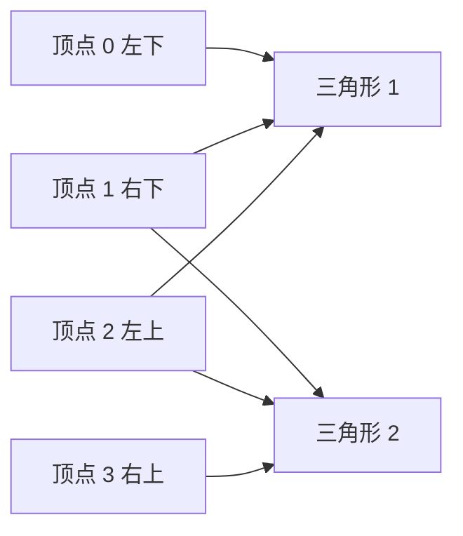
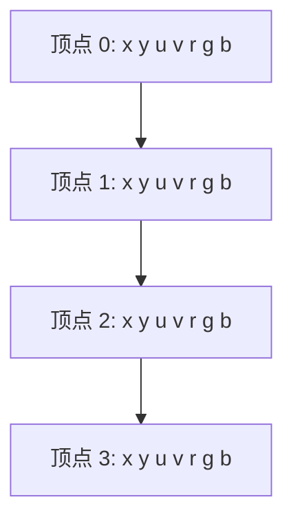
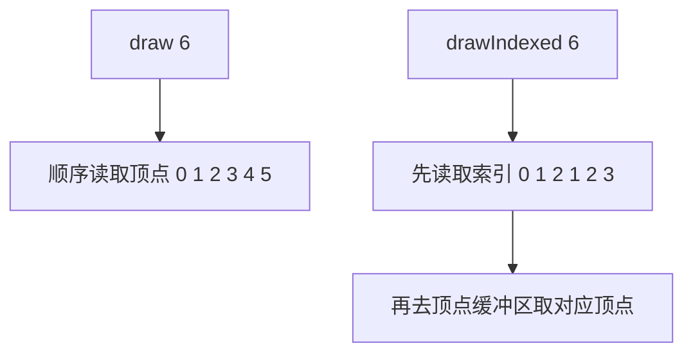

## 1. 这一节我们要做什么？

在上一篇里，我们已经成功把一张纹理贴到了矩形上。那一节最重要的收获，是把一整条“资源进入 shader”的链路跑通了：

- 顶点数据进入顶点着色器；
- 纹理和采样器通过绑定组进入片段着色器；
- 片段着色器通过 `textureSample(...)` 得到纹理颜色；
- 最后输出贴图后的结果。

但如果你回头看上一篇的矩形数据，会发现一个很明显的问题：

我们明明画的是一个矩形，可为了组成两个三角形，却传了 **6 个顶点**。

这 6 个顶点里，有两个顶点其实是重复的：

- 左上角写了两次；
- 右下角也写了两次。

这就引出了这一节真正要解决的问题：

> 当多个三角形共享同一批顶点时，我们能不能不要把顶点数据重复写好几遍？

答案当然是可以，这就是索引缓冲区（Index Buffer）要解决的事。

这一节，我们会做两件关键的升级：

1. 把“矩形的 6 个重复顶点”优化成“4 个唯一顶点 + 6 个索引”；
2. 把顶点数据从上一篇的“多个分离缓冲区”，改造成“单个交错缓冲区”。

也就是说，这一篇表面上是在讲 `Index Buffer`，但其实它同时还完成了另外一个很重要的过渡：

- 从“分离顶点属性存储”
- 过渡到“交错顶点属性存储”。

所以如果说上一篇解决的是：

- **纹理资源如何进入 shader？**

那么这一篇解决的就是：

- **多个三角形如何复用同一批顶点？**
- **为什么 `draw(6)` 在只有 4 个顶点时会报错？**
- **`drawIndexed(...)` 和 `draw(...)` 本质上有什么区别？**

这一节的核心主题可以概括成一句话：

> **用索引缓冲区把“顶点数据”和“顶点连接顺序”分离开。**

---

## 2. 先说结论：索引缓冲区到底解决了什么问题？

我们先不看 API，先看本质。

画一个矩形，最直观的方式是拆成两个三角形：

- 三角形 1：左下、右下、左上
- 三角形 2：右下、左上、右上

如果你直接按三角形顺序把顶点一股脑塞进顶点缓冲区，就会得到 6 个顶点：

```text
v0, v1, v2, v1, v2, v3
```

其中：

- `v1` 被写了两次；
- `v2` 也被写了两次。

如果图形很复杂，比如一个模型有成千上万个三角形，那这种重复会非常夸张。

索引缓冲区的思路就是：

1. 先只存“唯一顶点”；
2. 再单独存一份“这些顶点应该按什么顺序组装成三角形”。

于是矩形就可以写成：

- 顶点缓冲区：4 个顶点
- 索引缓冲区：`0, 1, 2, 1, 2, 3`

这样 GPU 在绘制时，就会按索引去取顶点，而不是按顶点缓冲区的自然顺序一路读下去。

---

## 3. 为什么这件事很重要？

索引缓冲区最直接的意义有三个：

### 3.1 减少顶点重复

这是最显而易见的好处。

对于矩形这种简单图形，少两个顶点似乎没什么。但在真实模型里，一个顶点往往不只包含：

- 位置；
- 颜色；
- UV。

它还可能包含：

- 法线；
- 切线；
- 骨骼权重；
- 多套 UV；
- 自定义属性。

这时候每重复一个顶点，代价就比你想象的大得多。

### 3.2 降低数据传输量

重复顶点越少，上传到 GPU 的数据就越少。

### 3.3 更符合真实模型的数据组织方式

大部分 3D 模型文件天然就是：

- 一份顶点列表；
- 一份索引列表。

也就是说，索引缓冲区不是“额外技巧”，而是工程常态。

---

## 4. 这一节和上一篇相比，代码结构发生了什么变化？

这一节的变化其实很集中，主要有四件事：

1. `Renderer` 不再维护三个顶点缓冲区：
   - `positionBuffer`
   - `colorBuffer`
   - `textureBuffer`

   而是改成：
   - `verticesBuffer`
   - `indexBuffer`

2. `geometry.ts` 不再分别存：
   - `positions`
   - `colors`
   - `texCoords`

   而是改成：
   - `vertices`
   - `inidices`

3. 新增了 `buffer-util.ts`
   - 专门创建顶点缓冲区和索引缓冲区。

4. 绘制调用从：
   - `draw(6)`

   改成了：
   - `setIndexBuffer(...)`
   - `drawIndexed(6)`

一句话总结：

> 上一篇是“直接按顺序喂 6 个顶点”；这一篇是“喂 4 个顶点，再用 6 个索引告诉 GPU 怎么拼”。 

---

## 5. 本节完整代码

### 5.1 `src/main.ts`

```typescript
import shaderSource from "./shaders/shader.wgsl?raw";
import { QuadGeometry } from "./geometry";
import { Texture } from "./texture";
import { BufferUtil } from "./buffer-util";

class Renderer {
  private context!: GPUCanvasContext;
  private device!: GPUDevice;
  private pipeline!: GPURenderPipeline;
  private verticesBuffer!: GPUBuffer;
  private indexBuffer!: GPUBuffer;
  private textureBindGroup!: GPUBindGroup;
  private testTexture!: Texture;

  constructor() {}
  
  public async initialize(): Promise<void> {
    if (!navigator.gpu) {
      alert("WebGPU不受支持!");
      return;
    }

    const canvas = document.getElementById('canvas') as HTMLCanvasElement;
    this.context = canvas.getContext('webgpu')!;
    
    if(!this.context) {
      alert("当前画布不支持WebGPU上下文!");
      return;
    }

    const adapter = await navigator.gpu.requestAdapter()!;

    if (!adapter) {
      alert("无法找到合适的适配器(显卡)");
      return;
    }

    const info = adapter?.info;
    console.log("显卡的厂商:", info?.vendor);
    console.log("显卡的架构:", info?.architecture);

    this.device = await adapter?.requestDevice()!;
    
    this.context.configure({
      device: this.device,
      format: navigator.gpu.getPreferredCanvasFormat(),
    });

    //  创建纹理
    this.testTexture = await Texture.createTextureFromURL(this.device, "src/assets/uv_test.png");

    const geometry = new QuadGeometry();
    // 直接使用 geometry 对象创建 GPUBuffer
    this.verticesBuffer = BufferUtil.createVertexBuffer(this.device, new Float32Array(geometry.vertices));
    this.indexBuffer = BufferUtil.createIndexBuffer(this.device, new Uint16Array(geometry.inidices));

    // 新增，准备shader module 着色器模块
    this.prepareModel();
  }

  private prepareModel(): void {
    const shaderModule = this.device.createShaderModule({
      code: shaderSource
    });

    const verticesBufferLayout: GPUVertexBufferLayout =
    {
      arrayStride: 7 * Float32Array.BYTES_PER_ELEMENT, // 2 floats * 4 bytes per float
      attributes: [
        {
          shaderLocation: 0,
          offset: 0,
          format: "float32x2" // 2 floats
        },
        {
          shaderLocation: 1,
          offset: 2 * Float32Array.BYTES_PER_ELEMENT,
          format: "float32x2" // 2 floats
        },
        {
          shaderLocation: 2,
          offset: 4 * Float32Array.BYTES_PER_ELEMENT,
          format: "float32x3" // 3 floats
        }
      ],
      stepMode: "vertex"
    };

    const vertexState: GPUVertexState = {
      module: shaderModule,
      entryPoint: "vertexMain",
      buffers: [
        verticesBufferLayout
      ]
    };

    const fragmentState: GPUFragmentState = {
      module: shaderModule,
      entryPoint: "fragmentMain",
      targets: [
        {
          format: navigator.gpu.getPreferredCanvasFormat(),
          blend: {
            color: {
              srcFactor: "one",
              dstFactor: "one-minus-src-alpha",
              operation: "add"
            },
            alpha: {
              srcFactor: "one",
              dstFactor: "one-minus-src-alpha",
              operation: "add"
            }
          }
        }
      ]
    };

    // 由于纹理使用了binding group 所以需要手动定义布局
    const textureBindGroupLayout = this.device.createBindGroupLayout({
      entries: [
        // 第一个entries的数组元素，对应@binding(0)
        {
          binding: 0,
          visibility: GPUShaderStage.FRAGMENT,
          sampler: {}
        },
        // 第二个entries的数组元素，对应@binding(1)
        {
          binding: 1,
          visibility: GPUShaderStage.FRAGMENT,
          texture: {}
        }
      ]
    }); 
    
    const pipelineLayout = this.device.createPipelineLayout({
      bindGroupLayouts: [
        textureBindGroupLayout
      ]
    });

    // 有了管线布局和绑定组布局后才可以创建绑定组
    this.textureBindGroup = this.device.createBindGroup({
      layout: textureBindGroupLayout,
      entries: [
        {
          binding: 0,
          resource: this.testTexture.sampler
        },
        {
          binding: 1,
          resource: this.testTexture.texture.createView()
        }
      ]
    });

    this.pipeline = this.device.createRenderPipeline({
      layout: pipelineLayout,
      vertex: vertexState,
      fragment: fragmentState,
      primitive: {
        topology: "triangle-list"
      }
    });
  }

  public draw() {
    const commandEncoder = this.device.createCommandEncoder();
    const rendePassDescriptor: GPURenderPassDescriptor = {
      colorAttachments: [
        {
          clearValue: { r: 0.8, g: 0.8, b: 0.8, a: 1.0 },
          loadOp: "clear",
          storeOp: "store",
          view: this.context.getCurrentTexture().createView()
        }
      ]
    };

    const passEncoder = commandEncoder.beginRenderPass(rendePassDescriptor);
    // DRAW HERE
    passEncoder.setPipeline(this.pipeline);
    // 设置索引缓冲区
    passEncoder.setIndexBuffer(this.indexBuffer, "uint16");
    passEncoder.setVertexBuffer(0, this.verticesBuffer);
    passEncoder.setBindGroup(0, this.textureBindGroup);
    // passEncoder.draw(6); 不要直接draw ，不然会报错 requires a larger buffer (168) than the bound buffer size (112) of the vertex buffer at slot 0 with stride 28.
    passEncoder.drawIndexed(6); // draw 3 vertices

    passEncoder.end();

    const commandBuffer = commandEncoder.finish();
    this.device.queue.submit([commandBuffer]);
  }
}

const renderer = new Renderer();
renderer.initialize().then(() => renderer.draw());
```

### 5.2 `src/geometry.ts`

```typescript
export class QuadGeometry {
    public vertices: number[];
    public inidices: number[];

    constructor() {
        // 交错缓冲区
        this.vertices = [
            // x y          u v          r g b
            -0.5, -0.5,     0.0, 1.0,    1.0,1.0,1.0,
            0.5, -0.5,      1.0, 1.0,    1.0,1.0,1.0,
            -0.5, 0.5,      0.0, 0.0,    1.0,1.0,1.0,
            0.5, 0.5,       1.0, 0.0,    1.0,1.0,1.0,
        ];

        // 索引缓冲区，这样我们就可以复用顶点，只用4个顶点组成矩形，而不是6个
        this.inidices = [
            0, 1, 2,
            1, 2, 3,
        ];
    }

}
```

### 5.3 `src/buffer-util.ts`

```typescript
export class BufferUtil {
    public static createVertexBuffer(device: GPUDevice, data: Float32Array): GPUBuffer {
        const buffer = device.createBuffer({
            size: data.byteLength,
            usage: GPUBufferUsage.VERTEX | GPUBufferUsage.COPY_DST,
            mappedAtCreation: true
        });

        new Float32Array(buffer.getMappedRange()).set(data);
        buffer.unmap();

        return buffer;
    }

    // 创建索引缓冲区
    public static createIndexBuffer(device: GPUDevice, data: Uint16Array): GPUBuffer {

        const buffer = device.createBuffer({
            size: data.byteLength,
            usage: GPUBufferUsage.INDEX | GPUBufferUsage.COPY_DST,
            mappedAtCreation: true
        });

        new Uint16Array(buffer.getMappedRange()).set(data);
        buffer.unmap();

        return buffer;

    }
}
```

### 5.4 `src/shaders/shader.wgsl`

```wgsl
struct VertexOut {
    @builtin(position) position: vec4f,
    @location(0) texCoords: vec2f,
    @location(1) color: vec4f,
}

@vertex 
fn vertexMain(
    @location(0) pos: vec2f,  // xy
    @location(1) texCoords: vec2f, // uv
    @location(2) color: vec3f,  // rgb
) -> VertexOut 
{ 
   
    var output : VertexOut; 

    output.position = vec4f(pos, 0.0, 1.0);
    output.texCoords = texCoords;
    output.color = vec4f(color, 1.0);

    return output;
}

@group(0) @binding(0)
var texSampler: sampler;

@group(0) @binding(1)
var tex: texture_2d<f32>;


@fragment
fn fragmentMain(fragData: VertexOut ) -> @location(0) vec4f 
{
    var textureColor = textureSample(tex, texSampler, fragData.texCoords);
    return fragData.color * textureColor;
}
```

---

## 6. 先看最显眼的变化：为什么 `Renderer` 里只剩一个顶点缓冲区了？

上一篇的 `Renderer` 里，你还记得有三块顶点缓冲区：

- `positionBuffer`
- `colorBuffer`
- `textureBuffer`

而这一节变成了：

```typescript
private verticesBuffer!: GPUBuffer;
private indexBuffer!: GPUBuffer;
```

这说明顶点数据的组织方式已经发生了变化。

上一节采用的是**分离缓冲区**：

- 位置一块；
- UV 一块；
- 颜色一块。

而这一节采用的是**交错缓冲区**：

- 同一个顶点的所有属性放在一起。

也就是说，顶点缓冲区里每一条记录都长这样：

```typescript
[x, y, u, v, r, g, b]
```

所以现在只需要一个 `verticesBuffer`，就能同时承载：

- 几何位置；
- 纹理坐标；
- 顶点颜色。

---

## 7. 为什么这一节要顺手切到“交错缓冲区”？

因为索引缓冲区和交错缓冲区放在一起讲，特别顺。

理由有两个：

### 7.1 它们都在朝“真实工程数据组织方式”靠近

前面几篇为了教学清晰，代码结构都比较拆开：

- 先拆位置和颜色；
- 再拆颜色和 UV；
- 这样每一步都更容易看懂。

但真实项目里，顶点属性更常见的写法就是交错存储。

### 7.2 一旦开始做“顶点复用”，交错缓冲区更自然

因为你复用的是“整个顶点”，而不是只复用：

- 位置；
- 或颜色；
- 或 UV。

顶点本来就是一个整体记录，所以在同一块缓冲区里组织起来，会更符合索引缓冲区的使用方式。

---

## 8. `geometry.ts`：当前顶点数据到底长什么样？

```typescript
this.vertices = [
    // x y          u v          r g b
    -0.5, -0.5,     0.0, 1.0,    1.0,1.0,1.0,
     0.5, -0.5,     1.0, 1.0,    1.0,1.0,1.0,
    -0.5,  0.5,     0.0, 0.0,    1.0,1.0,1.0,
     0.5,  0.5,     1.0, 0.0,    1.0,1.0,1.0,
];
```

这一段代码非常关键，因为它已经清楚地展示了交错布局的本质。

每个顶点有 7 个 `float`：

1. `x`
2. `y`
3. `u`
4. `v`
5. `r`
6. `g`
7. `b`

而且只存了 4 个唯一顶点：

- 左下
- 右下
- 左上
- 右上

这 4 个顶点就足够描述整个矩形了。

和上一篇相比，最大的变化不是“颜色都改成白色了”，而是：

> 这一节终于把“矩形的几何定义”和“两个三角形的连接关系”彻底分开了。

几何定义在 `vertices` 里，连接关系在后面的 `inidices` 里。

---

## 9. 为什么这里顶点颜色都写成了白色？

你会发现：

```typescript
1.0, 1.0, 1.0
```

被重复写了很多次。

原因很简单，因为片段着色器里仍然保留着这句：

```wgsl
return fragData.color * textureColor;
```

如果顶点颜色是白色 `(1,1,1)`，那和纹理颜色相乘时就相当于“不过滤，不染色”。

因为：

```text
1 * textureColor = textureColor
```

也就是说，这一节想强调的是：

- 索引缓冲区；
- 交错布局；
- `drawIndexed(...)`；

而不是继续强调顶点颜色插值效果。

所以把颜色统一设成白色，是一个很合理的教学选择。这样画面重点会回到：

- 顶点复用；
- 纹理正确采样；
- 数据组织方式的变化。

---

## 10. 真正的新主角：`inidices`

代码如下：

```typescript
this.inidices = [
    0, 1, 2,
    1, 2, 3,
];
```

虽然变量名这里拼成了 `inidices`，但它表达的含义非常明确：

> 这是一组索引值，用来告诉 GPU：应该按什么顺序取顶点。

我们把顶点编号出来：

- `0` -> 左下
- `1` -> 右下
- `2` -> 左上
- `3` -> 右上

那么索引：

```text
0, 1, 2
```

表示第一个三角形：

- 左下
- 右下
- 左上

而：

```text
1, 2, 3
```

表示第二个三角形：

- 右下
- 左上
- 右上

这样就拼成了一个矩形。

---

## 11. 用一张图看懂“顶点缓冲区”和“索引缓冲区”的关系



这张图的重点就是：

- 顶点 1 被两个三角形共用；
- 顶点 2 也被两个三角形共用。

这就是“复用顶点”的具体含义。

也正因如此，我们不需要再像上一篇那样，把：

- 左上角写两遍；
- 右下角写两遍。

---

## 12. `BufferUtil`：为什么这一节把创建缓冲区的逻辑抽成了工具类？

这一节新增了：

```typescript
import { BufferUtil } from "./buffer-util";
```

然后使用：

```typescript
this.verticesBuffer = BufferUtil.createVertexBuffer(...)
this.indexBuffer = BufferUtil.createIndexBuffer(...)
```

这说明现在缓冲区已经不只一种了：

- 顶点缓冲区；
- 索引缓冲区。

把创建逻辑封装起来有两个好处：

### 12.1 职责更清晰

`main.ts` 只需要关心：

- 我要什么缓冲区；
- 传什么数据进去；

而不需要重复写每次的 `createBuffer(...)` 细节。

### 12.2 不同缓冲区的“数据类型 + usage”终于有了明确分工

这一点很关键，因为：

- 顶点缓冲区通常对应 `Float32Array`
- 索引缓冲区通常对应 `Uint16Array` 或 `Uint32Array`

它们的写入视图和用途标志都不一样。

---

## 13. `createVertexBuffer(...)` 和 `createIndexBuffer(...)` 最大的区别是什么？

先看顶点缓冲区：

```typescript
public static createVertexBuffer(device: GPUDevice, data: Float32Array): GPUBuffer
```

它使用：

- `Float32Array`
- `GPUBufferUsage.VERTEX | GPUBufferUsage.COPY_DST`

然后写入时也是：

```typescript
new Float32Array(buffer.getMappedRange()).set(data);
```

再看索引缓冲区：

```typescript
public static createIndexBuffer(device: GPUDevice, data: Uint16Array): GPUBuffer
```

它使用：

- `Uint16Array`
- `GPUBufferUsage.INDEX | GPUBufferUsage.COPY_DST`

写入时也变成：

```typescript
new Uint16Array(buffer.getMappedRange()).set(data);
```

请注意，这里最关键的不同不是“函数名不一样”，而是：

> 索引不是浮点数，而是整数编号。

顶点属性要表示：

- 位置；
- UV；
- 颜色；

这些都适合用浮点数。

但索引表示的是：

- 第几个顶点；

这是编号，天然应该用整数。

---

## 14. 为什么当前代码选择的是 `Uint16Array`？

因为当前顶点数量非常少，只有 4 个。

`Uint16Array` 的单个元素是 16 位无符号整数，足够表示：

- `0`
- `1`
- `2`
- `3`

甚至还能表示到 `65535`。

所以对于小型几何体来说，`uint16` 是很自然的选择。

如果将来模型顶点数更多，超过 `65535`，那就需要用：

- `Uint32Array`

同时在 `setIndexBuffer(...)` 里也要对应改成：

- `"uint32"`

---

## 15. 为什么索引缓冲区的 `usage` 必须是 `GPUBufferUsage.INDEX`？

当前代码里：

```typescript
usage: GPUBufferUsage.INDEX | GPUBufferUsage.COPY_DST
```

这和前面几篇里你看到的 `VERTEX` 用途标志完全是同一个思路。

它的含义是：

- `INDEX`
  - 允许这块缓冲区被当作索引缓冲区绑定给 `setIndexBuffer(...)`

- `COPY_DST`
  - 允许 CPU 侧把数据写进去

如果你不给 `INDEX`，却又拿去做：

```typescript
passEncoder.setIndexBuffer(...)
```

那 WebGPU 会直接报错。

所以一定要建立这个意识：

- `VERTEX` 对应顶点缓冲区；
- `INDEX` 对应索引缓冲区；

虽然它们都是 `GPUBuffer`，但在渲染管线里扮演的身份完全不同。

---

## 16. 这一节最值得注意的变化：顶点布局只剩一个了

上一篇里，我们有：

- 位置布局；
- UV 布局；
- 颜色布局；

而这一节只有一个：

```typescript
const verticesBufferLayout: GPUVertexBufferLayout = { ... }
```

这正是交错缓冲区的直接结果。

因为现在所有顶点属性都放在同一条记录里，所以只需要一个布局对象，就能把整块顶点缓冲区解释清楚。

---

## 17. `arrayStride: 7 * Float32Array.BYTES_PER_ELEMENT` 到底代表什么？

每个顶点一共有 7 个 `float32`：

1. `x`
2. `y`
3. `u`
4. `v`
5. `r`
6. `g`
7. `b`

每个 `float32` 占 4 字节，所以一整个顶点记录宽度就是：

```text
7 × 4 = 28 字节
```

于是：

```typescript
arrayStride: 7 * Float32Array.BYTES_PER_ELEMENT
```

本质上就是：

```typescript
arrayStride: 28
```

它的意思是：

> GPU 读完一个顶点后，下一次要跨 28 个字节，才能走到下一个顶点的开头。

---

## 18. 三个 `attributes`：为什么偏移量分别是 0、8、16？

我们来看当前单个顶点的排列：

```text
[x, y, u, v, r, g, b]
```

### 18.1 位置

```typescript
{
  shaderLocation: 0,
  offset: 0,
  format: "float32x2"
}
```

位置从开头就开始，所以偏移量是 0。

### 18.2 UV

```typescript
{
  shaderLocation: 1,
  offset: 2 * Float32Array.BYTES_PER_ELEMENT,
  format: "float32x2"
}
```

在 UV 之前已经有：

- `x`
- `y`

也就是两个 float，占 8 字节。

所以 UV 从第 8 个字节开始。

### 18.3 颜色

```typescript
{
  shaderLocation: 2,
  offset: 4 * Float32Array.BYTES_PER_ELEMENT,
  format: "float32x3"
}
```

在颜色之前有：

- `x`
- `y`
- `u`
- `v`

一共 4 个 float，占 16 字节。

所以颜色从第 16 个字节开始。

---

## 19. 用一张图把交错布局看透



如果从单个顶点内部再细分：

- 偏移 `0` 开始读 `x y`
- 偏移 `8` 开始读 `u v`
- 偏移 `16` 开始读 `r g b`

这就是交错布局的全部本质。

也正因为第 4 篇已经把：

- `arrayStride`
- `offset`
- `format`
- `shaderLocation`

这些概念讲透了，所以这一节切到交错缓冲区时，理解起来会轻松很多。

---

## 20. WGSL 为什么几乎没变？

你会发现这一节的 WGSL 结构和上一篇非常像：

```wgsl
@vertex 
fn vertexMain(
    @location(0) pos: vec2f,
    @location(1) texCoords: vec2f,
    @location(2) color: vec3f,
) -> VertexOut
```

片段着色器也还是：

```wgsl
var textureColor = textureSample(tex, texSampler, fragData.texCoords);
return fragData.color * textureColor;
```

这其实说明了一个很重要的事实：

> 这一节的重点根本不在 shader 逻辑，而在“CPU 侧如何组织并提交数据”。

shader 并不关心：

- 你是分离缓冲区；
- 还是交错缓冲区；
- 是顺序绘制；
- 还是索引绘制。

shader 只关心一件事：

> 我最终能不能按 `@location` 拿到正确的输入。

这也是图形编程里一个很重要的分层思想：

- shader 关心语义输入；
- CPU 侧负责把资源和布局组织正确。

---

## 21. `setIndexBuffer(this.indexBuffer, "uint16")`：这一句到底做了什么？

这一步是本节最核心的新 API：

```typescript
passEncoder.setIndexBuffer(this.indexBuffer, "uint16");
```

它做了两件事：

1. 告诉当前 `RenderPass`：
   - 接下来绘制要使用哪一块索引缓冲区；

2. 告诉 GPU：
   - 这块索引缓冲区里的每个索引值是什么格式；
   - 当前是 `"uint16"`。

这个格式必须和你创建索引缓冲区时的 TypedArray 对应：

- `Uint16Array` -> `"uint16"`
- `Uint32Array` -> `"uint32"`

如果两边不匹配，GPU 读取出来的索引值就会是错的。

---

## 22. 为什么 `setIndexBuffer(...)` 和 `setVertexBuffer(...)` 要同时存在？

这是理解索引绘制的关键。

在当前 draw 调用里：

```typescript
passEncoder.setIndexBuffer(this.indexBuffer, "uint16");
passEncoder.setVertexBuffer(0, this.verticesBuffer);
passEncoder.drawIndexed(6);
```

这里：

- `setVertexBuffer(...)`
  - 提供“顶点仓库”

- `setIndexBuffer(...)`
  - 提供“取货顺序”

GPU 会先看索引缓冲区里的值，比如：

```text
0, 1, 2, 1, 2, 3
```

然后再去顶点缓冲区里取：

- 第 0 个顶点
- 第 1 个顶点
- 第 2 个顶点
- 第 1 个顶点
- 第 2 个顶点
- 第 3 个顶点

也就是说：

> 索引缓冲区不替代顶点缓冲区，它只是改变了“顶点被读取的顺序与复用方式”。

---

## 23. `draw(6)` 为什么会报错？

代码里有一句非常宝贵的注释：

```typescript
// passEncoder.draw(6); 不要直接draw ，不然会报错 requires a larger buffer (168) than the bound buffer size (112) of the vertex buffer at slot 0 with stride 28.
```

这句话特别值得展开讲，因为它几乎把“顺序绘制”和“索引绘制”的区别一次性讲透了。

### 23.1 `draw(6)` 的含义是什么？

`draw(6)` 的意思是：

> 直接按顺序读取 6 个顶点。

当前顶点缓冲区的 `arrayStride` 是 28 字节，所以如果要顺序读取 6 个顶点，理论上需要：

```text
6 × 28 = 168 字节
```

### 23.2 但当前顶点缓冲区实际有多少字节？

我们只有 4 个顶点，每个顶点 28 字节，所以总共只有：

```text
4 × 28 = 112 字节
```

也就是报错里写的：

- 需要 168
- 实际只有 112

### 23.3 为什么上一篇 `draw(6)` 没问题，这一篇就不行了？

因为上一篇顶点缓冲区里真的有 6 组顶点数据。

而这一篇顶点缓冲区里只有 4 组唯一顶点，剩下那两个“顶点位置”不再通过重复顶点来提供，而是交给索引缓冲区去复用。

所以在这一节里：

- `draw(6)` 是错误的，因为它要求真的存在 6 个顺序顶点；
- `drawIndexed(6)` 才是正确的，因为它表示“绘制 6 个索引项”，而不是“顺序读取 6 个顶点记录”。

---

## 24. `drawIndexed(6)` 到底是什么意思？

它的含义是：

> 根据索引缓冲区，发起一次索引绘制，本次要处理 6 个索引值。

由于索引缓冲区内容是：

```text
0, 1, 2, 1, 2, 3
```

所以 GPU 会执行 6 次“按索引取顶点”的操作，而不是 6 次“按顺序往后读顶点缓冲区”。

这也正是索引绘制和普通绘制最本质的区别：

- `draw(...)`
  - 默认按 0,1,2,3... 顺序往下读顶点；

- `drawIndexed(...)`
  - 按索引缓冲区里给出的值去读顶点。

---

## 25. 用一张图看懂 `draw(...)` 和 `drawIndexed(...)` 的区别



所以你可以把它们理解成：

- `draw` 是“顺序读”
- `drawIndexed` 是“按编号点名读”

后一种方式显然更适合做顶点复用。

---

## 26. 为什么当前 `primitive.topology` 还是 `triangle-list`？

这一节虽然引入了索引缓冲区，但管线里的图元拓扑并没有变：

```typescript
primitive: {
  topology: "triangle-list"
}
```

这是因为：

- 索引缓冲区只改变“取顶点的顺序”；
- 它并不会改变“取到顶点后该怎么组装图元”。

当前依然是：

- 每 3 个顶点组成一个独立三角形。

区别只是，这 3 个顶点不是按顶点缓冲区自然顺序来的，而是按索引缓冲区提供的顺序来的。

---

## 27. 这一节和第 4 篇、第 5 篇之间的关系

这一节其实同时承接了前两篇：

### 27.1 它承接第 4 篇

第 4 篇里，你已经建立了这些概念：

- `GPUBuffer`
- 顶点布局
- `shaderLocation`
- `arrayStride`
- `offset`
- `format`

这一节继续沿用这套体系，只不过把布局从“分离缓冲区”切到了“交错缓冲区”。

### 27.2 它承接第 5 篇

第 5 篇里，你已经建立了：

- UV 坐标
- 纹理
- 采样器
- 绑定组
- `textureSample(...)`

这一节完全保留了那套纹理链路，只是把几何数据从“6 个重复顶点”优化成了“4 个顶点 + 索引”。

所以这一节不是单纯新讲一个 API，而是在原有渲染器上做一次更接近真实工程的数据结构升级。

---

## 28. `BufferUtil` 其实也在暗示一个工程习惯

虽然 `BufferUtil` 很小，但它已经在暗示一个很典型的工程习惯：

> 当资源类型开始增多时，不要把所有缓冲区创建逻辑都堆在 `Renderer` 里。

你现在已经有：

- 顶点缓冲区；
- 索引缓冲区；
- 纹理；
- 采样器；
- 绑定组；

如果未来再加入：

- uniform buffer；
- instance buffer；
- storage buffer；

那继续把所有 `createBuffer(...)` 细节都写在渲染器里，代码会迅速膨胀。

所以这一节把缓冲区创建逻辑独立到工具类里，其实是很自然的第一步。

---

## 29. 容易踩坑的地方

### 29.1 索引缓冲区用错数据类型

如果你创建的是：

```typescript
new Uint16Array(...)
```

那 `setIndexBuffer(...)` 就必须写：

```typescript
"uint16"
```

两边不能错位。

### 29.2 忘了给索引缓冲区加 `GPUBufferUsage.INDEX`

没有这个 usage，索引缓冲区就不能被正确绑定。

### 29.3 误以为有索引缓冲区就不需要顶点缓冲区

索引缓冲区不存顶点数据，它只存编号。

### 29.4 把 `drawIndexed(6)` 理解成“绘制 6 个顶点”

更准确地说，它是：

> 处理 6 个索引项。

这些索引项最终可能只指向 4 个唯一顶点。

### 29.5 交错布局的偏移算错

当前布局里：

- 位置偏移是 0
- UV 偏移是 8
- 颜色偏移是 16

只要算错一个，shader 输入就会整体错位。

### 29.6 继续沿用 `draw(6)`

这是本节最典型的错误，也是当前代码注释里已经明确指出的问题。

因为现在只有 4 个顶点，所以顺序绘制 6 个顶点一定越界。

---

## 30. 从 API 角度回看：这一节新增掌握了哪些能力？

到这里，你实际上又多掌握了一整条非常重要的 WebGPU 能力链：

### 30.1 交错顶点数据组织

- 一个顶点缓冲区中同时放位置、UV、颜色

### 30.2 索引缓冲区创建

- `GPUBufferUsage.INDEX`
- `Uint16Array`

### 30.3 索引缓冲区绑定

- `GPURenderPassEncoder.setIndexBuffer(buffer, format)`

### 30.4 索引绘制

- `drawIndexed(indexCount)`

### 30.5 顶点复用

- 用“顶点列表 + 索引列表”替代“重复顶点”

### 30.6 更接近真实工程的数据组织

- `BufferUtil`
- 交错缓冲区
- 唯一顶点 + 索引连接关系

这意味着，从这一节开始，你已经不仅是在学习“WebGPU 能跑”，而是在逐渐接近：

> **一个真正渲染器在组织几何数据时会采用的方式。**

---

## 31. 总结

这一节表面上只是新增了一块索引缓冲区，但它带来的变化其实非常大。

因为从这一节开始，我们第一次把：

- 顶点数据本身；
- 顶点如何连接成图元；

这两件事彻底拆开了。

也正因为拆开了，GPU 才能：

- 只存一份唯一顶点；
- 再通过索引去反复复用它们。

如果你读完这一节，至少应该真正吃透下面这些结论：

1. 索引缓冲区的作用不是存属性数据，而是存“顶点编号”；
2. `draw(...)` 和 `drawIndexed(...)` 的核心区别，在于是否按索引取顶点；
3. 画一个矩形时，直接顺序绘制通常要 6 个顶点，而索引绘制只需要 4 个唯一顶点；
4. `Uint16Array` 对应 `setIndexBuffer(..., "uint16")`；
5. 索引缓冲区的 `usage` 必须包含 `GPUBufferUsage.INDEX`；
6. 这一节的顶点缓冲区已经从分离存储切换成了交错存储；
7. `arrayStride = 28`、`offset = 0/8/16` 分别对应位置、UV、颜色在单个顶点记录中的布局；
8. `draw(6)` 在当前代码里会报错，是因为它要求顺序读取 6 个顶点，但缓冲区里实际上只有 4 个顶点；
9. `drawIndexed(6)` 才是正确写法，因为它处理的是 6 个索引项，而不是 6 条顺序顶点记录；
10. 索引缓冲区和交错顶点缓冲区，是更接近真实工程的数据组织方式。

到了这里，你的渲染器在“几何数据组织”这一侧，已经比前几篇成熟了很多。

前面几篇是：

- 能画出来；
- 能贴图；

而这一篇开始是：

- 还能更合理地组织顶点数据。

接下来如果继续往后写，最自然的方向通常会是：

- `Uniform Buffer` 和矩阵变换；
- 多个对象的渲染；
- 更复杂的材质和资源绑定；
- 实例化渲染。

到那时候你会越来越清楚，索引缓冲区并不是一个孤立的小知识点，而是整套图形数据结构设计中的关键一环。
