## 1. 这一节我们要做什么？

前面几篇里，我们已经把 WebGPU 渲染器的基础骨架一点一点搭起来了。

- 前几篇解决了初始化、RenderPass、RenderPipeline、顶点缓冲区、纹理、采样器和绑定组；
- 上一篇又进一步把顶点数据改造成了“交错缓冲区 + 索引缓冲区”的形式；
- 到这里为止，我们已经能把一张纹理正确地贴到一个矩形上。

但如果你回头看前面的代码，会发现一个很关键的问题：

> 我们虽然已经能画出东西，但这些东西其实还没有真正“变换”。

所谓“变换”，最直观地说，就是：

- 让物体变大或变小；
- 让物体移动到别的位置；
- 让物体发生旋转；
- 更进一步，还可以让物体按照相机和投影规则显示在屏幕上。

而这些东西，并不是顶点缓冲区天生就能解决的。

原因很简单：

- 顶点缓冲区里存的是每个顶点各自不同的数据；
- 而变换矩阵这种数据，通常是整批顶点共享的一份“统一数据”。

这也正是本节要引出的新主角：

> **Uniform Buffer 统一缓冲区**

这一节我们会做两件特别重要的事：

1. 学会创建和使用 `Uniform Buffer`，把统一数据传给顶点着色器；
2. 学会使用矩阵来变换顶点，让一个本来只是“照原样绘制”的矩形，开始具备真正的空间变换能力。

如果说上一篇解决的是：

- **多个三角形如何复用同一批顶点？**

那么这一篇要解决的就是：

- **为什么变换矩阵不能塞进顶点缓冲区？**
- **Uniform Buffer 到底适合存什么数据？**
- **当前代码里的 `projectionViewMatrix` 是如何一步步影响顶点位置的？**
- **为什么现在的顶点坐标已经开始像“屏幕坐标”而不是“裁剪空间坐标”了？**

本节最核心的主题，可以概括成一句话：

> **把“整批顶点共享的一份矩阵数据”通过 Uniform Buffer 送进顶点着色器，从而真正开始控制对象的显示位置。**

---

## 2. 先从结果和直觉说起：为什么图形渲染一定会走到“变换”这一步？

在图形学里，最原始的做法当然是：

- 直接把顶点坐标写死；
- 然后让 GPU 老老实实按这些坐标画出来。

这在最初几篇教程里完全没问题，因为我们的目标只是：

- 跑通 WebGPU；
- 看见第一个三角形；
- 看见第一个贴图矩形。

但只要你想让渲染器更进一步，问题马上就来了：

- 角色总不能永远写死在画面中央；
- UI 元素总不能全靠手工改每个顶点的位置；
- 如果我想把一个对象放大 2 倍，难道要去改每一个顶点？
- 如果我想让一个物体旋转，难道也要每帧重写所有顶点坐标？

这显然不现实。

所以图形学里更通用的做法是：

1. 顶点保留一个“相对原始形状”；
2. 再通过矩阵去统一变换这些顶点。

你可以先把它理解成：

> 顶点缓冲区负责存“形状本体”，Uniform Buffer 负责存“如何变换这个形状”。

这个思路一旦建立起来，后面的移动、缩放、旋转、相机、投影，甚至 3D 渲染里的 MVP 矩阵，都会顺理成章。

---

## 3. 先补充一个核心概念：什么叫 Uniform？

“Uniform” 这个词，在图形编程里非常形象。

它的含义不是“高级”或者“复杂”，而是：

> **统一的、一致的、不会随着顶点变化而变化的数据。**

这和顶点缓冲区正好相反。

### 3.1 顶点缓冲区适合存什么？

顶点缓冲区存的是：

- 位置；
- 颜色；
- UV；
- 法线；
- 切线；

这些数据的共同特点是：

- **每个顶点都可能不一样。**

### 3.2 Uniform Buffer 适合存什么？

Uniform Buffer 更适合存：

- 变换矩阵；
- 时间；
- 屏幕尺寸；
- 相机参数；
- 光照参数；
- 某个对象统一的颜色或开关。

这些数据的共同特点是：

- **对于一整次 draw 来说，它们通常是一份共享数据。**

这就是为什么本节会把变换矩阵放进 Uniform Buffer，而不是继续放进顶点缓冲区。

---

## 4. 补充阅读里的结论：为什么 Uniform Buffer 是必须的？

阅读材料里对这件事讲得非常清楚：

> 顶点缓冲区存储的是会从一个顶点变化到另一个顶点的属性数据，而 Uniform Buffer 存储的是在顶点与顶点之间保持不变的数据。

这句话值得停下来反复咀嚼一下。

因为它其实是在替你划一条边界：

- 如果数据是“逐顶点变化”的，就放顶点缓冲区；
- 如果数据是“整批顶点共享”的，就应该考虑 Uniform Buffer。

而矩阵正是这种典型的统一数据。

比如当前这一节里，我们有一个矩阵：

- 顶点 0 用它；
- 顶点 1 也用它；
- 顶点 2 也用它；
- 顶点 3 还是用它。

既然一整批顶点都用同一份数据，那它当然不该重复塞进每个顶点记录里。

---

## 5. 阅读材料里的第一个经典示例：旋转正方形

书里的入门示例 `Ch05_RotateSquare` 非常经典，它的渲染结果大概是这样：

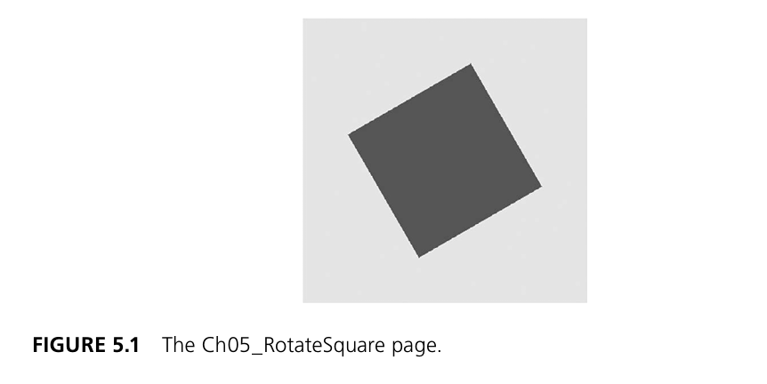

这张图虽然简单，但它特别适合用来说明 Uniform Buffer 的意义。

因为这个正方形之所以能旋转，并不是因为顶点缓冲区里存了“旋转后的坐标”，而是因为：

- 顶点缓冲区只存原始方形的四个顶点；
- 顶点着色器里拿到了一份旋转矩阵；
- 每个顶点在进入后续流水线之前，都先乘了一次这份矩阵。

也就是说：

> 真正让图形“发生变化”的，不是改了几何本体，而是改了变换矩阵。

这是本节最重要的直觉基础。

---

## 6. 先建立整体图景：当前代码里，Uniform 和变换是怎样串起来的？

先把当前代码的数据流画出来：

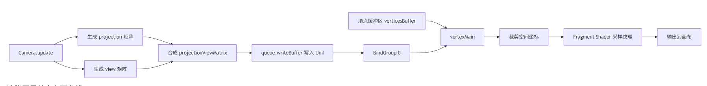

这张图里其实有两条线：

### 6.1 顶点属性线

顶点缓冲区继续提供：

- 位置；
- UV；
- 颜色。

### 6.2 统一数据线

Uniform Buffer 提供：

- `projectionViewMatrix`

两条线在顶点着色器里汇合：

- 顶点属性决定“原始形状是什么样”；
- 矩阵决定“这些顶点最终显示到哪里去”。

这就是当前代码最核心的新结构。

---

## 7. 先看本节完整代码

### 7.1 `src/main.ts`

```typescript
import shaderSource from "./shaders/shader.wgsl?raw";
import { QuadGeometry } from "./geometry";
import { Texture } from "./texture";
import { BufferUtil } from "./buffer-util";
import { Camera } from "./camera";
import { Content } from "./content";

class Renderer {

  private context!: GPUCanvasContext;
  private device!: GPUDevice;
  private pipeline!: GPURenderPipeline;
  private verticesBuffer!: GPUBuffer;
  private indexBuffer!: GPUBuffer;
  private projectionViewMatrixBuffer!: GPUBuffer;

  private projectionViewBindGroup!: GPUBindGroup;
  private textureBindGroup!: GPUBindGroup;

  private camera!: Camera;

  private testTexture!: Texture;

  constructor() {

  }

  public async initialize(): Promise<void> {

    const canvas = document.getElementById("canvas") as HTMLCanvasElement;

    this.camera = new Camera(canvas.width, canvas.height);

    this.context = canvas.getContext("webgpu") as GPUCanvasContext;

    if (!this.context) {
      console.error("WebGPU not supported");
      alert("WebGPU not supported");
      return;
    }

    const adapter = await navigator.gpu.requestAdapter();

    if (!adapter) {
      console.error("No adapter found");
      alert("No adapter found");
      return;
    }

    this.device = await adapter.requestDevice();

    await Content.initialize(this.device);

    this.context.configure({
      device: this.device,
      format: navigator.gpu.getPreferredCanvasFormat()
    });

    this.testTexture = await Texture.createTextureFromURL(this.device, "src/assets/uv_test.png");

    const geometry = new QuadGeometry();

    this.projectionViewMatrixBuffer = BufferUtil.createUniformBuffer(this.device, new Float32Array(16));
    this.verticesBuffer = BufferUtil.createVertexBuffer(this.device, new Float32Array(geometry.vertices));
    this.indexBuffer = BufferUtil.createIndexBuffer(this.device, new Uint16Array(geometry.inidices));

    this.prepareModel();
  }


  private prepareModel(): void {

    const shaderModule = this.device.createShaderModule({
      code: shaderSource
    });

    const positionBufferLayout: GPUVertexBufferLayout =
    {
      arrayStride: 7 * Float32Array.BYTES_PER_ELEMENT, // 2 floats * 4 bytes per float
      attributes: [
        {
          shaderLocation: 0,
          offset: 0,
          format: "float32x2" // 2 floats
        },
        {
          shaderLocation: 1,
          offset: 2 * Float32Array.BYTES_PER_ELEMENT,
          format: "float32x2" // 2 floats
        },
        {
          shaderLocation: 2,
          offset: 4 * Float32Array.BYTES_PER_ELEMENT,
          format: "float32x3" // 3 floats
        }

      ],
      stepMode: "vertex"
    };

    const vertexState: GPUVertexState = {
      module: shaderModule,
      entryPoint: "vertexMain",
      buffers: [
        positionBufferLayout,
      ]
    };

    const fragmentState: GPUFragmentState = {
      module: shaderModule,
      entryPoint: "fragmentMain",
      targets: [
        {
          format: navigator.gpu.getPreferredCanvasFormat(),
          blend: {
            color: {
              srcFactor: "one",
              dstFactor: "one-minus-src-alpha",
              operation: "add"
            },
            alpha: {
              srcFactor: "one",
              dstFactor: "one-minus-src-alpha",
              operation: "add"
            }
          }
        }
      ]
    };

    const projectionViewBindGroupLayout = this.device.createBindGroupLayout({
      entries: [
        {
          binding: 0,
          visibility: GPUShaderStage.VERTEX,
          buffer: {
            type: "uniform"
          }
        }
      ]
    });

    const textureBindGroupLayout = this.device.createBindGroupLayout({
      entries: [
        {
          binding: 0,
          visibility: GPUShaderStage.FRAGMENT,
          sampler: {}
        },
        {
          binding: 1,
          visibility: GPUShaderStage.FRAGMENT,
          texture: {}
        }
      ]
    });

    const pipelineLayout = this.device.createPipelineLayout({
      bindGroupLayouts: [
        projectionViewBindGroupLayout,
        textureBindGroupLayout
      ]
    });

    this.textureBindGroup = this.device.createBindGroup({
      layout: textureBindGroupLayout,
      entries: [
        {
          binding: 0,
          resource: Content.playerTexture.sampler
        },
        {
          binding: 1,
          resource: Content.playerTexture.texture.createView()
        }
      ]
    });

    this.projectionViewBindGroup = this.device.createBindGroup({
      layout: projectionViewBindGroupLayout,
      entries: [
        {
          binding: 0,
          resource: {
            buffer: this.projectionViewMatrixBuffer,
          }
        }
      ]
    });

    this.pipeline = this.device.createRenderPipeline({
      vertex: vertexState,
      fragment: fragmentState,
      primitive: {
        topology: "triangle-list"
      },
      layout: pipelineLayout,
    });

  }

  public draw(): void {

    this.camera.update();

    const commandEncoder = this.device.createCommandEncoder();

    const renderPassDescriptor: GPURenderPassDescriptor = {
      colorAttachments: [
        {
          clearValue: { r: 0.8, g: 0.8, b: 0.8, a: 1.0 },
          loadOp: "clear",
          storeOp: "store",
          view: this.context.getCurrentTexture().createView()
        }
      ]
    };

    const passEncoder = commandEncoder.beginRenderPass(renderPassDescriptor);

    this.device.queue.writeBuffer(
      this.projectionViewMatrixBuffer, 
      0, 
      this.camera.projectionViewMatrix as Float32Array);

    passEncoder.setPipeline(this.pipeline);
    passEncoder.setIndexBuffer(this.indexBuffer, "uint16");
    passEncoder.setVertexBuffer(0, this.verticesBuffer);
    passEncoder.setBindGroup(0, this.projectionViewBindGroup);
    passEncoder.setBindGroup(1, this.textureBindGroup);
    passEncoder.drawIndexed(6);
    passEncoder.end();
    this.device.queue.submit([commandEncoder.finish()]);
  }

}

const renderer = new Renderer();
renderer.initialize().then(() => renderer.draw());
```

### 7.2 `src/camera.ts`

```typescript
import { mat4, type Mat4 } from 'wgpu-matrix'

export class Camera {
    private projection!: Mat4;
    private view!: Mat4

    public projectionViewMatrix: Mat4;

    constructor(public width: number, public height: number) {
        this.projectionViewMatrix = mat4.create();
    }

    public update() {

        this.projection = mat4.ortho(0, this.width, this.height, 0, -1, 1);
        this.view = mat4.lookAt([0, 0, 1], [0, 0, 0], [0, 1, 0]);

        mat4.multiply(this.projection, this.view, this.projectionViewMatrix);
    }
}
```

### 7.3 `src/content.ts`

```typescript
import { Texture } from "./texture";

export class Content 
{
    public static playerTexture: Texture;

    public static async initialize(device: GPUDevice)
    {
        this.playerTexture = await Texture.createTextureFromURL(device, "src/assets/PNG/playerShip1_blue.png");
    }
}
```

### 7.4 `src/buffer-util.ts`

```typescript
export class BufferUtil {

    public static createVertexBuffer(device: GPUDevice, data: Float32Array): GPUBuffer {

        const buffer = device.createBuffer({
            size: data.byteLength,
            usage: GPUBufferUsage.VERTEX | GPUBufferUsage.COPY_DST,
            mappedAtCreation: true
        });

        new Float32Array(buffer.getMappedRange()).set(data);
        buffer.unmap();

        return buffer;
    }

    public static createIndexBuffer(device: GPUDevice, data: Uint16Array): GPUBuffer {

        const buffer = device.createBuffer({
            size: data.byteLength,
            usage: GPUBufferUsage.INDEX | GPUBufferUsage.COPY_DST,
            mappedAtCreation: true
        });

        new Uint16Array(buffer.getMappedRange()).set(data);
        buffer.unmap();

        return buffer;

    }

    public static createUniformBuffer(device: GPUDevice, data: Float32Array): GPUBuffer {
        const buffer = device.createBuffer({
            size: data.byteLength,
            usage: GPUBufferUsage.UNIFORM | GPUBufferUsage.COPY_DST,
        });

        return buffer;
    }

}
```

### 7.5 `src/geometry.ts`

```typescript
export class QuadGeometry {
    public vertices: number[];
    public inidices: number[];

    constructor() {

        const x = 100;
        const y = 100;
        const w = 99;
        const h = 75;

        this.vertices = [
            // x y            u v           r g b 
            x, y,            0.0, 0.0, 1.0, 1.0, 1.0,
            x + w, y,        1.0, 0.0, 1.0, 1.0, 1.0,
            x + w, y + h,    1.0, 1.0, 1.0, 1.0, 1.0,
            x, y + h,        0.0, 1.0, 1.0, 1.0, 1.0,
        ];

        this.inidices = [
            0, 1, 2,
            2, 3, 0
        ];
    }

}
```

### 7.6 `src/shaders/shader.wgsl`

```wgsl
struct VertexOut {
    @builtin(position) position: vec4f,
    @location(0) texCoords: vec2f,
    @location(1) color: vec4f,
}

@group(0) @binding(0)
var<uniform> projectionViewMatrix: mat4x4f;

@vertex 
fn vertexMain(
    @location(0) pos: vec2f,
    @location(1) texCoords: vec2f,
    @location(2) color: vec3f,
) -> VertexOut 
{ 
    var output : VertexOut; 

    output.position = projectionViewMatrix * vec4f(pos, 0.0, 1.0);
    output.texCoords = texCoords;
    output.color = vec4f(color, 1.0);

    return output;
}

@group(1) @binding(0)
var texSampler: sampler;

@group(1) @binding(1)
var tex: texture_2d<f32>;

@fragment
fn fragmentMain(fragData: VertexOut ) -> @location(0) vec4f 
{
    var textureColor = textureSample(tex, texSampler, fragData.texCoords);
    return fragData.color * textureColor;
}
```

---

## 8. 本节最大的结构变化：多了一块 Uniform Buffer

和上一篇相比，`Renderer` 新增了这两个字段：

```typescript
private projectionViewMatrixBuffer!: GPUBuffer;
private projectionViewBindGroup!: GPUBindGroup;
```

这已经非常能说明问题了：

- 前面几篇的重点一直是顶点缓冲区和纹理绑定组；
- 而这一节开始，渲染器要额外维护一块“统一矩阵数据”。

这里的命名也特别直白：

- `projectionViewMatrixBuffer`
  - 说明这块缓冲区里装的不是任意数据，而是“投影矩阵 × 视图矩阵”的结果；

- `projectionViewBindGroup`
  - 说明这块缓冲区也不能直接被 shader 访问，而是一样要通过绑定组进入管线。

所以这节的重点不是“又多了一块缓冲区”这么简单，而是：

> WebGPU 渲染器第一次明确区分出了“逐顶点数据”和“整批共享数据”。

---

## 9. 为什么变换矩阵不适合放进顶点缓冲区？

你完全可以想象一种很笨的写法：

- 每个顶点后面再跟 16 个浮点数；
- 这 16 个浮点数就是 4×4 矩阵；
- 然后每个顶点都重复存一遍。

这当然“理论上能工作”，但几乎毫无意义。

因为对当前这一个矩形来说：

- 顶点 0 用的是这份矩阵；
- 顶点 1 用的还是这份矩阵；
- 顶点 2 和顶点 3 用的也还是它。

也就是说，这 16 个值根本不会逐顶点变化。

这种数据如果硬塞进顶点缓冲区，就会带来两个问题：

1. **重复存储，极其浪费**
2. **语义也不对**

因为顶点缓冲区的职责本来就是存“每个顶点各自不同”的数据。

所以这里引入 Uniform Buffer，完全是顺理成章的。

---

## 10. 阅读材料中的标准流程：Uniform Buffer 一般怎么用？

阅读材料里把 Uniform Buffer 的使用过程概括成了五步：

1. 创建一个 `GPUBuffer`，并把用途标记为 `UNIFORM`；
2. 把数据写入缓冲区；
3. 访问或创建对应的绑定组布局；
4. 创建绑定组，把缓冲区和 binding 值关联起来；
5. 在着色器中通过 `@group` 和 `@binding` 访问它。

你当前的代码，正是沿着这五步来写的。

而这一篇，我们就按照这条主线，一步一步把当前代码拆开。

---

## 11. `BufferUtil.createUniformBuffer(...)`：统一缓冲区是怎么创建的？

代码如下：

```typescript
public static createUniformBuffer(device: GPUDevice, data: Float32Array): GPUBuffer {
    const buffer = device.createBuffer({
        size: data.byteLength,
        usage: GPUBufferUsage.UNIFORM | GPUBufferUsage.COPY_DST,
    });

    return buffer;
}
```

和前面创建顶点缓冲区、索引缓冲区相比，这里最重要的变化有两个：

### 11.1 `usage` 变成了 `UNIFORM | COPY_DST`

这说明：

- 这块缓冲区未来会被当作 Uniform Buffer 使用；
- 并且它允许 CPU 侧通过拷贝方式把数据写进去。

这正好对应了阅读材料里的结论：

> 创建统一缓冲区时，`usage` 应设置为 `GPUBufferUsage.UNIFORM | GPUBufferUsage.COPY_DST`。

### 11.2 它没有 `mappedAtCreation`

这一点尤其值得讲。

前几篇创建顶点缓冲区和索引缓冲区时，用的是：

- `mappedAtCreation: true`
- `getMappedRange()`
- `unmap()`

但这一节的 Uniform Buffer 没这么做。

原因是当前这块缓冲区的使用方式不一样：

- 顶点缓冲区、索引缓冲区通常是初始化阶段写一次；
- 统一缓冲区则很可能在每次绘制前都要更新。

而当前代码里，正是这样做的：

```typescript
this.device.queue.writeBuffer(
  this.projectionViewMatrixBuffer, 
  0, 
  this.camera.projectionViewMatrix as Float32Array);
```

也就是说，这块 uniform 缓冲区的思路是：

- 创建时先留好大小；
- 真正的数据在 draw 之前再写进去。

这其实更符合 Uniform Buffer 的常见使用方式。

---

## 12. 为什么这里是 `new Float32Array(16)`？

当前初始化时写的是：

```typescript
this.projectionViewMatrixBuffer = BufferUtil.createUniformBuffer(this.device, new Float32Array(16));
```

这里的 `16` 很关键。

因为一个 `4x4` 矩阵总共有：

```text
4 × 4 = 16
```

个浮点数。

每个 `float32` 占 4 字节，所以总字节数是：

```text
16 × 4 = 64 字节
```

这也正好和阅读材料里那个典型 Uniform Matrix 示例对上了：

- 16 个浮点数；
- 正好是一份 `mat4x4f`。

所以你现在可以建立一个很重要的映射关系：

- TypeScript 侧：`Float32Array(16)`
- WGSL 侧：`mat4x4f`

---

## 13. `writeBuffer(...)`：为什么统一缓冲区的数据是在 `draw()` 里写入的？

这一节的关键代码在这里：

```typescript
this.device.queue.writeBuffer(
  this.projectionViewMatrixBuffer, 
  0, 
  this.camera.projectionViewMatrix as Float32Array);
```

这行代码的意义非常直接：

> 把当前 `camera` 计算出来的矩阵，写进 Uniform Buffer。

### 13.1 为什么写在 `draw()` 里，而不是 `initialize()` 里？

因为矩阵是“有可能变化”的。

当前代码虽然只画一帧，但结构上已经明显是在为“后续每帧更新”做准备了：

1. `draw()` 一开始先调用 `this.camera.update()`；
2. 再把最新矩阵写进 Uniform Buffer；
3. 然后才开始真正编码并提交 draw 命令。

这说明当前代码的设计思路已经不是：

- “初始化完就永远不变”

而是：

- “在每次绘制前，都允许重新计算和刷新统一数据”

这正是 Uniform Buffer 最常见、最合理的使用场景。

---

## 14. 为什么这次的矩阵是通过 `queue.writeBuffer()` 更新，而不是重新创建缓冲区？

因为缓冲区资源本身不需要每次重建。

你真正变化的是：

- 缓冲区里的内容；

而不是：

- 缓冲区对象这个“容器”本身。

所以 WebGPU 的正确思路通常是：

1. 初始化阶段先创建好 `GPUBuffer`
2. 每帧或每次 draw 前，用 `queue.writeBuffer()` 把最新数据写进去

这比“每次都重新 createBuffer”高效得多，也更符合 GPU 资源管理的思路。

---

## 15. 当前代码里的 `Camera` 到底干了什么？

先看 `camera.ts`：

```typescript
export class Camera {
    private projection!: Mat4;
    private view!: Mat4

    public projectionViewMatrix: Mat4;

    constructor(public width: number, public height: number) {
        this.projectionViewMatrix = mat4.create();
    }

    public update() {

        this.projection = mat4.ortho(0, this.width, this.height, 0, -1, 1);
        this.view = mat4.lookAt([0, 0, 1], [0, 0, 0], [0, 1, 0]);

        mat4.multiply(this.projection, this.view, this.projectionViewMatrix);
    }
}
```

这段代码虽然不长，但信息量非常大。

它说明当前工程已经开始建立一个真正的“相机层”了，而不是像前几篇那样，完全把顶点当裁剪空间坐标硬塞进去。

### 15.1 `projection`

这里使用的是：

```typescript
mat4.ortho(0, this.width, this.height, 0, -1, 1)
```

也就是说，当前使用的是：

> **正交投影（Orthographic Projection）**

### 15.2 `view`

这里使用的是：

```typescript
mat4.lookAt([0, 0, 1], [0, 0, 0], [0, 1, 0])
```

也就是说，当前还构建了一份：

> **视图矩阵（View Matrix）**

### 15.3 `projectionViewMatrix`

最后用：

```typescript
mat4.multiply(this.projection, this.view, this.projectionViewMatrix);
```

把两者合并成一份最终矩阵。

这说明当前代码的目标不是单纯演示“旋转一下”，而是已经开始把：

- 相机；
- 投影；
- 统一矩阵；

这些概念真正接到一起了。

---

## 16. 为什么说当前代码已经不只是“RotateSquare”那么简单？

书里的 `Ch05_RotateSquare` 是一个非常经典的 Uniform 入门例子，但它主要强调的是：

- 通过一份旋转矩阵，让一个正方形旋转。

而你当前这份代码其实更进一步了：

- 它没有手写一份固定旋转矩阵；
- 它引入了 `Camera` 类；
- 它在 `Camera.update()` 里动态计算矩阵；
- 它使用的是 `ortho + lookAt` 的组合；
- 它把顶点从一种“像素式 2D 坐标”变换到最终的裁剪空间。

也就是说：

> 当前代码虽然渲染的还是一个二维精灵，但思路已经很接近一个真正游戏渲染器里的 2D 相机雏形了。

这点非常重要，因为它决定了这篇文章不能只照着书里的“旋转方块”去讲，而要把当前代码真正做的事情讲清楚。

---

## 17. 先补充理论：什么是线性变换？

阅读材料里把最重要的三种线性变换总结得非常清楚：

- 缩放（Scaling）
- 平移（Translation）
- 旋转（Rotation）

它们分别对应：

- 改变物体大小；
- 改变物体位置；
- 改变物体朝向。

这些变换的共同点是：

> 都可以通过矩阵和顶点坐标相乘来实现。

这就是为什么顶点着色器里最经典的一句代码，总是长得像：

```wgsl
matrix * vec4f(position, 0.0, 1.0)
```

因为在图形学里，矩阵就是用来批量变换顶点的。

---

## 18. 缩放、平移、旋转分别是什么意思？

### 18.1 缩放（Scaling）

缩放最容易理解，就是让对象变大或变小。

阅读材料里的示意图如下：

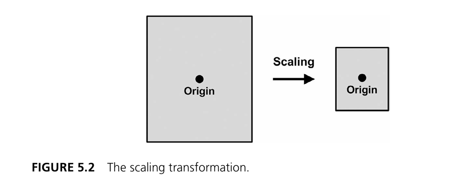

如果一个对象以原点为中心，那么缩放只会改变它的大小。  
如果对象不在原点，缩放除了改变大小，也会连带影响它到原点的距离。

### 18.2 平移（Translation）

平移就是移动，不改变形状本身。

示意图如下：

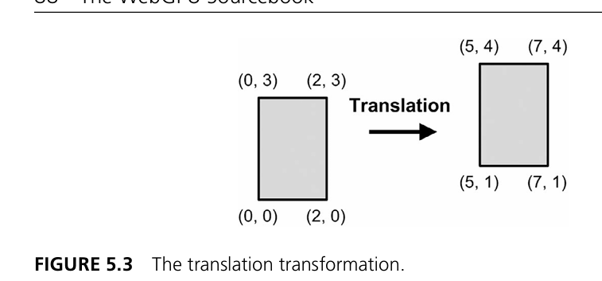

它本质上是在告诉你：

- x 方向挪多少；
- y 方向挪多少；
- z 方向挪多少。

### 18.3 旋转（Rotation）

旋转就是围绕某个轴转动。

示意图如下：

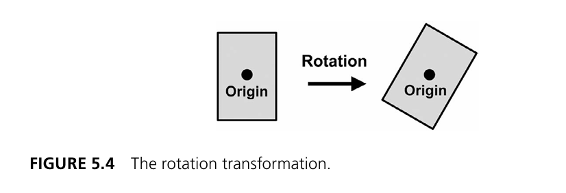

阅读材料里还特别强调了一点：

> 旋转从直觉上很好理解，但手算矩阵值会比较麻烦。

所以实际开发中，通常不会手写每一个矩阵元素，而是直接借助 `wgpu-matrix` 这样的数学库来生成矩阵。

---

## 19. `wgpu-matrix`：为什么当前代码里突然出现了这个库？

`camera.ts` 的第一行就是：

```typescript
import { mat4, type Mat4 } from 'wgpu-matrix'
```

这说明当前项目已经引入了 `wgpu-matrix`。

这非常合理，因为一旦进入变换阶段，手写矩阵会迅速变得又麻烦又容易错。

阅读材料里也专门把 `wgpu-matrix` 拿出来讲了，并列出了一批常用 API：

- `uniformScaling`
- `scaling`
- `translation`
- `rotationX/Y/Z`
- `mul`
- `lookAt`
- `ortho`
- `frustum`
- `perspective`

这些函数的共同特点是：

> 最终都会返回一个适合写入 Uniform Buffer 的 `Float32Array` 风格矩阵数据。

当前代码虽然只用了：

- `ortho`
- `lookAt`
- `multiply`

但它的思路和书里的变换章节是一脉相承的。

---

## 20. 为什么当前 `geometry.ts` 里的顶点坐标变成了 `100, 100` 这种数字？

这个变化非常值得单独讲清楚。

上一节里，你看到的顶点大多还是类似：

- `-0.5`
- `0.5`

这样的裁剪空间风格坐标。

而现在变成了：

```typescript
const x = 100;
const y = 100;
const w = 99;
const h = 75;
```

然后顶点数据变成：

```typescript
x, y
x + w, y
x + w, y + h
x, y + h
```

这说明：

> 当前代码里的几何坐标已经不再直接写成裁剪空间坐标，而更像是“屏幕/画布上的像素坐标”。

为什么可以这么干？

因为当前相机使用了：

```typescript
mat4.ortho(0, this.width, this.height, 0, -1, 1)
```

这个正交投影矩阵，正是用来把这种“屏幕式坐标”转换到 GPU 最终可接受的裁剪空间。

所以当前代码其实已经在做一件很典型的 2D 游戏开发工作：

> 你在 CPU 侧用比较自然的屏幕坐标摆放精灵，再由相机矩阵统一把它们变换成 GPU 需要的坐标系。

---

## 21. 这次的正交投影到底在干嘛？

当前代码：

```typescript
this.projection = mat4.ortho(0, this.width, this.height, 0, -1, 1);
```

如果只看函数名，可能还没有那么直观。

但你可以把它理解成：

> 把一个“左上角是 `(0,0)`，右下角是 `(width,height)`”的二维画布区域，映射成 WebGPU 最终需要的裁剪空间。

这会带来一个非常实用的结果：

- 你写 `x = 100`
- `y = 100`

它就真的会更像“离画布左上角 100 像素的位置”，而不是你还要手动去换算到 `-1 ~ 1`。

对 2D 渲染来说，这样的思路非常舒服。

---

## 22. 阅读材料中的正交投影和透视投影

书里对“视图区域”给了一张非常重要的图：

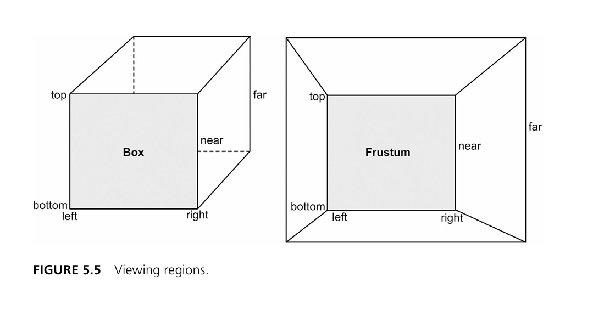

左边是盒子形的区域，右边是截锥体。

这两种区域对应两种不同的投影：

### 22.1 正交投影（Orthographic）

- 像盒子；
- 远近不改变物体显示大小；
- 很适合 2D、编辑器、UI、地图之类的场景。

### 22.2 透视投影（Perspective）

- 像截锥体；
- 近大远小；
- 很适合真实 3D 视角。

当前代码选择的是：

- `ortho`

这就说明它更偏向：

- 2D 画面；
- 精灵渲染；
- 屏幕坐标摆放。

这和当前代码渲染一艘飞船精灵的目标非常一致。

---

## 23. `lookAt(...)`：为什么 2D 渲染里还要有视图矩阵？

当前代码写的是：

```typescript
this.view = mat4.lookAt([0, 0, 1], [0, 0, 0], [0, 1, 0]);
```

如果你第一次看到，可能会觉得奇怪：

> 明明是个二维精灵，为什么还要搞 `lookAt`？

原因是：当前代码虽然是 2D 结果，但它依然沿用了图形学里很标准的“相机”表达方式。

这里的含义是：

- 观察者在 `(0, 0, 1)`
- 看向 `(0, 0, 0)`
- 向上方向是 `(0, 1, 0)`

这等于是给场景设定了一个很基础、很稳定的观察方式。

所以你可以把当前 `Camera` 理解成：

> 一个非常轻量、非常基础的 2D 相机壳子，但它使用的是标准的 3D 图形学矩阵语言。

这会让你后面继续升级到：

- 世界坐标；
- 相机移动；
- 跟随视角；
- 透视投影；

的时候非常自然。

---

## 24. 为什么当前代码里只有 `projectionViewMatrix`，没有完整 MVP？

这也是本节最应该讲透的地方之一。

阅读材料里讲了完整的三套变换：

- 模型变换（Model）
- 视图变换（View）
- 投影变换（Projection）

也就是经典的 MVP。

但当前代码只有：

```typescript
projectionViewMatrix
```

为什么？

因为当前这个例子还没有显式拆出单独的模型矩阵。

换句话说：

- 当前矩形的位置已经直接写在 `geometry.ts` 里了；
- `x = 100`、`y = 100` 已经把它放到了画布某个位置；
- 所以当前示例没有再额外做“模型变换”这一步。

因此这一节更准确地说，是：

> 先把 View 和 Projection 接起来，再让顶点着色器学会吃一份统一矩阵。

这比一步上完整 MVP 更平滑，也更适合作为当前系列文章的承接点。

---

## 25. 用一张图看懂当前代码里的坐标流转

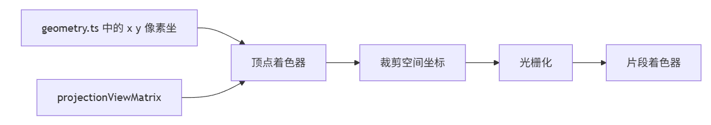

这张图特别关键，因为它说明：

- 当前几何数据不是最终显示坐标；
- 它只是“待变换的输入”；
- 真正把它送进 GPU 裁剪空间的，是矩阵乘法。

---

## 26. `shader.wgsl`：Uniform Buffer 在 shader 里是怎么声明的？

当前 WGSL 最关键的新代码就是这一句：

```wgsl
@group(0) @binding(0)
var<uniform> projectionViewMatrix: mat4x4f;
```

这句话可以拆成三层理解：

### 26.1 `@group(0) @binding(0)`

表示：

- 这个资源来自第 0 个绑定组；
- 且是其中第 0 个资源槽位。

### 26.2 `var<uniform>`

表示：

> 这是一个 uniform 资源，而不是顶点输入，也不是普通局部变量。

### 26.3 `mat4x4f`

表示：

> shader 把它当作一个 4×4 浮点矩阵使用。

这和 TypeScript 侧的：

- `Float32Array(16)`
- `createUniformBuffer(...)`
- `createBindGroup(...)`

形成了非常严格的一一对应。

---

## 27. 关键一行：`projectionViewMatrix * vec4f(pos, 0.0, 1.0)`

顶点着色器里的核心就在这里：

```wgsl
output.position = projectionViewMatrix * vec4f(pos, 0.0, 1.0);
```

这一句的含义可以直接翻译成：

> 先把二维顶点位置补成一个四维齐次坐标，再乘上相机矩阵，得到最终裁剪空间位置。

这里：

- `pos`
  - 是顶点缓冲区里提供的二维位置；

- `vec4f(pos, 0.0, 1.0)`
  - 是把二维坐标扩成符合图形流水线要求的四维向量；

- `projectionViewMatrix`
  - 则负责把它从当前定义坐标系，变换到最终裁剪空间。

所以这一句几乎可以看作：

> 当前代码进入“变换时代”的标志线。

因为在它之前，位置只是“拿来就用”；在它之后，位置开始变成“先经过矩阵变换再使用”。

---

## 28. 为什么 Uniform Buffer 要走自己的绑定组？

当前代码里有两个绑定组：

```typescript
passEncoder.setBindGroup(0, this.projectionViewBindGroup);
passEncoder.setBindGroup(1, this.textureBindGroup);
```

这意味着当前渲染管线已经开始明确区分两类资源：

### 28.1 第 0 组：顶点阶段的统一矩阵资源

- `projectionViewMatrixBuffer`

### 28.2 第 1 组：片段阶段的纹理资源

- sampler
- texture view

这个拆分非常合理，因为两者的用途完全不同：

- 矩阵在顶点阶段使用；
- 纹理在片段阶段使用。

同时，这也让绑定关系变得非常清晰：

|组号|资源|使用阶段|
|---|---|---|
|`group(0)`|矩阵 uniform|顶点着色器|
|`group(1)`|纹理 + sampler|片段着色器|

这比把所有东西都混进一个组里更清楚，也更接近工程写法。

---

## 29. `projectionViewBindGroupLayout`：为什么这里的 `buffer.type` 是 `"uniform"`？

代码如下：

```typescript
const projectionViewBindGroupLayout = this.device.createBindGroupLayout({
  entries: [
    {
      binding: 0,
      visibility: GPUShaderStage.VERTEX,
      buffer: {
        type: "uniform"
      }
    }
  ]
});
```

这段代码的意思是：

> 第 0 号 binding 是一个供顶点阶段访问的 uniform buffer。

这里的三个字段都非常关键：

- `binding: 0`
  - 对应 shader 里的 `@binding(0)`

- `visibility: GPUShaderStage.VERTEX`
  - 说明只有顶点阶段会读它

- `buffer.type: "uniform"`
  - 明确告诉 WebGPU：这是统一缓冲区，不是 storage buffer

这也和阅读材料里讲的绑定组步骤完全吻合。

---

## 30. 这次为什么不用 `layout: "auto"`？

和前几篇类似，当前代码仍然是显式创建 `PipelineLayout`：

```typescript
const pipelineLayout = this.device.createPipelineLayout({
  bindGroupLayouts: [
    projectionViewBindGroupLayout,
    textureBindGroupLayout
  ]
});
```

原因也很自然：

- 现在已经有两个绑定组了；
- 而且一个给顶点阶段，一个给片段阶段；
- 显式写出来，结构非常清楚。

阅读材料里其实也提到过：

- 如果场景简单，可以用 `layout: "auto"`；
- 但如果你的应用程序需要多个绑定组，手动创建布局是个好主意。

当前代码正好属于后者。

---

## 31. 当前代码里的一个细节：`testTexture` 被创建了，但真正用的是 `Content.playerTexture`

当前 `initialize()` 里写了：

```typescript
this.testTexture = await Texture.createTextureFromURL(this.device, "src/assets/uv_test.png");
```

但真正创建纹理绑定组时，用的却是：

```typescript
resource: Content.playerTexture.sampler
resource: Content.playerTexture.texture.createView()
```

也就是说：

> 当前真正参与渲染的纹理，其实是 `Content.playerTexture`，也就是 `playerShip1_blue.png`。

这点很值得在笔记里说清楚，因为它透露出一个重要变化：

### 31.1 上一阶段

更像是“直接在渲染器里试验一张测试纹理”。

### 31.2 当前阶段

开始把资源加载转交给：

- `Content.initialize(...)`

这说明项目正在逐渐走向“内容管理层”。

也就是说，当前渲染器已经不是单纯 demo 级别了，而是在慢慢形成：

- 渲染器；
- 相机；
- 几何；
- 内容资源；

这些模块分层。

---

## 32. `Content.initialize(...)`：为什么它也值得讲？

`content.ts` 很短：

```typescript
export class Content 
{
    public static playerTexture: Texture;

    public static async initialize(device: GPUDevice)
    {
        this.playerTexture = await Texture.createTextureFromURL(device, "src/assets/PNG/playerShip1_blue.png");
    }
}
```

但它其实是在做一件很有工程味道的事：

> 把“渲染器用什么资源”从渲染逻辑里剥离出来。

这样做的好处是：

- 渲染器不需要关心每张图的具体路径；
- 以后资源变多时，可以统一初始化；
- 更容易走向精灵图集、角色资源、关卡资源的管理。

对于本节来说，它还带来一个额外好处：

> 你会更清楚地看到，Uniform Buffer 和纹理绑定组其实是两条完全不同的资源线。

一条来自相机，一条来自内容资源。

---

## 33. 阅读材料里的完整 MVP 体系

阅读材料后半部分开始把问题进一步推向 3D，那里讲了非常经典的一组概念：

- 模型坐标（Object Coordinates）
- 世界坐标（World Coordinates）
- 眼睛坐标（Eye Coordinates）
- 裁剪坐标（Clip Coordinates）

以及三种核心矩阵：

- 模型矩阵（Model）
- 视图矩阵（View）
- 投影矩阵（Projection）

把它们乘在一起，通常就得到 MVP 矩阵。

这套体系在书里是从二维变换一路过渡到 3D 的核心桥梁。

当前代码虽然还没有完整拆出：

- Model
- View
- Projection

三份独立矩阵，但你已经能清楚看到它正走在这条路上：

- 顶点已经不再直接是裁剪空间；
- 相机矩阵已经开始统一控制坐标；
- Uniform Buffer 已经被用来传矩阵；
- 绑定组已经开始按阶段分组。

也就是说，这一节虽然还不是“完整 MVP 篇”，但它已经把通往 MVP 的门推开了。

---

## 34. 阅读材料中的 3D 继续延伸：立方体、视锥和相机

书里的后半段还给了几张很有代表性的图。

首先是立方体的顶点组织和颜色分配示意：

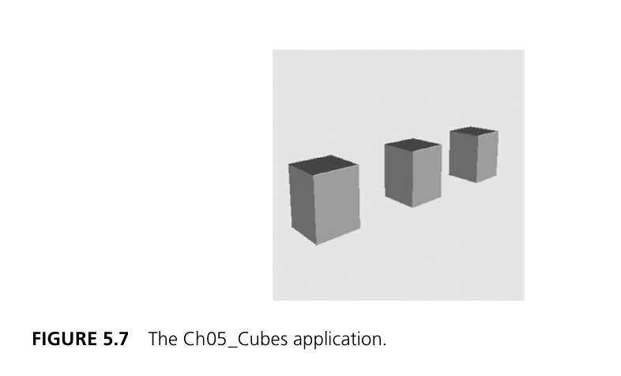

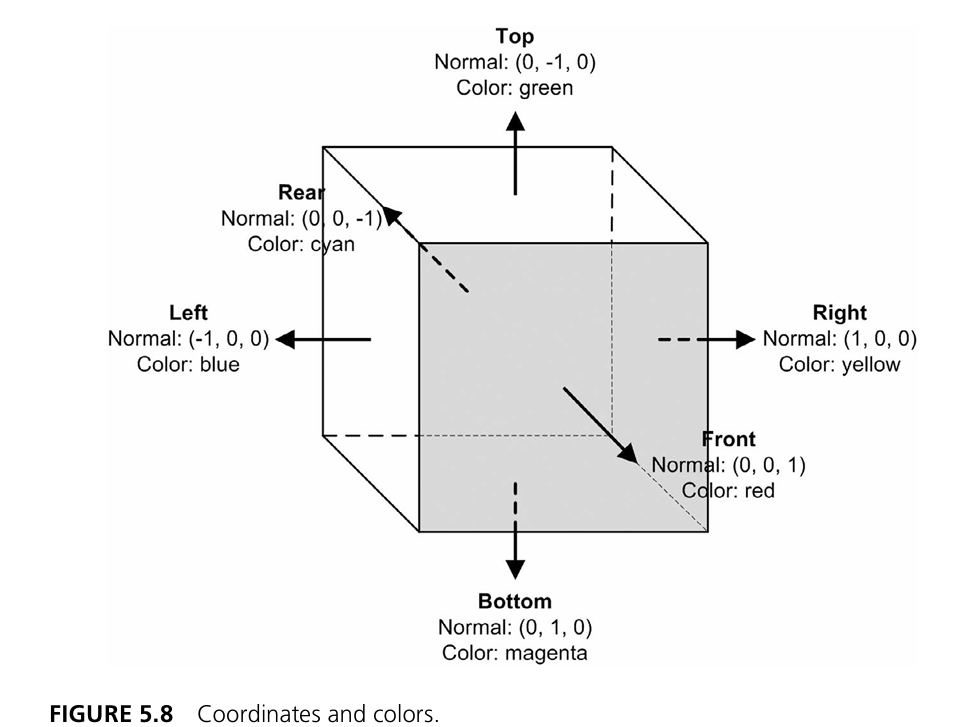

然后是观察者、视图方向和场景空间关系：

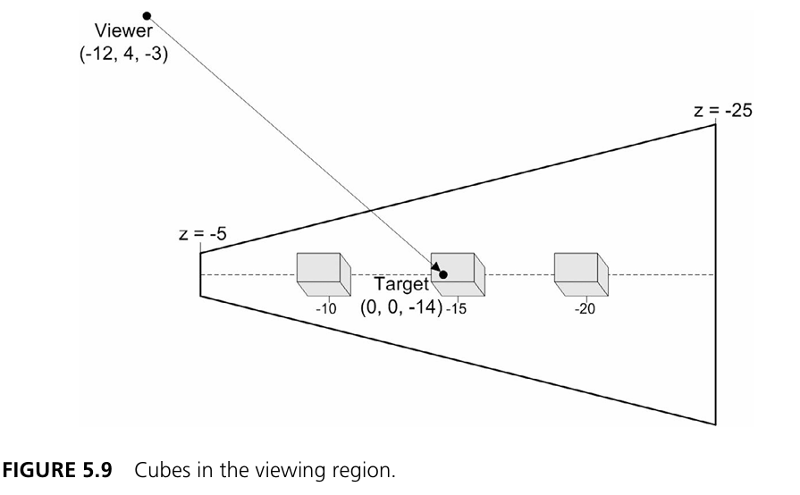

这些图虽然对应的是更进一步的 3D 示例，但它们有一个非常重要的作用：

> 它们帮助你理解，为什么当前这个 2D 精灵示例也会开始出现 `Camera`、`lookAt`、`ortho` 这些“看起来像 3D”的概念。

因为从图形学的角度看，2D 和 3D 的变换语言是统一的。

你现在写的是：

- 一个二维飞船精灵；

但你使用的工具已经是：

- 矩阵；
- 相机；
- 统一缓冲区；
- 绑定组；

这些东西以后完全可以无缝扩展到 3D。

---

## 35. 用一张图总结当前代码里的两条绑定线

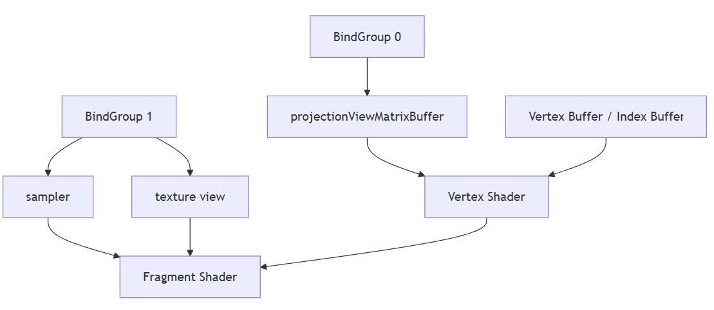

这张图特别适合用来记当前项目的结构：

- 顶点缓冲区和索引缓冲区提供几何；
- 第 0 组提供顶点阶段的统一矩阵；
- 第 1 组提供片段阶段的纹理资源；
- 然后由顶点阶段和片段阶段分别处理。

到了这一步，渲染器已经不再是“一个 shader + 一个 buffer”的简单样子，而是真正开始分层了。

---

## 36. 容易踩坑的地方

### 36.1 把 uniform 数据也塞进顶点缓冲区

这是最典型的概念混淆。

要记住：

- 顶点缓冲区存逐顶点数据；
- Uniform Buffer 存整批共享数据。

### 36.2 忘了给 Uniform Buffer 加 `COPY_DST`

当前代码要用：

```typescript
queue.writeBuffer(...)
```

去更新矩阵，所以 `usage` 必须包含：

- `GPUBufferUsage.COPY_DST`

### 36.3 只创建 Uniform Buffer，不创建绑定组

缓冲区创建出来，不代表 shader 就能访问。  
它仍然要经过：

- `BindGroupLayout`
- `BindGroup`
- `setBindGroup(...)`

这条链路。

### 36.4 `@group/@binding` 和 TypeScript 配置对不上

例如 WGSL 里写：

```wgsl
@group(0) @binding(0)
```

那 TypeScript 里就必须在第 0 组的第 0 个 binding 上放对应该资源。

### 36.5 误以为当前代码已经是完整 MVP

严格来说还不是。

当前例子更像是：

- 几何直接用屏幕式坐标放好；
- 再通过 `projectionViewMatrix` 做统一变换。

它已经明显往 MVP 靠近了，但还没有把模型矩阵单独拆出来。

### 36.6 忘了在 `draw()` 前更新 uniform 数据

如果矩阵变了，却不重新写入 Uniform Buffer，那 GPU 读到的还是旧数据。

---

## 37. 从 API 角度回看：这一节到底新增掌握了哪些能力？

到这里，你实际上已经掌握了一整条非常关键的 Uniform 与变换链路：

### 37.1 Uniform Buffer 创建

- `GPUBufferUsage.UNIFORM | GPUBufferUsage.COPY_DST`
- `createUniformBuffer(...)`

### 37.2 Uniform 数据更新

- `queue.writeBuffer(...)`

### 37.3 Uniform 绑定布局

- `createBindGroupLayout({ buffer: { type: "uniform" } })`

### 37.4 Uniform 绑定组

- `createBindGroup(...)`
- `setBindGroup(0, ...)`

### 37.5 WGSL 中访问 uniform

- `var<uniform> projectionViewMatrix: mat4x4f`

### 37.6 顶点矩阵变换

- `projectionViewMatrix * vec4f(pos, 0.0, 1.0)`

### 37.7 正交投影与视图矩阵

- `mat4.ortho(...)`
- `mat4.lookAt(...)`
- `mat4.multiply(...)`

这些能力合在一起，意味着你的渲染器终于开始具备：

> **不靠硬编码裁剪空间，而是靠相机矩阵统一控制对象显示位置的能力。**

---

## 38. 总结

这一节表面上看，只是多了一块 Uniform Buffer、多了一个 `Camera` 类。

但从学习路径上看，它其实标志着一个非常关键的跃迁：

- 从“把顶点直接喂给 GPU”
- 进化到“先用统一矩阵变换顶点，再交给 GPU”。

如果你把这一节真正吃透，至少应该把下面这些结论记住：

1. Uniform Buffer 适合存放整批顶点共享的数据，例如矩阵、时间、屏幕参数和相机参数；
2. 变换矩阵不适合放进顶点缓冲区，因为它不会逐顶点变化；
3. 当前代码中的 Uniform Buffer 里装的是一份 `projectionViewMatrix`；
4. `Float32Array(16)` 对应 shader 侧的 `mat4x4f`；
5. `queue.writeBuffer(...)` 是更新 Uniform Buffer 内容的关键 API；
6. 当前的 `Camera` 通过 `mat4.ortho(...)` 和 `mat4.lookAt(...)` 生成相机矩阵；
7. 顶点着色器通过 `projectionViewMatrix * vec4f(...)` 把几何坐标变换成最终位置；
8. 当前代码虽然渲染的是 2D 精灵，但思路已经明显走向了相机、投影和更完整的变换系统；
9. 当前示例还不是完整 MVP，但它已经把 View 和 Projection 这两部分先接起来了；
10. Uniform Buffer 和纹理绑定组是两条不同的资源线，它们分别服务于顶点阶段和片段阶段。

到了这里，你的渲染器已经不再只是“会画一个贴图矩形”了。

它开始真正具备：

- 相机；
- 投影；
- 统一矩阵；
- 屏幕坐标到裁剪空间的变换；

这些更接近真实游戏和图形程序的能力。

顺着这条路继续往后走，最自然的方向通常会是：

- 完整的 MVP 矩阵拆分；
- 多个对象的模型矩阵；
- 相机移动与跟随；
- 动态旋转、缩放和平移；
- 进一步进入真正的 3D 渲染。

你会越来越清楚地看到：

> **Uniform Buffer 不是一个额外的 API 点缀，它是“让顶点不再死死写在原地”的关键开关。**
