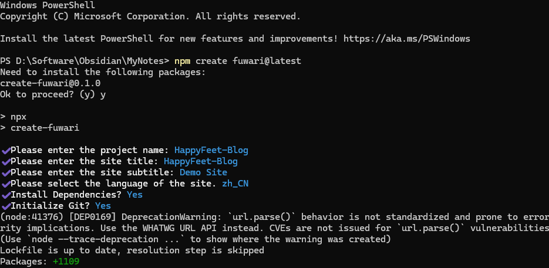
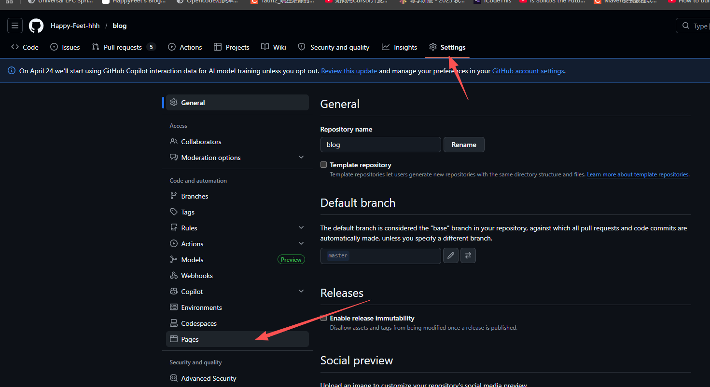
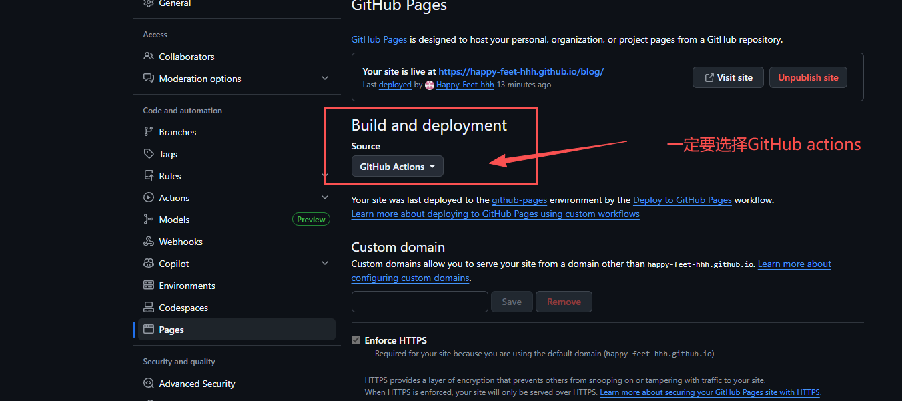
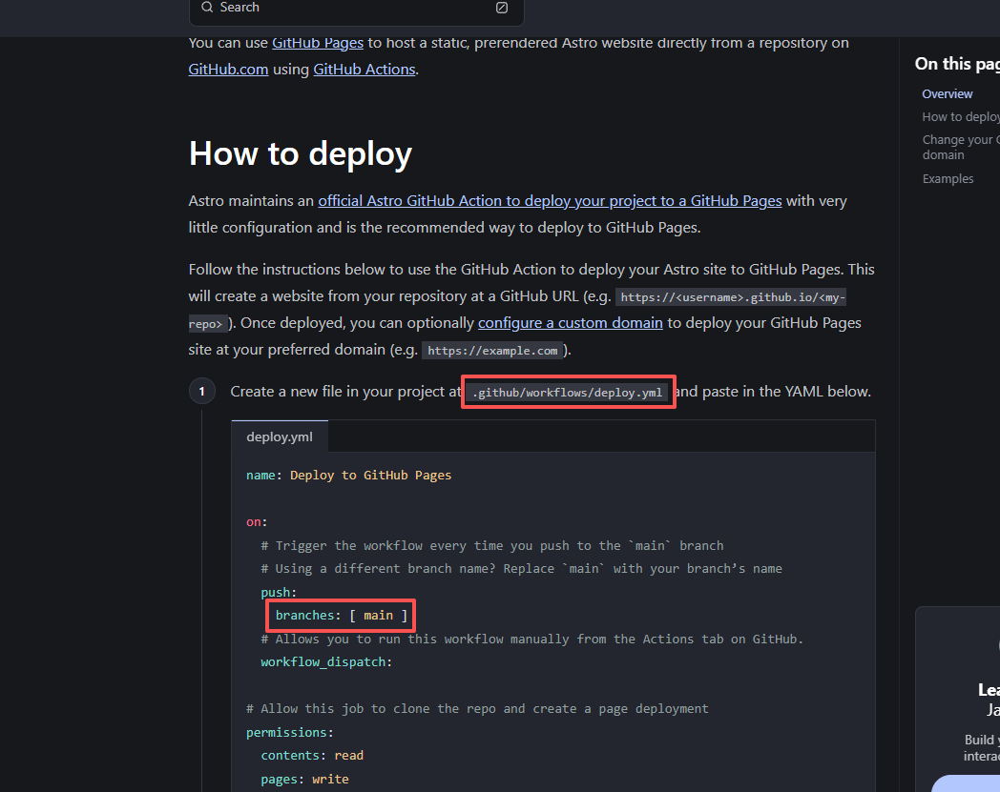
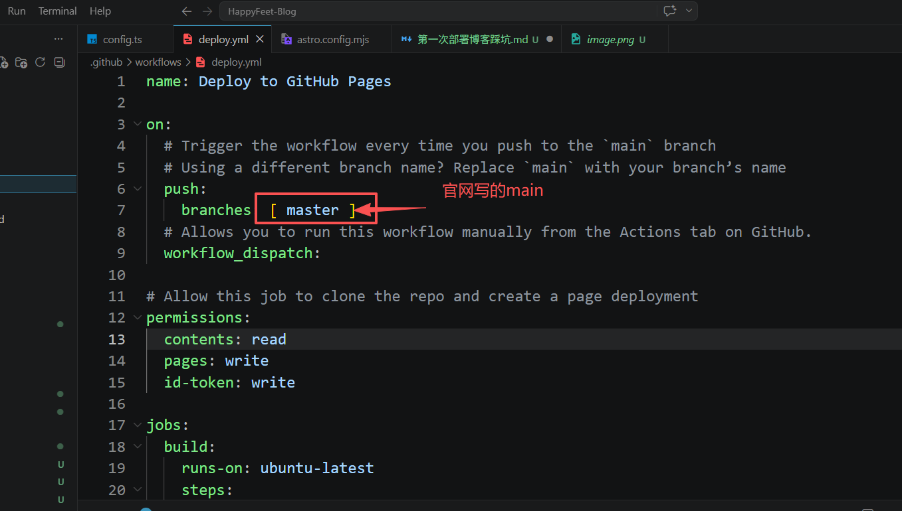
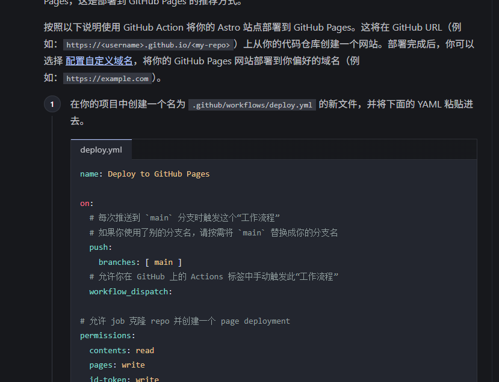
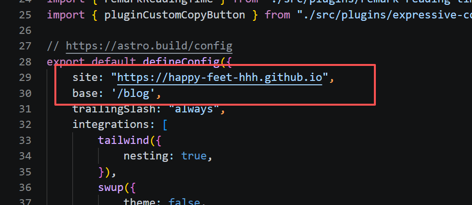
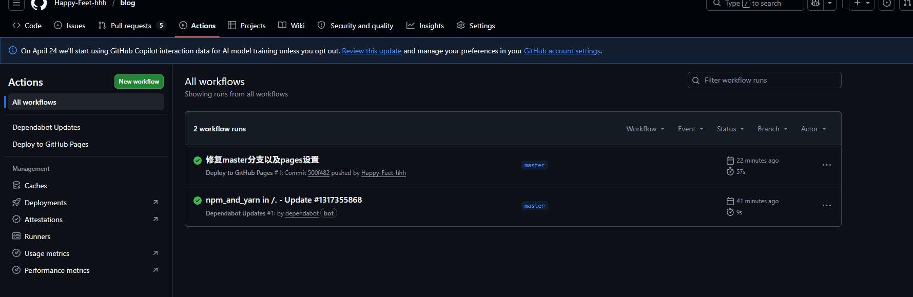

## 起因

一直以来我都想自己记录自己的学习和生活，养成记录的习惯。因为我总是做的很多，但是总结得很少，这样也导致我的成长一直都比较缓慢。

中间试过自己写博客，但也无疾而终，直到今天发现了这个博客项目——Fuwari。它基于astro，性能不错，而且非常容易部署到GitHub，并且最重要的是，我不用自己从头开始配置美化，这对我来说真的很重要！

记录一下过程，免得之后忘了，第一步通过npm创建Fuwari项目：
```bash
npm create fuwari@latest
```

然后回答一些项目配置的问题：
```bash
Need to install the following packages:
create-fuwari@0.1.0
Ok to proceed? (y) y

> npx
> create-fuwari

✔ Please enter the project name: HappyFeet-Blog
✔ Please enter the site title: HappyFeet-Blog
✔ Please enter the site subtitle: Demo Site
✔ Please select the language of the site. zh_CN
✔ Install Dependencies? Yes
✔ Initialize Git? Yes
```

如下图所示：


之后就是漫长的等待安装的过程，也就一两分钟。

之后`cd`进入项目文件夹输入

```bash
npm run dev
```

就可以看到效果。

然后是主题配置，这个先按下不表，毕竟我也刚刚搭建好博客，只想安静的写一点内容。后面再搞这些花里胡哨的。

现在项目在本地搭建了起来，问题是如何部署到GitHub上。

## 第一个坑，忘记设置项目的pages

老实说，我不太会用git，更不太了解github，什么是actions，什么是GitHub Pages我一概不知。只知道这些玩意儿可以帮我部署博客，所以我创建了一个仓库，但我忘了设置pages，现在粘贴好图片，然后警醒自己：




不然可能部署不了。

## 第二个坑，分支的错误

我最开始是按照官网文档[Astro部署到Github](https://docs.astro.build/en/guides/deploy/github/)



我按照官网的指示在`.github/workflows/deploy.yml`里直接复制了官网提供的工作流，但是我没想到，Fuwari的默认目录为 `master`，而Astro官网写的`main`分支。



然后就是修改项目根目录的`astro.config.mjs`文件了，这个倒还好，官网说的非常清楚：


我也改好了


## 第三个坑，预先build

Astro官网提供的workflow不需要我提前`npm run build`，我开始不知道，导致我浪费了一些时间。

然后就是正常的使用 `git remote add origin https://github.com/Happy-Feet-hhh/blog.git `，然后`git add .`，`git commit -m 'xxx'`和`git push origin master`了。

只要将本地的更新推送到远程仓库，GitHub会自动部署，非常nice！


至于怎么连接远程仓库，我之后会贴一篇新的文章，反正我要学git的，有一篇文章专门写了，但是我不知道怎么在Astro种超链接到另一篇文章。之后再说吧。

爽！